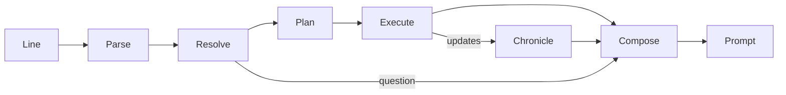

# Interactive fiction engine

The text client's engine turns what the player types into game actions, and
everything that happens before the next prompt into one passage of prose. This
page is its architecture. The [parser architecture](if-parser-architecture.md)
covers the language layer it starts from, and the
[adventure slice](text-adventure.md) covers commands as the player sees them.

## Goals

- **One input, one passage.** Everything between two prompts is narrated
  together: the attempt, what happened on the way, how it ended, and anything
  else the character noticed. Nothing is printed while a turn is in progress.
- **The prompt means "your move".** It returns only when the game is waiting
  for this player: the character is ready, no journey is running, and
  everything the turn started is finished or abandoned.
- **Verbs aren't actions.** Many verbs share one action (`take`, `get`,
  `pick up`, `grab`); one verb picks different actions by its object (`open`
  a door is a door action, `open` a token is a refusal); and one command may
  need several actions (`take token` when it's out of reach is a journey, then
  a pickup).
- **No mechanics on screen.** Ticks, readiness, revisions, ids and offsets
  stay underneath. HP is the one number shown, because the player plays by it.
- **Only disclosed facts, with atmosphere.** The engine reads the disclosed
  view; it never invents causes, names, inscriptions, rooms or anything that
  would matter to play. Atmosphere (mood words, smells, sounds) colours places
  but has no gameplay effect and is fixed per place.
- **Deterministic.** The same game and the same input give the same text.

## Pipeline



1. **Parse** (`parser`): the line becomes sentences, and each sentence a
   `ParsedCommand`. Unchanged in structure; see the parser architecture.
2. **Resolve** (`engine::resolve`): noun phrases become *referents* in the
   current scene, or a question, or a refusal.
3. **Plan** (`engine::verbs`): verb semantics turn a resolved command into
   *goals*, an answer, a question or a refusal. `engine::turn` decides each
   goal's steps as it runs.
4. **Execute** (`engine::turn`): steps run one at a time against the server.
   Each step rechecks its preconditions against the view in hand.
5. **Chronicle** (`engine::chronicle`): every update the turn receives becomes
   structured *beats*: movement, arrivals, pickups, door changes, blows, deaths,
   sightings, HP changes, interruptions.
6. **Compose** (`engine::narrate`): the intentions and beats of the whole turn
   become one passage.

### The scene

`engine::scene` interprets one `StateView` for language: what is here, what it
is called, and where it is relative to the character. It replaces
`parser::scope` and the scattered lookups in `adventure.rs`.

| Referent | From | Notes |
| --- | --- | --- |
| Thing | ground and carried items | Indistinguishable things (same name, description and appearance, same holder) form one *group* with a count: "two copper tokens". |
| Figure | visible actors | One per actor id, however many cells its body covers. The character is the *self* referent (`me`, `myself`), never a figure in the room. |
| Door | doors in visible cells | One per door id. |
| Surface | seen floors, walls, ceilings | Materials only. |
| Place, exit | anchors and ways onward | Used by directions and `go to`. |

Each referent carries the words that name it (head nouns and adjectives, from
its disclosed name), where it is (carried, at your feet, nearby, a bearing and
rough distance) and whether it's within reach.

### Resolution

A noun phrase resolves to one referent, several (plurals, `all`), a question,
or a reason it can't (`You can't see any lamp here.`). The rules follow
Inform's:

- Every word of the phrase must name the referent; the head noun may be the
  last word of the name or a known synonym (`corpse` for "ruin scout corpse").
- **Verb preferences** narrow candidates before asking: `take` prefers things
  not carried, `drop` carried things, `attack` figures, `open` doors.
- **Indistinguishable things never cause a question.** `take token` with two
  identical tokens takes one; `take tokens` or `take all tokens` takes both.
- `all`, `everything` and `all except …` expand within the verb's domain:
  for `take`, things here and not carried; for `drop`, carried things.
- Pronouns: `it` is the last thing or door mentioned *by the player or the
  narration*; `them` the last group or plural; `him`/`her` the last figure.
  So after "A rat scurries into view", `attack it` means the rat.
- A question records the command and the rest of the chain. An answer (a
  number, an ordinal, or words that pick one candidate) completes the command
  and continues the chain; any other command abandons the question.

### Verb semantics and plans

`engine::verbs` maps a verb and the kind of referent to goals or a refusal.
`engine::turn` runs each goal as steps, deciding the next one from the view in
hand:

| Step | Server request | Completes when |
| --- | --- | --- |
| `Approach(target)` | `travel` to a standing cell for the target | the journey ends and the character is ready |
| `Act(action)` | `act` | the action is acknowledged and the character is ready again |
| `Resume` | `continue` | the character is ready (used when it isn't, for example after reconnecting in recovery) |

Examples:

| Verbs | Referent | Steps |
| --- | --- | --- |
| take, get, pick up, grab, carry | thing within reach | `Act(Take)` |
| | thing out of reach | `Approach(thing)`, `Act(Take)` |
| | thing already carried | refusal: "You already have the token." |
| drop, put down, discard; put on the floor | carried thing | `Act(Drop)` |
| open, close, shut | door within reach | `Act(SetDoor)` |
| | door out of reach | `Approach(door)`, `Act(SetDoor)` |
| attack, kill, hit, fight, strike | figure | `Approach(figure)` when not next to it, then `Act(Attack)` (which resumes interrupted preparation) |
| go to, approach, walk to | thing, door, figure, place | `Approach(target)` |
| a direction; go, walk, head | way onward | `Approach(exit)`, then the new place is described |
| wait, z | | `Act(Wait)`, or `Resume` when not ready |
| examine, x, look at, read, listen, smell, touch | anything | no step; the answer is composed from the scene (`listen` and `smell` give the place's atmosphere) |
| wear, eat, drink, give, throw, unlock, push, talk, search, pray, ... | anything | refusal once the object is found: "You can't wear anything yet." |

A step's preconditions are checked again just before it runs, with the view
then in hand: the thing must still be there and within reach, the door still
in the wrong state, the character in control and ready. A failed recheck
ends the goal and the passage says why ("but it's no longer there").

Travel is never told to attack, and arriving never authorizes the next step
if a figure the turn hadn't seen came into view, even when the server
reports arrival.

### Executing a turn

`engine::turn` runs a turn as an async procedure over a small `Link` trait
(send a request, read the next server message, read the client state). The
real link wraps `tor_client_common::Connection`; tests use scripted links.

A turn runs each sentence's plan in order. It stops early when a step is
refused, interrupted or fails, when a question is needed, when the run ends
(death or a terminal victory), when control is lost, or when a snapshot
replaces the state. Stopping discards the rest of the chain, and the passage
says what was abandoned only through the interrupted intention ("intent on
picking it up").

**When a step completes.** The server runs play until this player's
character is next, then reports it `ready`. So an action step completes at the
first update after its acknowledgement whose revision is newer and in which the
character is ready, and a journey step at the first update in which its travel
has ended and the character is ready. If play goes quiet for two seconds with
the character still not ready, the step ends anyway: another player's
character, or one nothing controls, is next. A journey still keeps the way it
ended. That removes today's race, where the prompt returned at
the acknowledgement and the rest of the turn arrived after it, and the
corpse bug, where a pickup after a journey was dropped because the character
was still recovering.

Updates between turns (another player acting, a door opened elsewhere, or the
watched player's actions for a spectator) are gathered until play has been
quiet for 150 ms, then composed the same way and printed as one passage above a
fresh prompt. They also tell the watched character's own actions: "Time
passes.", "You pick up a stone tablet."


### The chronicle

Each update yields beats by comparing the view before it with the view after
it, plus the update's own event and the combat events it carries:

- **Self:** moved (direction), journey progress and its end (arrived,
  blocked, interrupted, thrown off course), took, dropped, opened or closed
  a door, waited, began an attack, attack interrupted, HP changed,
  displaced, impacted, died.
- **Others:** a figure came into view (where), went out of view, struck or
  missed someone, died; a door changed state; a thing appeared or vanished.
- **Run:** objective disclosed, victory, defeat.

Beats carry referent identities, not text, so the composer can choose names,
pronouns and order.

### Composition

The composer realizes the turn's intentions and beats as one passage:

1. **Journeys collapse into one clause.** Steps aren't narrated; the clause
   names the direction or destination: "You walk east." / "You walk over to
   the copper token".
2. **A goal's steps join into one sentence** when they succeed: "You walk over
   to the copper token and pick it up."
3. **Interruptions keep the purpose:** "You walk toward the copper token,
   intent on picking it up. A ruin scout steps into view to the east, and you
   stop warily."
4. **Combat reads as an exchange,** in the order it happened, with pronouns for
   repeated subjects: "You strike the ruin scout. It lunges back and catches
   you." Deaths end the exchange: "The ruin scout collapses." HP follows once,
   as a status line, when it changed: `HP 46/50`.
5. **Arrival in a new place** appends its description; a place already visited
   gets its name and anything notable.
6. **Other perceptions** come last: "You notice a stone guardian to the east."
7. **Referring expressions:** a figure first seen in this passage is "a ruin
   scout", later "the ruin scout" or "it". Names are capitalized only at the
   start of a sentence; articles follow pronunciation ("an echoing hall").

`engine::prose` holds the language utilities: articles, plurals and number
words, lists ("north, east or west"), capitalization, and subject-verb
agreement for the self and others.

The narration also updates pronoun referents, so the player can refer to what
was just described.

### Places and ways

`engine::place` works out the place the character is in from the disclosed
cells alone. The body stands on the open cells at its own level (z = 0) with
headroom above (z = 1). A column is open when its z = 0 cell is seen, open and
not a doorway, with no wall seen above it.

- **Extent.** The place is the open columns reachable from the character's
  without crossing a door or a *gap*: an open column with closed or unseen
  columns on both sides along one axis, at most two wide. Unseen columns close
  gaps because nothing is disclosed beside an opening where regions join.
  Standing in a gap, the place is the passage of gaps it belongs to. With no
  walls in sight at all (raw diagnostic regions), gaps mean nothing and the
  place is the open ground nearest the same authored place hint.
- **Ways.** Doors and open columns at the edge of the place, grouped where they
  touch, are its openings: a door, a passage (more gaps beyond) or an archway.
  A journey through one ends at the farthest seen open cell up to three steps
  beyond it. Stairs at the character's cell are ways up or down. When no
  opening lies in a direction, an authored anchor seen that way in another
  place is the fallback.
- **Form.** No walls seen: an open space. Standing in a gap, or a place at most
  two columns wide and four long: a passage. Up to 6 columns: an alcove; up to
  40: a chamber (small up to 15); more: a large hall.
- **Beyond sight.** Unseen columns at the place's edge mean it goes on out of
  sight in their directions.

### Descriptions

`adventure::describe_place_with` tells a place under its name in two
paragraphs: the place and its ways out, then who and what is in it.

```text
Hidden Promise
You are in a small, damp chamber of stone. A damp chill clings to the stones.
Somewhere out of sight, water drips slowly. A passage leads north, an open
oak door east, and a closed oak door south.
There is a wounded ruin scout to the east. A copper token lies at your feet;
two stone tablets lie on the floor nearby.
```

- **The place** (`narrative::describe_place`): its kind and size, what it's
  made of ("of stone" when floor and walls match, otherwise "with a flagstone
  floor and walls of dressed stone"), its atmosphere, a high ceiling, and where
  it goes on out of sight (in "several directions" when that's four or more).
- **Ways by kind.** Openings of one kind are named once with their directions,
  and later kinds are gapped: "A passage leads north, and open oak doors east
  and west." Directions with only a place seen beyond follow ("You can also
  head south."). A walled place with no way out and nothing out of sight says
  "You see no way out."
- **Who and what is here.** Figures alike in one direction are counted
  together, with injuries as adjectives ("two badly wounded rats"); healthy
  figures get none. Things alike in one place are counted together, stacks
  included ("At your feet lie 17 arrows"), and a name already told is
  "another" or "more" ("another copper token lies to the south"). Doors in
  sight that aren't ways out of this place come last ("You can also see an
  open wooden door to the northeast.").

`look` always describes the place in full, with HP but not the objective,
which the opening description shows and `status` (or `score`) recalls.

**Arrivals.** A turn that ends in another place than it began, whether by a
direction or by walking over to something, describes the new place after the
narration. Sightings during the turn of figures the description names are
dropped, unless one cut a goal short ("as a rat comes into view"). How fully
it's described depends on the verbosity, which the engine keeps with the set
of places it has described in full:

| Mode | First arrival | Later arrivals |
| --- | --- | --- |
| `brief` (default) | in full | name, ways, contents |
| `verbose` | in full | in full |
| `superbrief` | name and contents | name and contents |

A place without a name says "You are back in the damp chamber." instead.
This isn't game state: it's lost on restart, like the rest of `Engine`.

### Atmosphere

`engine::atmosphere` colours places without affecting play. Each place gets a
*theme* for its fabric (stone, marble, timber, earth, or nothing seen), and a
theme's mood words, air, smell and sound belong together: a "damp chamber"
smells of wet stone, never of dust. The description gets the mood word, the
air, sometimes a closeness note for narrow passages, and for a third of places
each the smell or the sound. `smell` and `listen` answer with the place's own.

Every choice is a separate hash of the place's key, so a place reads the same
on every visit and from anywhere inside it, while neighbouring places rarely
share a description. Stone alone has nine themes, each with two or three
mood words and two choices per sense.

The key (`narrative::current_place_anchor`) is the authored place hint inside
the place with the lowest key, or else the place's open cell with the lowest
key. Cell keys are fixed for a game (they're salted per save), so the same
place reads alike for the whole game, but a new game may colour it
differently. The hint's mnemonic name titles the place, and `name room`
renames it; a place without a hint can't be named.

## Testing

Following the [testing policy](testing.md):

- **Place tests** (`engine::place` and `tests/it/adventure.rs`): extents,
  gaps, passages, doors, ways beyond sight, and descriptions from walled maps.
- **Unit tests** for each layer: scene construction and grouping, resolution
  (synonyms, preferences, groups, `all`/`except`, pronouns, questions), verb
  plans, chronicle beats from pairs of views, prose utilities and composition
  from beats.
- **Turn tests** (`crates/client-text/tests/it/turns.rs`) run whole inputs
  through a scripted server whose updates pass through the real client state:
  a journey and pickup, pickup after recovery, an interrupted journey, arrival
  as a figure appears, an exchange of blows ending in a death, a chain paused
  by a question and resumed by its answer, a refusal, grouped pickups and
  `again`, a passage between turns, and refused verbs.
- **Process acceptance tests** (`scripts/test_adventure_process.py` and the
  other text process suites) check exact transcripts through the real
  executables, including the first dungeon's fight and corpse pickup.

## Implementation order

1. **Structured combat events** (done, protocol 21): blows, interruptions and
   deaths reach clients as data; injury is a level and the objective a kind.
   The server sends no prose.
2. **The engine core** (done): scene, resolution, verb plans, turn execution,
   chronicle and composition replace `Dialogue` and the old presentation loop,
   and `parser::{scope, matcher, context}`.
3. **Places, exits and room descriptions** (done): see
   [places and ways](#places-and-ways).
4. **Prose descriptions, atmosphere and verbosity** (done): see
   [descriptions](#descriptions) and [atmosphere](#atmosphere).

## Next steps

These are the open items, roughly in order of value. Each needs only the code
named unless it says otherwise.

1. **Remembered places.** `places` lists names, but `go to <place name>`
   doesn't travel to a remembered place out of sight. That needs a destination
   the server accepts: travel takes a known cell key, and remembered cells are
   in `ClientState::memory`.
2. **Stable keys for unhinted places.** Without a place hint, the key is the
   lowest-keyed open cell seen in the place, which can change while more of
   the place comes into sight (it's stable once all of it has been seen).
   Choosing it from remembered cells, or asking scenario authors for hints in
   every room, would fix it from the first sight.
3. **Authored region names.** Regions have authored names ("Threshold") the
   protocol doesn't disclose, so titles are the character's mnemonic names.
   Disclosing them is a protocol change: ask the maintainer.
4. **Knowing when it's this player's move.** A turn ends when the character is
   ready, or after two quiet seconds when someone else's character is next.
   A server signal for "waiting on another client" would remove the timeout
   (a protocol change).
5. **Verbs waiting for game rules.** When the game gains equipment,
   consumables, containers, locks or speech, add the action to
   `engine::verbs::Goal`, map the verbs to it, run it in `engine::turn::step`,
   and narrate its event in `engine::chronicle` and `engine::narrate`.
6. **Fewer surveys.** A `look` surveys the place three times (description,
   anchor, ways); cache one survey per state revision if descriptions get
   slower.

