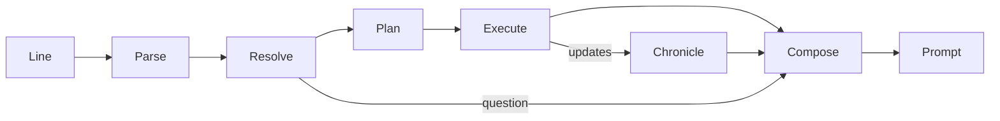

# Interactive fiction engine

The text client's engine turns what the player types into game actions, and
everything that happens before the next prompt into one passage of prose. This
page is its architecture. The [parser architecture](if-parser-architecture.md)
covers the language layer it starts from, and the
[adventure slice](text-adventure.md) covers commands as the player sees them.

## Goals

- **One input, one passage.** Everything between two prompts is narrated
  together: the attempt, what happened on the way, how it ended, and anything
  else the character noticed. Nothing is printed while a turn is in progress.
- **The prompt means "your move".** It returns only when the game is waiting
  for this player: the character is ready, no journey is running, and
  everything the turn started is finished or abandoned.
- **Verbs aren't actions.** Many verbs share one action (`take`, `get`,
  `pick up`, `grab`); one verb picks different actions by its object (`open`
  a door is a door action, `open` a token is a refusal); and one command may
  need several actions (`take token` when it's out of reach is a journey, then
  a pickup).
- **No mechanics on screen.** Ticks, readiness, revisions, ids and offsets
  stay underneath. HP is the one number shown, because the player plays by it.
- **Only disclosed facts.** The engine reads the disclosed view; it never
  invents causes, names, inscriptions or rooms.
- **Deterministic.** The same game and the same input give the same text.

## Pipeline

1. **Parse** (`parser`): the line becomes sentences, and each sentence a
   `ParsedCommand`. Unchanged in structure; see the parser architecture.
2. **Resolve** (`engine::resolve`): noun phrases become *referents* in the
   current scene, or a question, or a refusal.
3. **Plan** (`engine::verbs`, `engine::plan`): verb semantics turn a resolved
   command into an *intention*: a goal and the steps that achieve it.
4. **Execute** (`engine::turn`): steps run one at a time against the server.
   Each step rechecks its preconditions against the view in hand.
5. **Chronicle** (`engine::chronicle`): every update the turn receives becomes
   structured *beats*: movement, arrivals, pickups, door changes, blows, deaths,
   sightings, HP changes, interruptions.
6. **Compose** (`engine::narrate`): the intentions and beats of the whole turn
   become one passage.

### The scene

`engine::scene` interprets one `StateView` for language: what is here, what it
is called, and where it is relative to the character. It replaces
`parser::scope` and the scattered lookups in `adventure.rs`.

| Referent | From | Notes |
| --- | --- | --- |
| Thing | ground and carried items | Indistinguishable things (same name, description and appearance, same holder) form one *group* with a count: "two copper tokens". |
| Figure | visible actors | One per actor id, however many cells its body covers. The character is the *self* referent (`me`, `myself`), never a figure in the room. |
| Door | doors in visible cells | One per door id. |
| Surface | seen floors, walls, ceilings | Materials only. |
| Place, exit | anchors and ways onward | Used by directions and `go to`. |

Each referent carries the words that name it (head nouns and adjectives, from
its disclosed name), where it is (carried, at your feet, nearby, a bearing and
rough distance) and whether it's within reach.

### Resolution

A noun phrase resolves to one referent, several (plurals, `all`), a question,
or a reason it can't (`You can't see any lamp here.`). The rules follow
Inform's:

- Every word of the phrase must name the referent; the head noun may be the
  last word of the name or a known synonym (`corpse` for "ruin scout corpse").
- **Verb preferences** narrow candidates before asking: `take` prefers things
  not carried, `drop` carried things, `attack` figures, `open` doors.
- **Indistinguishable things never cause a question.** `take token` with two
  identical tokens takes one; `take tokens` or `take all tokens` takes both.
- `all`, `everything` and `all except …` expand within the verb's domain:
  for `take`, things here and not carried; for `drop`, carried things.
- Pronouns: `it` is the last thing or door mentioned *by the player or the
  narration*; `them` the last group or plural; `him`/`her` the last figure.
  So after "A rat scurries into view", `attack it` means the rat.
- A question records the command and the rest of the chain. An answer (a
  number, an ordinal, or words that pick one candidate) completes the command
  and continues the chain; any other command abandons the question.

### Verb semantics and plans

`engine::verbs` is a declarative table from a verb and the kind of referent to
a plan or a refusal. A plan is a goal plus steps:

| Step | Server request | Completes when |
| --- | --- | --- |
| `Approach(target)` | `travel` to a standing cell for the target | the journey ends and the character is ready |
| `Act(action)` | `act` | the action is acknowledged and the character is ready again |
| `Resume` | `continue` | the character is ready (used when it isn't, for example after reconnecting in recovery) |

Examples:

| Verbs | Referent | Plan |
| --- | --- | --- |
| take, get, pick up, grab, carry | thing within reach | `Act(Take)` |
| | thing out of reach | `Approach(thing)`, `Act(Take)` |
| | thing already carried | refusal: "You already have the token." |
| drop, put down, discard | carried thing | `Act(Drop)` |
| open, close, shut; push, pull a door | door within reach | `Act(SetDoor)` |
| | door out of reach | `Approach(door)`, `Act(SetDoor)` |
| attack, kill, hit, fight, strike | figure | `Act(Attack)` (resumes interrupted preparation) |
| go to, approach, walk to | thing, door, figure, place | `Approach(target)` |
| a direction; go, walk, head | way onward | `Approach(exit)`, then the new place is described |
| wait, z | | `Act(Wait)`, or `Resume` when not ready |
| examine, x, look at, read, search, listen, smell | anything | no step; the answer is composed from the scene |

A step's preconditions are checked again just before it runs, with the view
then in hand: the thing must still be there and within reach, the door still
in the wrong state, the character in control and ready. A failed recheck
ends the plan with a beat that says why ("but it is no longer there").

Travel is never told to attack, and arriving never authorizes the next step
if a figure the turn hadn't seen came into view, even when the server
reports arrival.

### Executing a turn

`engine::turn` runs a turn as an async procedure over a small `Link` trait
(send a request, read the next server message, read the client state). The
real link wraps `tor_client_common::Connection`; tests use scripted links.

A turn runs each sentence's plan in order. It stops early when a step is
refused, interrupted or fails, when a question is needed, when the run ends
(death or a terminal victory), when control is lost, or when a snapshot
replaces the state. Stopping discards the rest of the chain, and the passage
says what was abandoned only through the interrupted intention ("intent on
picking it up").

**When a step completes.** The server runs play until this player's
character is next, then reports it `ready`. So an action step completes at the
first update after its acknowledgement in which the character is ready, and a
journey step at the first update in which its travel has ended and the
character is ready. That removes today's race, where the prompt returned at
the acknowledgement and the rest of the turn arrived after it, and the
corpse bug, where a pickup after a journey was dropped because the character
was still recovering.

Updates between turns (another player acting, a door opened elsewhere) are
chronicled and composed the same way, printed as one passage above a fresh
prompt.

### The chronicle

Each update yields beats by comparing the view before it with the view after
it, plus the update's own event and the combat events it carries:

- **Self:** moved (direction), journey progress and its end (arrived,
  blocked, interrupted, thrown off course), took, dropped, opened or closed
  a door, waited, began an attack, attack interrupted, HP changed,
  displaced, impacted, died.
- **Others:** a figure came into view (where), went out of view, struck or
  missed someone, died; a door changed state; a thing appeared or vanished.
- **Run:** objective disclosed, victory, defeat.

Beats carry referent identities, not text, so the composer can choose names,
pronouns and order.

### Composition

The composer realizes the turn's intentions and beats as one passage:

1. **Journeys collapse into one clause.** Steps aren't narrated; the clause
   names the direction or destination: "You walk east." / "You walk over to
   the copper token".
2. **A plan's steps join into one sentence** when they succeed: "You walk over
   to the copper token and pick it up."
3. **Interruptions keep the purpose:** "You walk toward the copper token,
   intent on picking it up. A ruin scout steps into view to the east, and you
   stop warily."
4. **Combat reads as an exchange,** in the order it happened, with pronouns for
   repeated subjects: "You strike the ruin scout. It lunges back and catches
   you." Deaths end the exchange: "The ruin scout collapses." HP follows once,
   as a status line, when it changed: `HP 46/50`.
5. **Arrival in a new place** appends its description; a place already visited
   gets its name and anything notable.
6. **Other perceptions** come last: "You notice a stone guardian to the east."
7. **Referring expressions:** a figure first seen in this passage is "a ruin
   scout", later "the ruin scout" or "it". Names are capitalized only at the
   start of a sentence; articles follow pronunciation ("an echoing hall").

`engine::prose` holds the language utilities: articles, plurals and number
words, lists ("north, east or west"), capitalization, and subject-verb
agreement for the self and others.

The narration also updates pronoun referents, so the player can refer to what
was just described.

## Testing

Following the [testing policy](testing.md):

- **Unit tests** for each layer: scene construction and grouping, resolution
  (synonyms, preferences, groups, `all`/`except`, pronouns, questions), verb
  plans, chronicle beats from pairs of views, prose utilities and composition
  from beats.
- **Turn tests** run whole inputs through scripted links: a journey and pickup,
  an interrupted journey, an attack exchange with an interruption and a death,
  pickup after combat recovery, a chain stopped by a question and resumed by
  its answer.
- **Server integration tests** run the engine against a real in-process server
  and the authored scenarios, including first-dungeon's scout fight and corpse
  pickup.
- **Process acceptance tests** (`scripts/test_adventure_process.py`) check
  exact transcripts through the real executables.

## Implementation order

1. **Structured combat events** in the protocol, so blows and deaths reach the
   client as data rather than English sentences.
2. **The engine core:** scene, resolution, verb plans, turn execution,
   chronicle and composition, replacing `Dialogue` and the presentation loop.
   This also retires `parser::{scope, matcher, context}`, which the resolver
   supersedes.
3. **Places, exits and room descriptions:** describe the place the character
   is in rather than everything visible, offer only ways that lead somewhere,
   and say what blocks a way.
