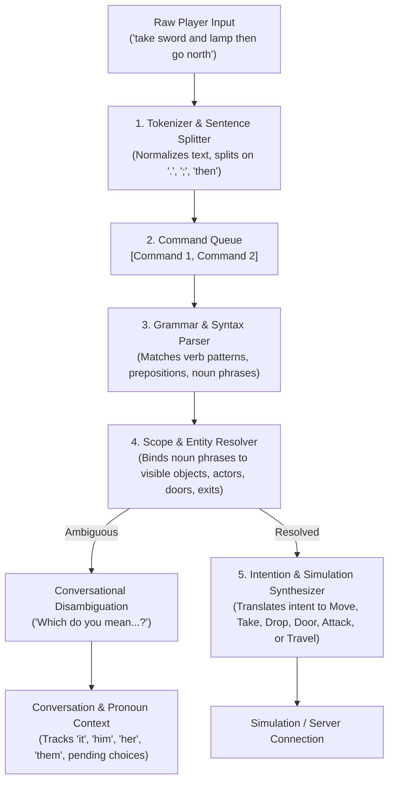

# Interactive Fiction Parser Architecture

This document specifies the architecture and implementation design for the
natural language Interactive Fiction (IF) parser and interface in `tor-client-text`.

## 1. Vision and Goals

The text client provides an authentic, advanced Interactive Fiction interface
modeled on the standards established by MDL Zork (1979), Infocom (ZIL), and
modern IF design (Inform 7, TADS 3).

### Key Principles

1. **Complete Protocol Abstraction**: The player interacts with a living
   narrative world. Protocol mechanics—such as numeric `#id` entities,
   `expected_revision`, discrete grid coordinates, ticks, and raw RPC error
   codes—are strictly encapsulated beneath the IF paradigm and never leaked
   to the player.
2. **Dedicated Division of Responsibilities**:
   - `tor-client-headless` is the automation and testing client for protocol,
     geometry, perception, and scenario verification.
   - `tor-client-text` is dedicated to player-facing interactive fiction,
     natural language comprehension, narrative prose, and conversational play.
3. **World-Class Natural Language Understanding**:
   - **Sentence chaining**: Multiple commands on one line separated by `.`, `;`,
     or `then` / `and then` (e.g. `take lamp. go east. open door`).
   - **Prepositional & Ditransitive Grammar**: Full `<verb> <direct-object> <preposition> <indirect-object>`
     structures (e.g. `hit goblin with sword`, `take coin from floor`, `unlock door with key`).
   - **Compound Nouns & Conjunctions**: `take sword and shield`, `take all`,
     `drop all except token`, `take 3 arrows`.
   - **Adjectives & Ordinals**: `the rusty sword`, `wooden door`, `the second token`.
   - **Pronouns & Context**: Pronoun tracking (`it`, `them`, `him`, `her`) updated
     dynamically as entities are mentioned, examined, or manipulated.
   - **Conversational Disambiguation**: Natural in-world clarification prompts
     (*"Which token do you mean: the copper token or the silver token?"*)
     resolved seamlessly on the next turn (*"the copper one"* or *"copper"*)
     without numeric IDs or technical menus.
   - **Literary Feedback**: Classic IF responses and failure descriptions
     replaces raw diagnostic errors.

---

## 2. Architecture Overview



---

## 3. Component Specifications

### 3.1 Lexer and Tokenizer (`parser::lexer`)

The lexer converts raw user input strings into a sequence of sentences, where
each sentence is a list of typed tokens.

- **Sentence Delimiters**: Split input on `.`, `;`, `!`, `?`, `then`, and `and then`.
  Example: `get torch. e. open door` becomes 3 distinct command buffers.
- **Normalization**: Trim whitespace, convert case to lowercase while preserving
  punctuation marks, and strip noise characters.
- **Token Classification**:
  - `Word(String)`: Regular words (nouns, adjectives, verbs).
  - `Number(u64)`: Explicit quantities (e.g. `3`, `12`).
  - `Direction(Direction)`: Cardinal, diagonal, and vertical directions (`n`, `north`, `ne`, `up`, etc.).
  - `Punctuation(char)`: Commas, periods, semicolons.
  - `Quoted(String)`: Quoted text for communication or naming (`say "hello"`).

### 3.2 Lexicon & Grammar (`parser::grammar`)

The grammar defines accepted sentence structures declaratively through syntax
rules.

- **Parts of Speech**:
  - **Verbs**: Primary action indicators with rich synonym sets:
    - *Examine*: `examine`, `x`, `look at`, `inspect`, `read`, `study`, `search`.
    - *Take*: `take`, `get`, `pick up`, `grab`, `carry`.
    - *Drop*: `drop`, `put down`, `discard`, `leave`.
    - *Open / Close*: `open`, `close`, `shut`.
    - *Combat*: `attack`, `kill`, `hit`, `fight`, `strike`, `slay`.
    - *Movement*: `go`, `walk`, `head`, `run`, `climb`, `enter`, `exit`.
    - *Intransitive*: `look`/`l`, `inventory`/`i`, `wait`/`z`, `quit`/`q`, `again`/`g`, `diagnose`, `help`.
    - *Sensory & Environment*: `listen`/`hear`, `smell`/`sniff`, `search`.
    - *Consumables*: `drink`/`quaff`/`sip`, `eat`/`taste`/`consume`.
    - *Equipment*: `wear`/`don`/`put on`, `wield`/`equip`/`brandish`, `remove`/`doff`/`take off`.
    - *Manipulation*: `put`, `give`, `insert`, `push`/`shove`, `pull`/`drag`, `turn`/`rotate`, `unlock`, `lock`.
    - *Social*: `talk to`/`speak to`, `ask <actor> about <topic>`.
  - **Prepositions**: Words defining spatial and instrumental relations:
    `with`, `using`, `in`, `into`, `inside`, `on`, `onto`, `upon`, `under`, `behind`, `from`, `to`, `at`, `through`, `off`, `about`.
  - **Determiners**: Noise words ignored during matching: `the`, `a`, `an`, `some`, `this`, `that`.
  - **Conjunctions**: `and`, `,`, `except`, `but`.
  - **Pronouns**: `it`, `them`, `him`, `her`, `that`.
  - **Ordinals**: `first`, `1st`, `second`, `2nd`, `third`, `3rd`, `last`.

- **Syntax Rule Types**:
  1. `Intransitive(Verb)`: E.g., `look`, `inventory`, `wait`, `again` / `g`, `diagnose`, `search`.
  2. `Directional(Direction)`: E.g., `north`, `ne`, `climb up`, `go south`.
  3. `Transitive(Verb, NounPhrase)`: E.g., `take brass lantern`, `read tablet`, `drink potion`, `wear ring`, `wield sword`, `talk to goblin`.
  4. `Ditransitive(Verb, NounPhrase, Preposition, NounPhrase)`:
     E.g., `hit goblin with iron sword`, `take coin from floor`, `put sword on floor`, `give ring to goblin`, `ask goblin about key`.
  5. `CompoundTransitive(Verb, Vec<NounPhrase>)`: E.g., `take sword and shield`.

### 3.3 Noun Phrases and Scope Binding (`parser::resolver`)

A noun phrase represents the player's reference to one or more game entities:

```rust
pub struct NounPhrase {
    pub determiner: Option<Determiner>,
    pub quantity: Option<Quantity>,
    pub adjectives: Vec<String>,
    pub head: Option<String>,
    pub ordinal: Option<usize>,
    pub pronoun: Option<Pronoun>,
    pub exception: Option<Box<NounPhrase>>,
}
```

#### World Scope
Scope represents all entities the player can currently perceive or interact with,
constructed directly from the disclosed `StateView`:
1. **Carried items**: Items in `observation.inventory`.
2. **Ground items**: Items in `observation.ground_items` (reachable or visible).
3. **Doors**: Doors in `observation.visible_cells`.
4. **Actors**: Other figures in `observation.visible_actors`.
5. **Surfaces / Scenery**: Visible walls, floor, and ceiling.
6. **Exits / Places**: Disclosed navigation anchors and bearings.

#### Matching & Scoring
Candidate entities are scored against the noun phrase:
- **Exact word matches**: Adjectives and head nouns compared against object names and descriptions.
- **Pronoun expansion**: Replacing `it`/`them`/`him`/`her` with current contextual referents.
- **Plural & Quantifiers**: Resolving `all` or `everything` into all suitable objects in scope (e.g. all ground items for `take all`).

### 3.4 Context Memory & Conversational Disambiguation (`parser::context`)

The conversation context preserves state between user turns:
- **Pronoun referents**:
  - `it`: Last referenced inanimate entity (e.g., `copper token`, `door`).
  - `him` / `her`: Last referenced person or creature.
  - `them`: Last referenced group or plural items.
- **Pending Disambiguation**:
  - If a noun phrase matches multiple distinct entities (e.g., `copper token` and `silver token` for `take token`), the parser generates a conversational question:
    > *"Which token do you mean: the copper token or the silver token?"*
  - The context stores the partially completed command and candidate set.
  - On the following turn, an input such as *"the copper one"*, *"copper"*, or *"the first one"* completes the pending command naturally.

### 3.5 Simulation Synthesis (`adventure::synthesizer`)

The resolved IF command is converted into backend simulation commands:
- **Immediate vs. Compound Travel**:
  - If a target entity is already reachable (or adjacent), issue the direct action (`Action::Take`, `Action::SetDoor`, `Action::Attack`).
  - If the target entity is visible but out of reach, issue a `Command::Travel` to approach it, chaining the action upon arrival (e.g. *"You walk over to the stone tablet and pick it up."*).
- **Interruption Handling**:
  - If travel is interrupted by a hazard or block, narrative feedback explains why and cancels any pending chained actions and queued commands.
- **Command Queue Execution**:
  - Queued commands from multi-command inputs execute sequentially as each action finishes, pausing when player interaction or clarification is needed.

---

## 4. Testing Strategy

Following the repository [testing policy](testing.md):
1. **Parser Unit Tests**: Complete unit tests covering lexing, tokenization,
   synonyms, prepositions, conjunctions, plurals, ordinals, and pronouns.
2. **Disambiguation Unit Tests**: Verifying conversational clarification prompts
   and multi-turn resolution.
3. **Simulation Mapping Tests**: Verifying that resolved IF intents map
   deterministically to protocol actions without protocol leaks.
4. **Actual-Process Acceptance Tests**: Full process acceptance testing
   driving natural IF transcripts through `scripts/test_adventure_process.py`.

---

## 5. Client-Side Narrative vs. Server-Side World Mutations

A foundational principle of `tor-client-text` is delivering an authentic, immersive
Interactive Fiction experience matching MDL Zork and Inform 7 even when the underlying
simulation engine has not yet implemented specific backend mutation subsystems.

### Current Protocol Scope (Milestone 4e)
The server-authoritative protocol currently defines the following `Action` mutations:
- `Action::Move { direction }` (discrete grid displacement and step execution)
- `Action::Take { item, quantity }` (inventory acquisition from ground)
- `Action::Drop { item, quantity }` (inventory placement to ground)
- `Action::SetDoor { door, open }` (door opening and closing)
- `Action::Attack { target }` (combat engagement against visible actors)
- `Action::Wait` (turn advancement and combat continuation)

### Simulated Client Narrative Actions
To preserve natural IF interaction depth without waiting for server-side equipment,
alchemy, or hunger systems, `tor-client-text` provides simulated literary feedback:
1. **Equipment Operations**:
   - `wear` / `don` -> *"You put on the <item>."*
   - `wield` / `equip` -> *"You ready the <item> for combat."*
   - `remove` / `doff` -> *"You take off the <item>."*
2. **Consumables**:
   - `drink` / `quaff` -> *"You take a sip of the <item>. It is refreshing, though it has no further effect right now."*
   - `eat` / `consume` -> *"You sample the <item>. It sustains you, though it has no further effect right now."*
3. **Physical Manipulation**:
   - `push` / `pull` / `turn` -> Contextual feedback for scenery, doors, and actors.
4. **Social & Speech**:
   - `talk to` / `ask <actor> about <topic>` -> Authentic NPC silence/glare feedback.

### Engine Integration Hook Points
When future engine milestones implement server-authoritative equipment slots and
consumable item effects, the client implementation in [`adventure.rs`](file:///f:/gemini/TOR/crates/client-text/src/adventure.rs)
is explicitly annotated with structured hook comments:
- `// HOOK[engine:equipment]`: In `fn object()`, replace the simulated `Intent::Say(...)`
  branches for `wear`, `wield`, and `remove` with `Intent::Action(Action::Equip { item: id, slot })`
  and `Intent::Action(Action::Unequip { item: id })`.
- `// HOOK[engine:consumables]`: In `fn object()`, replace simulated `drink` and `eat`
  branches with `Intent::Action(Action::Consume { item: id })`.
- `// HOOK[engine:social]`: In `fn talk_to()`, replace conversational defaults with
  dialogue requests once an NPC dialogue tree protocol is established.

Because client presentation is entirely derived from disclosed `StateView` updates,
upgrading these hook points from client narrative to backend actions will require
zero changes to the parsing, disambiguation, or pronoun tracking pipelines.
