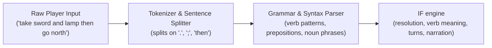

# Interactive Fiction Parser Architecture

This document specifies the architecture and implementation design for the
natural language Interactive Fiction (IF) parser and interface in `tor-client-text`.

## 1. Vision and Goals

The text client provides an authentic, advanced Interactive Fiction interface
modeled on the standards established by MDL Zork (1979), Infocom (ZIL), and
modern IF design (Inform 7, TADS 3).

### Key Principles

1. **Complete Protocol Abstraction**: The player interacts with a living
   narrative world. Protocol mechanics—such as numeric `#id` entities,
   `expected_revision`, discrete grid coordinates, ticks, and raw RPC error
   codes—are strictly encapsulated beneath the IF paradigm and never leaked
   to the player.
2. **Dedicated Division of Responsibilities**:
   - `tor-client-headless` is the automation and testing client for protocol,
     geometry, perception, and scenario verification.
   - `tor-client-text` is dedicated to player-facing interactive fiction,
     natural language comprehension, narrative prose, and conversational play.
3. **World-Class Natural Language Understanding**:
   - **Sentence chaining**: Multiple commands on one line separated by `.`, `;`,
     or `then` / `and then` (e.g. `take lamp. go east. open door`).
   - **Prepositional & Ditransitive Grammar**: Full `<verb> <direct-object> <preposition> <indirect-object>`
     structures (e.g. `hit goblin with sword`, `take coin from floor`, `unlock door with key`).
   - **Compound Nouns & Conjunctions**: `take sword and shield`, `take all`,
     `drop all except token`, `take 3 arrows`.
   - **Adjectives & Ordinals**: `the rusty sword`, `wooden door`, `the second token`.
   - **Pronouns & Context**: Pronoun tracking (`it`, `them`, `him`, `her`) updated
     dynamically as entities are mentioned, examined, or manipulated.
   - **Conversational Disambiguation**: Natural in-world clarification prompts
     (*"Which do you mean, the copper token or the silver token?"*)
     resolved seamlessly on the next turn (*"the copper one"* or *"copper"*)
     without numeric IDs or technical menus.
   - **Literary Feedback**: Classic IF responses and failure descriptions
     replaces raw diagnostic errors.

---

## 2. Architecture Overview



---

## 3. Component Specifications

### 3.1 Lexer and Tokenizer (`parser::token`)

The lexer converts raw user input strings into a sequence of sentences, where
each sentence is a list of typed tokens.

- **Sentence Delimiters**: Split input on `.`, `;`, `!`, `?`, `then`, and `and then`.
  Example: `get torch. e. open door` becomes 3 distinct command buffers.
- **Normalization**: Trim whitespace, convert case to lowercase while preserving
  punctuation marks, and strip noise characters.
- **Token Classification**:
  - `Word(String)`: Regular words (nouns, adjectives, verbs).
  - `Number(u64)`: Explicit quantities (e.g. `3`, `12`).
  - `Direction(Direction)`: Cardinal, diagonal, and vertical directions (`n`, `north`, `ne`, `up`, etc.).
  - `Punctuation(char)`: Commas, periods, semicolons.
  - `Quoted(String)`: Quoted text for communication or naming (`say "hello"`).

### 3.2 Lexicon & Grammar (`parser::grammar`)

The grammar defines accepted sentence structures declaratively through syntax
rules.

- **Parts of Speech**:
  - **Verbs**: about seventy verbs with their synonyms, drawn from MDL Zork and
    NetHack, are in `parser::lexicon` (`take`/`get`/`grab`/`pick up`,
    `attack`/`kill`/`hit`, `examine`/`x`/`look at` and so on). Multi-word verbs
    such as `pick up`, `put down`, `put on`, `take off`, `turn on`, `blow out`,
    `talk to` and `look around` are recognized first. A bare verb parses as
    intransitive; the engine asks for an object when it needs one.
  - **Prepositions**: Words defining spatial and instrumental relations:
    `with`, `using`, `in`, `into`, `inside`, `on`, `onto`, `upon`, `under`, `behind`, `from`, `to`, `at`, `through`, `off`, `about`.
  - **Determiners**: Noise words ignored during matching: `the`, `a`, `an`, `some`, `this`, `that`.
  - **Conjunctions**: `and`, `,`, `except`, `but`.
  - **Pronouns**: `it`, `them`, `him`, `her`, `that`.
  - **Ordinals**: `first`, `1st`, `second`, `2nd`, `third`, `3rd`, `last`.

- **Syntax Rule Types**:
  1. `Intransitive(Verb)`: E.g., `look`, `inventory`, `wait`, `again` / `g`, `diagnose`, `search`.
  2. `Directional(Direction)`: E.g., `north`, `ne`, `climb up`, `go south`.
  3. `Transitive(Verb, NounPhrase)`: E.g., `take brass lantern`, `read tablet`, `drink potion`, `wear ring`, `wield sword`, `talk to goblin`.
  4. `Ditransitive(Verb, NounPhrase, Preposition, NounPhrase)`:
     E.g., `hit goblin with iron sword`, `take coin from floor`, `put sword on floor`, `give ring to goblin`, `ask goblin about key`.
  5. `MultiTransitive(Verb, Vec<NounPhrase>)`: E.g., `take sword and shield`.

### 3.3 Noun phrases

A noun phrase represents the player's reference to one or more game entities:

```rust
pub struct NounPhrase {
    pub raw: String,
    pub head: Option<String>,
    pub adjectives: Vec<String>,
    pub determiner: Option<String>,
    pub quantity: Option<u64>,
    pub ordinal: Option<usize>,
    pub pronoun: Option<Pronoun>,
    pub all: bool,
    pub is_one: bool,
    pub except: Option<Box<NounPhrase>>,
}
```

The parser stops here. What a phrase refers to, pronouns, questions, what a
verb means and how its actions run and are narrated belong to the
[IF engine](if-engine.md): `engine::scene` builds the referents,
`engine::resolve` binds phrases to them, `engine::verbs` gives verbs their
meaning, and `engine::turn` and `engine::narrate` run and tell each turn.

## 4. Testing Strategy

Following the repository [testing policy](testing.md):

1. **Parser unit tests** (`#[cfg(test)]` modules in `parser/`): tokenizing,
   sentences, noun phrases and grammar.
2. **Parser pipeline tests** (`crates/client-text/tests/it/parser.rs`): whole
   sentences through the parser, and what the engine's resolver binds them to.
3. The engine's own tests are listed in [the IF engine](if-engine.md#testing).

## 5. Verbs the game doesn't support yet

The lexicon recognizes verbs from MDL Zork and NetHack that the game has no
rules for yet: `wear`, `wield`, `remove`, `eat`, `drink`, `give`, `show`,
`throw`, `fire`, `unlock`, `lock`, `push`, `pull`, `turn`, `kick`, `break`,
`cut`, `burn`, `light`, `extinguish`, `dig`, `fill`, `pour`, `use`, `engrave`,
`zap`, `rub`, `tie`, `untie`, `wave`, `knock`, `sit`, `jump`, `swim`, `sleep`,
`pray`, `talk`, `ask`, `tell`, `say`, `search`, `climb`, `enter` and `exit`.
They parse like any other verb, the engine resolves their objects, and then
says plainly that it can't be done: "You can't wear anything yet." The client
never narrates an effect the game didn't have. When the game gains an action,
supporting its verbs is one entry in the engine's verb table.
