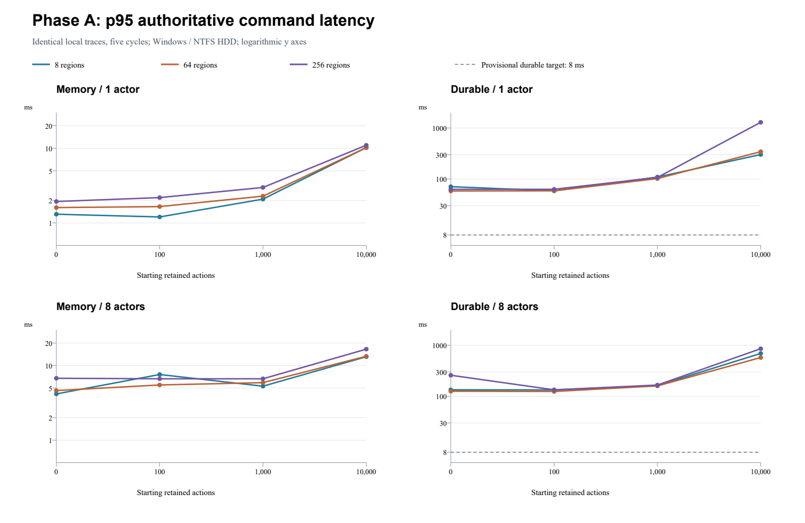
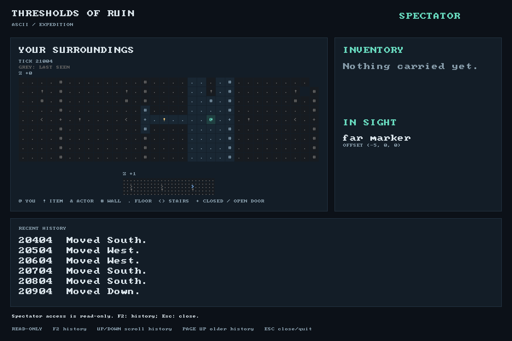

# Phase A performance findings

Date: 2026-09-24. Phase A is complete. Phase B remains unimplemented.

The baseline supports continuing with the planned persistence work, then addressing
state copies and client memory growth. The principal findings are:

- All 32 durable cases missed the provisional p95 target: observed p95 ranged
  from 51.32 to 1,292.96 ms; the largest observed maximum was 11.09 s.
  File sync dominated the measured durable means.
- History growth is costly even in memory. At eight regions and one actor,
  p95 increased from 1.20 ms at 100 starting actions to 10.20 ms at 10,000.
  Candidate capture and disposal of the previous state grow; full encoding
  adds another history-dependent cost during durable commands.
- The largest case wrote 12.42 GiB during 2,496 accepted commands to produce a
  5.69 MiB final save: about 2,234 times its final size. Its restart took 110 s.
- Growing discovery reached 20,956 remembered cells. Mean client update time
  over a region traversal rose from 0.164 to 9.691 ms; rendering rose from
  0.614 to 1.119 ms. Stationary local traces alone miss this client cost.



Histories are discrete test cases; the vertical axes are logarithmic. Durable
tail differences are strongly affected by storage and run order, so they do not
establish a causal world-size penalty. The fixed-history memory comparison below
better isolates the observed world-size trend. The
[chart source](measurements/phase-a-2026-09-24/plot.py) uses ReportLab and pypdfium2
with the retained matrix summary.

## Reproducible baseline

The [harness guide](performance-harness.md) defines the shared geometry/trace,
exact action coverage, and timing boundaries. The retained
[manifest](measurements/phase-a-2026-09-24/manifest.json) identifies the source,
release binaries, toolchain, hardware, commands, and validation.

The machine has an Intel i7-9750H (6 cores / 12 threads), approximately 16 GiB
RAM, Windows 11 build 26200, and Rust 1.98.1 (`x86_64-pc-windows-msvc`). Saves and
raw output are on the project's F: NTFS Seagate HDD. `TMP` and `TEMP` were scoped
to a directory on that drive. An incomplete preliminary run on the nearly full
C: NVMe SSD was discarded and is not combined with this baseline.

The matrix uses five complete primary cycles per case, seed 42, no warmup,
and 1/8/64/256 regions, 1/8 actors, 0/100/1,000/10,000 starting actions, and
memory/durable mode. Secondary actors take real scheduled turns, so the sample
count and ending history depend on actor count. Single-region cases have the
shorter applicable interior trace. Raw samples include every blocked attempt
separately; successful mixed distributions exclude them.

Results are diagnostic on this machine and storage device. They are not CI
latency limits. Normal OS/background activity was not isolated. Cases ran
sequentially without concurrent builds or test suites, so file-cache/device
state and time-of-run effects remain possible. Operation counts and actual
bytes provide more stable evidence of algorithmic scaling than wall time alone.
The complete run, including normal replay of every final archive, took 109.8 minutes.

## Complete matrix and measured bottlenecks

Validation passed for all 64 cases: 78,064 ordered attempts, 77,424 accepted commands, and 3,575 separate discovery actions. Every case passed normal replay and final disclosed-state comparison. The [compressed raw JSONL](measurements/phase-a-2026-09-24/samples.jsonl.gz) retains all actions, profiles and per-label distributions; the [matrix summary](measurements/phase-a-2026-09-24/matrix-summary.json) retains every case's mixed distributions and restart/save totals.

```sh
python scripts/performance_report.py docs/measurements/phase-a-2026-09-24/samples.jsonl.gz
```

Representative eight-region cases keep the same local geometry and action mix across histories. Times below are successful authoritative commands, in milliseconds. Ending histories are explicit because eight actors perform many more turns per primary cycle.

| Actors | Start → end history | Mode | n | Mean | p50 | p95 | Max |
| ---: | ---: | --- | ---: | ---: | ---: | ---: | ---: |
| 1 | 0 → 305 | memory | 305 | 0.70 | 0.62 | 1.31 | 2.11 |
| 1 | 0 → 305 | durable | 305 | 46.71 | 39.84 | 70.84 | 615.86 |
| 1 | 100 → 405 | memory | 305 | 0.70 | 0.63 | 1.20 | 1.53 |
| 1 | 100 → 405 | durable | 305 | 46.24 | 39.90 | 58.56 | 530.56 |
| 1 | 1,000 → 1,305 | memory | 305 | 1.41 | 1.31 | 2.08 | 3.07 |
| 1 | 1,000 → 1,305 | durable | 305 | 58.10 | 47.46 | 109.20 | 610.93 |
| 1 | 10,000 → 10,305 | memory | 305 | 9.31 | 9.23 | 10.20 | 19.47 |
| 1 | 10,000 → 10,305 | durable | 305 | 188.27 | 159.38 | 301.76 | 988.04 |
| 8 | 0 → 2,496 | memory | 2,496 | 3.08 | 3.03 | 4.16 | 7.73 |
| 8 | 0 → 2,496 | durable | 2,496 | 64.35 | 53.11 | 133.89 | 762.42 |
| 8 | 100 → 2,600 | memory | 2,500 | 3.82 | 3.57 | 7.58 | 11.68 |
| 8 | 100 → 2,600 | durable | 2,500 | 64.36 | 52.35 | 133.09 | 750.84 |
| 8 | 1,000 → 3,496 | memory | 2,496 | 3.97 | 3.89 | 5.29 | 18.30 |
| 8 | 1,000 → 3,496 | durable | 2,496 | 77.63 | 60.25 | 162.19 | 869.74 |
| 8 | 10,000 → 12,496 | memory | 2,496 | 11.76 | 11.71 | 13.11 | 29.12 |
| 8 | 10,000 → 12,496 | durable | 2,496 | 264.21 | 179.14 | 691.41 | 7601.72 |

World-size comparison holds the starting history at 1,000 and uses identical applicable traces. One-region cases use a shorter trace and should not be treated as a directly interchangeable world-size control.

| Regions | Actors | Memory p95 ms | Durable p95 ms | Memory perception mean ms | Memory navigation mean ms |
| ---: | ---: | ---: | ---: | ---: | ---: |
| 8 | 1 | 2.08 | 109.20 | 0.30 | 0.12 |
| 64 | 1 | 2.28 | 102.06 | 0.35 | 0.13 |
| 256 | 1 | 2.99 | 107.41 | 0.43 | 0.14 |
| 8 | 8 | 5.29 | 162.19 | 1.48 | 0.45 |
| 64 | 8 | 5.90 | 159.65 | 1.75 | 0.48 |
| 256 | 8 | 6.64 | 165.95 | 2.14 | 0.51 |

Exclusive phase means for selected durable cases (ms); client application/rendering are separate and excluded. These means can be added within a case. The raw distributions retain each phase's tails.

| Exclusive phase | 8 regions / 1 actor / h100 | 8 / 1 / h10,000 | 256 / 8 / h10,000 |
| --- | ---: | ---: | ---: |
| Candidate capture | 0.39 | 8.18 | 8.62 |
| Simulation | 0.07 | 0.04 | 0.01 |
| Navigation | 0.31 | 0.17 | 0.63 |
| Perception | 0.74 | 0.42 | 2.73 |
| Revision comparison | 0.00 | 0.00 | 0.01 |
| Rewind snapshot | 0.06 | 0.07 | 0.34 |
| Encoding | 0.53 | 8.36 | 7.80 |
| Write / flush | 0.50 | 4.62 | 4.66 |
| File sync | 41.75 | 156.79 | 266.20 |
| Replacement | 1.16 | 1.94 | 2.97 |
| Publication / previous-state disposal | 0.30 | 6.15 | 7.95 |
| Other | 0.44 | 1.53 | 1.66 |
| Total | 46.24 | 188.27 | 303.57 |

### Work and I/O amplification

The current successful command captures one candidate and one rewind snapshot, refreshes navigation once, and compares two revision views per actor. Scene/observation counters include nested door validation and navigation calls; they are not inferred from actor count. All cases retained at most 128 rewind boundaries. The assertions permit later implementations to reduce these counts.

Whole-archive encoding serializes every retained record on each durable action. Bytes below are actual underlying writes; the sum excludes setup, restart, and external driver logging. Restart time includes normal replay and the existing startup save.

| Case | Accepted | End records | Final save MiB | Action writes GiB | Writes / final size | Restart seconds |
| --- | ---: | ---: | ---: | ---: | ---: | ---: |
| r8-a1-h0-durable | 305 | 305 | 0.17 | 0.03 | 153.0× | 0.27 |
| r8-a1-h10000-durable | 305 | 10,305 | 4.68 | 1.37 | 299.5× | 51.28 |
| r8-a8-h0-durable | 2,496 | 2,496 | 1.19 | 1.45 | 1247.2× | 7.67 |
| r8-a8-h10000-durable | 2,496 | 12,496 | 5.69 | 12.42 | 2234.1× | 96.49 |
| r256-a8-h10000-durable | 2,496 | 12,496 | 5.69 | 12.42 | 2234.1× | 109.98 |

### Focused workload distributions

Five primary cycles in `r8-a1-h1000-durable`; authoritative command times in ms. The small sample counts for individual transitions limit percentile precision. The complete raw file includes the same distributions for all applicable cases and phases.

| Workload | n | Mean | p50 | p95 | Max |
| --- | ---: | ---: | ---: | ---: | ---: |
| change_elevation | 20 | 53.30 | 47.99 | 79.87 | 109.20 |
| cross_boundary_with_los_change | 10 | 54.08 | 48.29 | 113.53 | 113.53 |
| cross_region_boundary | 10 | 41.55 | 38.31 | 48.79 | 48.79 |
| move_near_obstacle | 50 | 50.97 | 47.97 | 86.15 | 110.44 |
| move_same_region | 170 | 55.03 | 46.46 | 105.31 | 590.36 |
| open_or_close_door | 40 | 88.86 | 49.09 | 296.68 | 610.93 |
| wait_same_region | 5 | 48.02 | 50.37 | 53.37 | 53.37 |
| multi_actor_visibility_change (8 actors) | 313 | 74.24 | 58.63 | 159.19 | 660.40 |

Intentional blocked-obstacle/door attempts have only total command-call timing and remain outside every successful mixed total. They change no state, tick, receipt, or retained history.

### Growing discovery and client work

This separate memory-only trace traverses every region. Client application uses the same persistent observer throughout; rendering draws the actual ASCII canvas. First/last values below are mean times over the first/last 11-action region traversal, which keeps the compared action mix constant.

| Regions | Actions | Remembered cells first → last | Apply first → last ms | Render first → last ms |
| ---: | ---: | ---: | ---: | ---: |
| 8 | 77 | 45 → 620 | 0.167 → 0.596 | 0.595 → 0.800 |
| 64 | 693 | 45 → 5,212 | 0.156 → 4.143 | 0.565 → 1.154 |
| 256 | 2,805 | 45 → 20,956 | 0.164 → 9.691 | 0.614 → 1.119 |

Growing discovery measures a different trajectory from repeating local cycles. Both authoritative history/navigation knowledge and the client remembered map grow. These results must not be attributed solely to total distant world size.

## Actual-client presentation and desktop verification

The [actual-client samples](measurements/phase-a-2026-09-24/actual-client.json)
retain three unpaced release cycles in the 256-region world plus forward travel
between cycles: 211 attempts, 205 accepted commands, six deliberate blocked
attempts. Actor 1's remembered map grew from 44 to 581 cells and the confirmed
spectator revision advanced from 0 to 205.

| Driver-observed interval | n | Mean ms | p50 ms | p95 ms | Maximum ms |
| --- | ---: | ---: | ---: | ---: | ---: |
| Request to acknowledgement | 205 | 82.69 | 56.36 | 236.37 | 762.11 |
| Request to headless ready | 205 | 84.34 | 58.14 | 237.83 | 764.78 |
| Request to matching presented frame | 205 | 147.50 | 116.68 | 295.39 | 814.21 |

These intervals include diagnostic JSON reporting; presentation also includes
framebuffer capture. They differ from server-only authoritative timing and from
GPU/display latency. Logs and the save use the same F: drive. Pacing, snapshot
requests, and progress annotations are outside action timing; the unpaced run
has no progress-annotation saves.



All four actual desktop shortcuts were launched and verified: Text, ASCII,
Text + ASCII Spectator, and 256 Region Spectator. Binaries, helpers, and icons
point to the rebuilt debug directory. Text controls the paired game and ASCII
uses a distinct server-enforced spectator credential. Each launch retained a
fresh save and cleaned up its owned processes. The paced fourth shortcut showed
three complete cycles with visible workload progress before its window was
closed to verify cleanup. Machine-local launchers, credentials, and saves are
not published.

## Correctness findings and storage handoff

TDD exposed a same-tick readiness bug: an actor could become ready without a
revision change, so real clients did not receive the handoff. Revision comparison
now includes readiness, with unit and actual eight-client regressions. Strict
replay is retained; older multi-actor receipts using the previous revisions may
fail replay and are not migrated. Failed replay preserves the original file.

History setup is detached-only and checked against normal commands, including
all retained rewind boundaries. Diagnostic saves honor the save lock. Phase
measurements are exclusive, count nested scene/perception work at real call
sites, and retain the intended buffered streaming writer. No harness-owned
client clone or update construction is inside client-application timing.

The [storage review](persistence-review.md) records real writer/publication fault
coverage and the reviewed future frame/checkpoint contract. The current writer
still lacks a demonstrated name-durability barrier for the power-loss contract.
Process recovery tests do not prove that contract. The toy scanner/checkpoint
models have been removed; append storage, checkpointing, rotation, caching, and
state-copy optimizations remain later work.

## Verification

Local workspace tests passed in debug and release, along with formatting,
Clippy, architecture checks, documentation/link checks, and Rust documentation
with warnings denied. All 52 release frontend process tests passed. Debug
frontend tests also passed after rerunning the native mouse test with interactive
desktop permission; its first sandboxed run was denied `SetCursorPos` access.
The large release actual-client run and all four shortcut paths were verified
separately. Both [Windows and Linux CI](https://github.com/KCall360/thresholds-of-ruin/actions/runs/35954192426)
passed on implementation commit `21d0b5e`, including debug/release Rust and
actual-client process tests.
