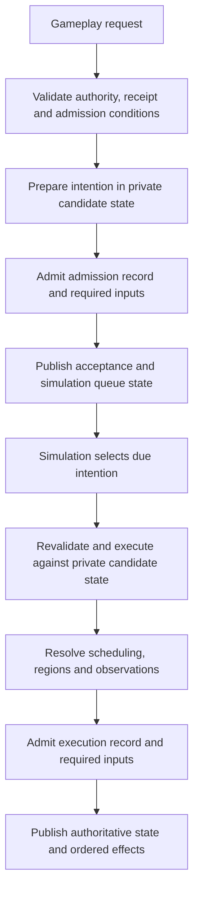

# Architecture refactor

The accepted six-sequence implementation is published and its integrated review
found no outstanding implementation gap. The published checkpoint passed the
required Windows/Linux CI. This is a completed implementation review, not a
claim that the separate performance milestone or scripting runtime is complete.
The [roadmap](milestones.md) owns status; [architecture](architecture.md) owns
current boundaries and [testing](testing.md) owns verification requirements.

## Contracts to preserve

The server owns authority, world topology, scheduling, and disclosure. Gameplay
requests admit intentions to a simulation-owned action queue. Admission and
execution are distinct: the scheduler resolves due actions and publishes their
effects. Queries, annotations, and session operations can finish immediately.
Player, AI, travel, and eventual script intentions should use the same execution
path. Submit-time checks do not replace execution-time checks when intervening
actions can change targets, timing, or authority.

Every authoritative mutation is prepared against private candidate state. Its
journal record and required content must be admitted to persistence before state
and ordered effects are published. Retries resolve existing receipts; reconnect
must not duplicate an uncertain action. Queue, cancellation, restart, rewind,
and region-freezing semantics belong in deterministic saved state.

Each increment must have clear ownership, explicit domain states and cohesive
interfaces. Review repeated decisions and special cases at their owning boundary.
An abstraction should make the permitted operations easier to follow and reduce
duplicated rules. Regression tests establish behavior; architectural review and
measurements establish maintainability and performance within their stated scope.

The gameplay flow has two persistence/publication boundaries. The merged queue
foundation connects human intentions, backend admission and execution, journal
replay, and client lifecycle tracking. Published preparation recovery adds
original-identity resume/cancel, durable interruption facts, explicit paused
preparation, and a typed lifecycle proof shared by replay and checkpoint recovery.
Autonomous decisions use the published common queue path. Native travel integration
is published, along with stream contexts and recovery. The six accepted implementation sequences have been reviewed together;
new feature and performance follow-up work is scoped separately.

Immediate queries and metadata operations use their own request paths. An
acceptance acknowledges the queued intention. Clients use simulation effects and
authoritative readiness to determine when subsequent gameplay intentions are available.

Spatial indexes are backend-only derived data. Keys use region-local locations;
no global Euclidean distance is assumed. Occupancy includes every portal-resolved
body cell and its frame. Queries crossing regions follow portal topology. Clients
may index disclosed opaque identities and relative projections, never private
region identities or authoritative occupancy.

## Accepted implementation scope

1. **Explicit boundaries and focused responsibilities.** Replace implicit JSON
   conversions with exhaustive typed mappings. Separate transport, backend
   commands, simulation outcomes, journal entries, disclosed views, authoring
   schemas, compiled content, and persistence schemas. Extract responsibilities
   from the engine and session without changing ordering or durability.
2. **Reuse derived work.** Build each actor's observation once per boundary and
   reuse it for revision comparison, navigation knowledge, and client publication.
   Preserve observer privacy and intermediate memory. Prepare an AI decision once
   at its valid boundary. Share route searches. Add spatial and historical indexes
   with centralized mutation and rebuild after load, replay, rewind, and region
   transitions. Compare optimized queries with reference scans.
3. **Admission, scheduling, and stream recovery.** Make action admission and
   completion explicit; bound mailbox work and output queues with fair scheduling.
   Define slow-controller and spectator policies. Add stream identities, reset
   epochs, exact delta bases, readiness revisions, contextual receipts, and
   resynchronization. Validate snapshots and deltas centrally, including duplicate
   identifiers, arithmetic overflow, bounds, and collection invariants. Measure
   collection deltas against encoded full snapshots. Keep projected occurrences
   separate from underlying entities and protect journal identity from disclosure.
   Bound decode bytes and nesting and outbound bytes as well as message counts.
   Make integer encoding safe for future JavaScript clients. Add explicit
   capabilities and opaque, typed interaction identifiers without exposing
   private topology or eventual script functions.
4. **Scenario compilation.** Decouple authoring types from simulation internals.
   Normalize defaults and inheritance, resolve references with source diagnostics,
   and compile immutable content. Pin dependencies by identity and digest.
   Derive generation seeds from semantic parameters, stable region identity,
   generator version, and an explicit salt; use named random streams for geometry,
   population, and loot. Keep structural metadata and identifiers independent of
   activation order. Preserve lazy construction and distinguish sampled validation
   from proof of all possible generated worlds.
5. **Persistence and history.** Introduce explicit save DTOs and independent
   format/version axes. Pool immutable content across rewind boundaries. Keep the
   journal authoritative and receipts/indexes reconstructible. Bound decoding and
   reject duplicate/unknown fields in one validation path. Admit source blobs and
   journal records atomically; paths are locators, digests are identity. Measure
   compression and chunking before adoption. Add indexed, privacy-filtered history
   pagination without silently pruning retained history.
   Design portable save export separately from runtime storage. Bound resident
   history using storage-backed access when measurements justify it.
6. **Latency and extension seams.** Remove synchronous diagnostics from hot paths,
   shorten storage lock scope, and measure region fallback and checkpoint capture.
   Retain existing workload targets and investigate timing tails. Define future
   extension contracts around scoped queries, validated effects, deterministic RNG,
   named handlers, persistent typed state, scheduling, and region suspension.
   No language, VM, or package script support is added in this refactor.

## Verification and measured limits

Behavior tests cover typed boundaries, reference-equivalent indexes, queued
player/AI/travel actions, restart and preparation recovery, atomic stream
validation, bounded transport, lazy scenario construction and strict saves.
The final integrated review added dense navigation equivalence across body
sizes and rotated portals, including snapshot isolation and repeated refreshes.
Published verification includes the local debug gate and both-platform
independent debug/release CI; deployment-specific checks are separate evidence.

The strict saved-JSON decoder reduced restore peak memory without weakening
validation or changing formats. Timing results were mixed. End-to-end queued
completion measurements include the final action outcome and are distinct from
admission acknowledgement or engine-only execution.

A six-round release navigation membership experiment preserved operation and
byte counts but did not demonstrate a useful improvement, so its runtime changes
were removed. Its behavioral equivalence test remains. Dense falling still
exceeded the command p95 target; persistence/restore tails and the longer
multi-client workload remain in the [performance plan](performance-persistence.md#open-work).
No broad speedup, additional caching, compression or restore rewrite is claimed.

The [historical increment record](history/refactoring-increments.md) preserves
individual comparisons, failed attempts and their limitations. Historical pending
states do not override the current roadmap.

## Future scenario extension contracts

These constraints guide the refactor; no scripting language, runtime, package
syntax or handler API is implemented. Adding those formats remains a separate
explicit compatibility decision. Authors should be able to choose declarative
rules and reusable behavior templates, then opt into named handlers for behavior
that needs code. Both forms should compile to the same backend concepts rather
than introducing a second mutation or scheduling system.

**Queries and authority.** Controller handlers should query an actor's disclosed
observations and remembered navigation. Scenario-world handlers may need broader
authority, such as maintaining a hidden encounter, through explicitly granted
region-scoped queries. A query's scope must therefore be part of its contract;
restricting every author hook to player visibility would prevent useful scenario
rules. Neither form grants clients access to private state. Locations remain
region-local, with explicit portal traversal and frame conversion. Queries must
distinguish unknown, unloaded and absent data without eagerly constructing every
referenced region. Authority to activate or modify another region is a separate
validated effect, subject to the normal lifecycle rules.

**Effects and ordering.** Handlers produce bounded, typed proposed effects or
gameplay intentions. They do not obtain mutable engine, store, socket or world
references. Validate effects against private candidate state; revalidate queued
intentions when the simulation executes them. Persist the operation's required
inputs, state changes and result before publishing observations. Handler failure
must reject its enclosing transaction rather than publish a partial effect batch.
Use named hooks at documented simulation boundaries, with deterministic ordering
and limits on recursive event production. Wall-clock callbacks and thread
completion must not decide authoritative order. Clients invoke authorized opaque
interaction identities, never arbitrary handler names or interpreter functions.

**Determinism and limits.** Supply explicit named random streams whose identity
and state survive save/replay/rewind. The runtime must not read wall-clock time,
filesystem, network or ambient randomness. Define deterministic instruction/work,
effect-count and persistent-state limits, including a total budget for an event
cascade. A wall-clock timeout may protect the host but cannot select a different
successful game outcome. Exhaustion follows an explicit failure policy; it must
not silently drop effects or resume half an invocation in live state.

**Persistence and lifecycle.** Persistent handler state should have a declared,
bounded typed schema keyed by stable content and owner identities. Save values
and scheduled intentions rather than interpreter stacks, closures or native
handles. Pin handler inputs by content digest and eventual runtime/API identity;
reject unsupported identities using the existing current-format policy. A
handler's actor, region or scenario ownership determines its lifetime and clock.
Regional timers and progress must follow freeze/thaw rules, and rewind must
restore state and pending work together. Lazy regions must not allocate handler
state before activation. Restoring progress must preserve the existing policy
requiring fresh human input where appropriate. Historical runtime support or
state migration requires its own future compatibility milestone.

The immediate refactor consequences are to retain typed command/effect boundaries,
private transaction state, simulation-owned scheduling, immutable prepared
definitions, independent format axes and backend-controlled disclosure. Avoid
persisting implementation-specific controller objects or exposing a general
world-mutation escape hatch merely to make a future runtime easy to connect.

## Follow-up boundaries

Runtime scripting, generalized procedural recipes/floor groups, creature builds,
survival, richer items and the Rogue scenario are planned in the
[design plan](game-design-plan.md) and [Rogue scenario plan](rogue-scenario-plan.md).
Their implementation needs its own scoped design and tests. Portable save export
remains a [separate design](checkpoints.md#portable-export-contract-design).
Do not reopen rejected optimizations without new evidence.
