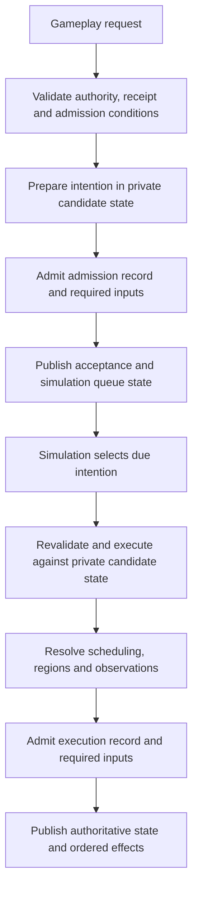

# Refactor plan

This is the accepted refactor scope. Implementation proceeds in verified
increments; a listed design is not a claim that it is implemented. Text-client
improvements and a scripting runtime are deferred.

## Contracts to preserve

The server owns authority, world topology, scheduling, and disclosure. Gameplay
requests admit intentions to a simulation-owned action queue. Admission and
execution are distinct: the scheduler resolves due actions and publishes their
effects. Queries, annotations, and session operations can finish immediately.
Player, AI, travel, and eventual script intentions should use the same execution
path. Submit-time checks do not replace execution-time checks when intervening
actions can change targets, timing, or authority.

Every authoritative mutation is prepared against private candidate state. Its
journal record and required content must be admitted to persistence before state
and ordered effects are published. Retries resolve existing receipts; reconnect
must not duplicate an uncertain action. Queue, cancellation, restart, rewind,
and region-freezing semantics belong in deterministic saved state.

The target gameplay flow has two persistence/publication boundaries. This is the
planned architecture; the general intent-admission queue is not implemented yet.

Immediate queries and metadata operations use their own request paths. An
acceptance acknowledges the queued intention. Clients use simulation effects and
authoritative readiness to determine when subsequent gameplay intentions are available.

Spatial indexes are backend-only derived data. Keys use region-local locations;
no global Euclidean distance is assumed. Occupancy includes every portal-resolved
body cell and its frame. Queries crossing regions follow portal topology. Clients
may index disclosed opaque identities and relative projections, never private
region identities or authoritative occupancy.

## Work sequence

1. **Explicit boundaries and focused responsibilities.** Replace implicit JSON
   conversions with exhaustive typed mappings. Separate transport, backend
   commands, simulation outcomes, journal entries, disclosed views, authoring
   schemas, compiled content, and persistence schemas. Extract responsibilities
   from the engine and session without changing ordering or durability.
2. **Reuse derived work.** Build each actor's observation once per boundary and
   reuse it for revision comparison, navigation knowledge, and client publication.
   Preserve observer privacy and intermediate memory. Prepare an AI decision once
   at its valid boundary. Share route searches. Add spatial and historical indexes
   with centralized mutation and rebuild after load, replay, rewind, and region
   transitions. Compare optimized queries with reference scans.
3. **Admission, scheduling, and stream recovery.** Make action admission and
   completion explicit; bound mailbox work and output queues with fair scheduling.
   Define slow-controller and spectator policies. Add stream identities, reset
   epochs, exact delta bases, readiness revisions, contextual receipts, and
   resynchronization. Validate snapshots and deltas centrally, including duplicate
   identifiers, arithmetic overflow, bounds, and collection invariants. Measure
   collection deltas against encoded full snapshots. Keep projected occurrences
   separate from underlying entities and protect journal identity from disclosure.
   Bound decode bytes and nesting and outbound bytes as well as message counts.
   Make integer encoding safe for future JavaScript clients. Add explicit
   capabilities and opaque, typed interaction identifiers without exposing
   private topology or eventual script functions.
4. **Scenario compilation.** Decouple authoring types from simulation internals.
   Normalize defaults and inheritance, resolve references with source diagnostics,
   and compile immutable content. Pin dependencies by identity and digest.
   Derive generation seeds from semantic parameters, stable region identity,
   generator version, and an explicit salt; use named random streams for geometry,
   population, and loot. Keep structural metadata and identifiers independent of
   activation order. Preserve lazy construction and distinguish sampled validation
   from proof of all possible generated worlds.
5. **Persistence and history.** Introduce explicit save DTOs and independent
   format/version axes. Pool immutable content across rewind boundaries. Keep the
   journal authoritative and receipts/indexes reconstructible. Bound decoding and
   reject duplicate/unknown fields in one validation path. Admit source blobs and
   journal records atomically; paths are locators, digests are identity. Measure
   compression and chunking before adoption. Add indexed, privacy-filtered history
   pagination without silently pruning retained history.
   Design portable save export separately from runtime storage. Bound resident
   history using storage-backed access when measurements justify it.
6. **Latency and extension seams.** Remove synchronous diagnostics from hot paths,
   shorten storage lock scope, and measure region fallback and checkpoint capture.
   Retain existing workload targets and investigate timing tails. Define future
   extension contracts around scoped queries, validated effects, deterministic RNG,
   named handlers, persistent typed state, scheduling, and region suspension.
   No language, VM, or package script support is added in this refactor.

## Verification

Use the repository verification tiers and process tests for touched boundaries.
Exercise retries, save/reload, replay, rewind, disclosure, reconnect, generated
regions, portal transforms, and scheduling. Prove scaling with operation counts
at multiple world sizes and compare release workload measurements before claiming
performance improvements. Windows and Linux CI remain required before merge.
Compatibility-breaking decisions must be stated explicitly before adoption.

## Current checkpoint

The ordinary wire/backend command mapping is explicit. Developer command text
still uses its existing parser and opaque wire representation. No wire, package,
save, or ruleset format has changed. Action broadcasts resolve disclosed state
once per watched actor while retaining each client's independent delta base and
stream sequence. A derived boundary cache shares the observation and exact scene
between reads and revision detection; committed ordinary actions publish their
already-computed post-action views. Region transitions invalidate those views,
and load, rewind, and diagnostic seeding start from fresh derived data. The action
queue and remaining items above are pending.

Backend request metadata now has a focused checking stage before candidate
capture. Wizard authorization and identity labels precede receipt resolution;
matching receipts still resolve before branch and revision checks. Fresh action,
travel, rename, and wizard requests reject stale revisions before copying private
state. The command variants explicitly state whether a revision is required.
A private executor consumes the checked-request type in the uninterrupted command
pipeline; this transient proof is not a queued intention.
Operation-specific targets and timing remain validated against candidate state,
and session attachment/controller authority stays in the session layer.
Full Windows checks passed, including 217 debug Python/process tests and 107
release process tests. The updated desktop targets passed seven real-client
connection/frame checks. Release measurements and their limits are below.
Regressions check zero candidate captures for
stale requests, unchanged error precedence and retry results, and real-client
state/history preservation across rejection and restart.

Item mutations now pass through a private store that maintains ground-location
and inventory-owner indexes. Observation, stack matching, corpse inventory
release, and item occupancy checks use these indexes. Candidate and rewind clones
share index storage; mutation copies the affected region map and location bucket.
Partial views merge ordered bucket iterators without a temporary identity set.
When those buckets cover every item, views iterate the authoritative item table
directly, avoiding an identity lookup per disclosed item. Unrelated items never
enter partial-view identification or rendering work.
Checkpoint restoration rebuilds indexes from the unchanged authoritative item
table. Item ordering, quantities, portal-local positions, and disclosure remain
unchanged. Reference-scan, interrupted-edit, clone-isolation, portal-transfer,
checkpoint, and actual-client save/resume/drop tests cover the new store.
Scaling regressions at 16, 256, and 4,096 unrelated items and regions examine one
disclosed candidate, zero candidates for an empty destination inventory, and one
matching ground stack.

Actor mutations now pass through a private store with anchor-region membership
and derived body-cell occupancy. Body cells retain their portal-resolved frames
and authored order, using the same resolver as uncached physics rules. Edits mark
an actor dirty; unchanged pose/body definitions reuse their mapping. Geometry
witnesses reuse the world's existing process-local cache versions and never
enter saved state or decide game behavior. Geometry changes conservatively
rebuild mappings for loaded actors. Clone, restore, and region transitions retain
the authoritative actor table and rebuild or update derived data.

Occupancy, body fitting, collision identity, and region freeze/thaw queries use
the indexes. Actor disclosure selects only visible region buckets, using the
smaller occupied-cell or visible-cell set within each region, then preserves
identity and authored cell order. Combat shares those selected body mappings.
Each caller retains its existing life/freeze rules; cached mappings include dead actors.
At 16, 256, and 4,096 unrelated actors, repeated warm occupancy queries resolve
no bodies, and an isolated observer examines only its own body candidate.
Reference comparisons cover cell/frame mappings, partial disclosure, geometry
edits, interrupted edits, and clone isolation. A real-client sideways-portal
save/restart test checks body projections, continued motion, and topology privacy.

This stage passed full Windows verification. The index uses memory proportional to loaded
body cells; resident memory is not yet measured. Shared root maps can still copy
their entries on first mutation, and geometry edits can incur a complete body
rebuild. These changes do not establish constant-time whole commands.

Actor bodies and derived body entries now share immutable body definitions across
in-memory snapshots. Readiness and pose changes retain that storage; body edits
detach it through copy-on-write. The public body API and transparent checkpoint
encoding retain their existing values. This does not pool definitions in encoded
saves or intern independently authored actors' definitions.

At 16, 256, and 4,096 unrelated actors, a readiness-changing action copies zero
body definitions instead of copying every actor's cell vector. A regression
checks body-edit isolation, occupancy invalidation, the encoded body value and
checkpoint restoration. The portal physics process test now saves and restarts
twice, checking continued motion at both restored boundaries. Quick and full
Windows verification passed, including 217 debug Python/process tests and 107
release process tests. Updated desktop targets passed seven real-client checks.
Release measurements and their limits are below.
Root-map entries can still copy on first mutation; resident memory has not been
measured.

AI target ranking, pursuit, and retreat-distance lookup now share one incremental
minimum-tick route search within a decision. The frontier borrows authoritative
actor state and remembered navigation, so it cannot outlive a game mutation. It
uses the existing direction order, orientation composition, diagonal rules,
movement costs, and discovery-order tie breaks; it reads no hidden terrain.
Completed destinations reuse the first settled frame and predecessor chain.
Search memory lasts only for that decision and is not saved.

Reference comparisons cover target-order changes, repeated lookups, directed
cycles, portal frames, blocked cells, and unreachable destinations. A public
simulation regression with fifteen visible targets starts one search instead of
one per target. A real headless client verifies AI-scoped history and saves,
restarts, and continues at an authoritative decision boundary. Full Windows
checks passed, including 216 debug Python/process tests and 106 release process
tests. The updated desktop targets passed six real-client connection/frame checks.
Release measurements and their limits are below. Route construction still
allocates each returned path, and selecting versus executing an AI action still
computes the decision twice; removing that duplication remains pending.

Historical queries now use a derived entry-ID lookup and ordered buckets for
each branch, actor, and private author. Pages merge actor-wide and own-private
entries in journal order; pagination anchors still require branch and disclosure
checks. Annotation anchors and replay duplicate-ID checks use the same lookup.
One append boundary updates both history and receipt indexes. Ordinary candidate
transactions do not copy the indexes, and checkpoint restoration rebuilds them
from retained journal records. No entries are pruned and the saved representation
is unchanged.

Reference-filter comparisons cover interleaved branches, actors, user/frontend/
backend authors, privacy, limits, and anchors. Scaling regressions with 16, 256,
and 4,096 unrelated private entries visit one returned record, or two records
when a pagination anchor is supplied. This count excludes the logarithmic bucket
search and entry-ID lookup. Checkpoint/tail replay and actual-client restart
tests cover pagination and rejection of inaccessible anchors. The index itself
uses memory proportional to retained entries; storage-backed history and direct
resident-memory measurement remain pending.

The command, item, history, and actor/body checkpoints passed full Windows
verification in debug and release, including 215 debug Python/process tests and
105 release process tests for the actor/body stage. The updated desktop targets
passed five real-client connection/frame tests, including portal-body restart.
Linux CI is still required before merge. No merge or raw-measurement publication
has occurred.

### Initial release measurements

Three interleaved baseline/refactor rounds on the same Windows host compared
ordinary play and region streaming. Values below are milliseconds, baseline to
refactor; `n` is the number of command samples on each side.

| Case | n | p50 | p95 | max | Scene/perception calls per run |
| --- | ---: | --- | --- | --- | --- |
| 8 regions, 1 actor, 100 history entries | 915 | 0.615 → 0.559 | 0.893 → 0.819 | 1.512 → 1.015 | 640 → 340 |
| 64 regions, 8 actors, 100 history entries | 7,500 | 0.020 → 0.026 | 2.751 → 2.632 | 8.076 → 9.997 | 9,848 → 6,759 |
| Streaming, 256 regions | 2,100 | 0.229 → 0.217 | 0.412 → 0.394 | 0.763 → 0.906 | 1,710 → 890 |

All runs validated; history, client memory, and saved byte counts were unchanged.
The eight-actor median increased by six microseconds, and maxima rose in two
cases; these measurements establish reduced derived work and lower sampled p95,
not improvement in every timing statistic. Server cache memory has not yet been
measured directly. Raw samples remain local; publication requires separate
maintainer authorization under the performance policy.

### Item-index release comparison

Three interleaved rounds compared this item-store implementation with the earlier
command-mapping and boundary-cache checkpoint. Timings are milliseconds; `n` is
the command or transfer sample count on each side. These are diagnostic local
measurements, not a published performance-ledger entry.

| Case | n | p50 | p95 | max |
| --- | ---: | --- | --- | --- |
| Transfers, 16 items / 8 identities | 1,200 | 0.052 → 0.058 | 0.111 → 0.118 | 0.199 → 0.211 |
| Transfers, 1,000 items / 256 identities | 1,200 | 0.603 → 0.616 | 0.724 → 0.743 | 0.994 → 0.956 |
| 64 regions, 8 actors, 100 history entries | 7,500 | 0.025 → 0.026 | 2.561 → 2.544 | 7.334 → 6.868 |
| Falling, 8 actors / 128 items / 8 body cells | 576 | 0.088 → 0.084 | 11.803 → 11.638 | 22.209 → 21.020 |

All runs validated. Each item benchmark run contains 20 samples of 20 transfers.
Stack candidates fell from 3,400 to 200 for the small pile, and from 200,200 to
200 for the dense pile. Those fixtures disclose the whole pile, so observation
and identity-work counts remain equal; the sparse-disclosure regressions prove
bounded candidate work separately. Saved and disclosed byte counts, history,
client memory, body-cell work, and physics steps were unchanged.

Item transfers retain a small maintenance cost: dense p95 increased by 2.7% and
small-pile p95 by seven microseconds. A temporary-set implementation initially
increased dense p95 by 11%; ordered bucket merging and the complete-view fast path
removed most of that overhead. Dense falling resume p95 increased from 248.3 to
256.1 ms. Save timings varied widely, so these runs do not establish a save-time
improvement. Server index memory has not been measured directly.

### History-index release comparison

Three interleaved rounds compared history indexing with the item-store checkpoint
on the same Windows host. Command samples number 915 on each side of each case;
restart samples number only three. Timings are milliseconds, baseline to refactor.

| Case / metric | n | p50 | p95 | max |
| --- | ---: | --- | --- | --- |
| 100 entries, memory / command | 915 | 0.546 → 0.541 | 0.800 → 0.811 | 1.719 → 2.726 |
| 10,000 entries, memory / command | 915 | 0.536 → 0.533 | 0.767 → 0.757 | 1.530 → 1.220 |
| 10,000 entries, durable / command | 915 | 0.520 → 0.521 | 0.737 → 0.740 | 2.358 → 1.028 |
| 100 entries, memory / restart | 3 | 163.2 → 164.2 | 165.5 → 169.3 | 165.5 → 169.3 |
| 10,000 entries, memory / restart | 3 | 682.2 → 417.7 | 693.2 → 428.4 | 693.2 → 428.4 |
| 10,000 entries, durable / restart | 3 | 390.6 → 382.1 | 408.9 → 391.9 | 408.9 → 391.9 |

All runs validated. Saved bytes, history, memory, derived-work counts, and replay
record counts were unchanged. The long memory case replays 10,305 records; its
median restart time fell by 38.8%. The durable case restores a checkpoint and
replays 304 records, with a smaller improvement. Small-history command p95 rose
by eleven microseconds and its maximum increased, so these runs do not establish
an improvement in every timing statistic. Restart samples are too few to establish
stable tail behavior. Page-request latency and resident index memory were not
measured; bounded page work is established by the scaling regressions above.
These remain diagnostic local measurements, with raw samples unpublished.

### Actor/body-index release comparison

Three interleaved rounds compared actor/body indexing with the history checkpoint
on the same Windows host. Timings are milliseconds, baseline to refactor.

| Case / metric | n | p50 | p95 | max |
| --- | ---: | --- | --- | --- |
| 8 regions, 1 actor / command | 915 | 0.557 → 0.562 | 0.801 → 0.788 | 1.728 → 1.457 |
| 64 regions, 8 actors / command | 7,500 | 0.027 → 0.029 | 2.535 → 2.582 | 6.137 → 17.851 |
| Falling, 8 actors / 128 items / 8 cells / command | 576 | 0.087 → 0.087 | 11.774 → 11.757 | 21.391 → 20.272 |
| Falling / resume | 9 | 249.6 → 258.5 | 264.2 → 283.7 | 264.2 → 283.7 |
| Falling / save | 9 | 74.649 → 102.2 | 276.7 → 317.2 | 276.7 → 317.2 |
| 64 regions, 8 actors / restart | 3 | 1544.2 → 1551.1 | 1554.4 → 1625.6 | 1554.4 → 1625.6 |

All runs validated. Dense falling resolved 233,064 body cells instead of 380,328,
a 38.7% reduction; physics steps, scenes, disclosed bytes, and saved bytes were
unchanged. Ordinary-case perception and revision work were unchanged. Eight-actor
command p95 rose 1.9% and its maximum increased. Dense falling resume p95 rose
7.4%; save timings varied substantially between rounds and increased overall.
Restart samples number only three per latency case, and save/resume samples number
nine per physics case. These measurements do not establish a broad latency or
save-time improvement. The scaling regressions establish bounded local query work;
resident cache memory remains unmeasured. Raw samples remain local and unpublished.

### Shared-route release comparison

Three interleaved rounds compared decision-local shared searches with the
actor/body checkpoint on the same Windows host. A further three rounds repeated
the unexpectedly slower small case using the same verified binaries. Timings
are milliseconds, baseline to refactor; both result sets are retained.

| Case / metric | n | p50 | p95 | max |
| --- | ---: | --- | --- | --- |
| 8 regions, 1 actor / command | 915 | 0.559 → 0.582 | 0.804 → 0.852 | 1.946 → 3.903 |
| Same small case, repeat / command | 915 | 0.544 → 0.564 | 0.786 → 0.815 | 1.307 → 2.242 |
| 64 regions, 8 actors / command | 7,500 | 0.029 → 0.028 | 2.583 → 2.537 | 7.264 → 7.205 |
| Combat, 8 actors / 1,000 history / command | 576 | 0.507 → 0.522 | 3.356 → 3.288 | 4.125 → 3.906 |
| Same combat / decision | 576 | 0.076 → 0.084 | 0.549 → 0.546 | 0.771 → 0.694 |
| Same combat / resume | 9 | 192.5 → 194.6 | 201.9 → 206.0 | 201.9 → 206.0 |
| Same combat / save | 9 | 403.4 → 202.3 | 446.7 → 371.6 | 446.7 → 371.6 |

All runs validated. Combat body-cell work, scenes, navigation refreshes, saved
bytes, and disclosed bytes were unchanged; ordinary-case workload counts were
also unchanged. Small-case p95 increased 5.9% initially and 3.8% on repeat, or
48 and 29 microseconds. Eight-actor play and combat command p95 decreased by
about 2%, but combat decision p95 was almost unchanged and decision median rose
by eight microseconds. Save timings varied substantially between rounds; these
runs do not establish a save-time improvement. Save/resume samples number only
nine per combat case. Multi-target latency, isolated single-route latency, and
resident frontier memory remain unmeasured. The regression tests establish one
search per fifteen-target decision and exact route equivalence. These remain
diagnostic local measurements, with raw samples unpublished.

### Checked-request release comparison

Three interleaved rounds compared early request checks and the private executor
with the shared-route checkpoint on the same Windows host. These are valid
workloads; stale-request latency and throughput were not measured. Timings are
milliseconds, baseline to refactor.

| Case / metric | n | p50 | p95 | max |
| --- | ---: | --- | --- | --- |
| 8 regions, 1 actor / command | 915 | 0.573 → 0.556 | 0.829 → 0.799 | 1.460 → 1.871 |
| 64 regions, 8 actors / command | 7,500 | 0.029 → 0.028 | 2.551 → 2.558 | 6.411 → 6.591 |
| Combat, 8 actors / 1,000 history / command | 576 | 0.518 → 0.521 | 3.276 → 3.330 | 3.487 → 3.976 |
| Same combat / decision | 576 | 0.081 → 0.085 | 0.546 → 0.547 | 0.604 → 1.251 |
| Same combat / resume | 9 | 193.1 → 199.2 | 207.3 → 213.2 | 207.3 → 213.2 |
| Same combat / save | 9 | 424.9 → 191.4 | 472.3 → 449.4 | 472.3 → 449.4 |

All runs validated. Saved/disclosed bytes, body-cell work, scenes, navigation
refreshes, and valid-command workload counts were unchanged. Eight-actor command
p95 increased 0.3%, and combat command p95 increased 1.6%; small-case p95 fell
by 30 microseconds but its maximum increased. Combat resume p95 increased 2.8%,
and decision maximum increased. Save timings varied substantially between rounds;
these runs do not establish a save-time improvement. Save/resume samples number
only nine per combat case. The stale-request regression establishes zero
candidate captures instead of one for action, travel, rename and wizard requests;
it does not establish an invalid-request timing or throughput improvement.
Raw samples remain local and unpublished.

### Immutable-body release comparison

Three interleaved rounds compared immutable body sharing with the checked-request
checkpoint on the same Windows host. Timings are milliseconds, baseline to refactor.

| Case / metric | n | p50 | p95 | max |
| --- | ---: | --- | --- | --- |
| 8 regions, 1 actor / command | 915 | 0.557 → 0.553 | 0.827 → 0.786 | 3.388 → 1.357 |
| 64 regions, 8 actors / command | 7,500 | 0.028 → 0.027 | 2.568 → 2.541 | 8.523 → 6.503 |
| Falling, 8 actors / 128 items / 8 cells / command | 576 | 0.086 → 0.086 | 11.711 → 11.702 | 20.085 → 19.837 |
| Same falling / resume | 9 | 243.0 → 255.6 | 251.4 → 292.4 | 251.4 → 292.4 |
| Same falling / save | 9 | 72.639 → 137.4 | 260.5 → 290.3 | 260.5 → 290.3 |
| Same falling, repeat / command | 576 | 0.087 → 0.087 | 11.923 → 12.666 | 20.280 → 21.910 |
| Same falling, repeat / resume | 9 | 238.9 → 253.9 | 250.2 → 285.4 | 250.2 → 285.4 |
| Same falling, repeat / save | 9 | 65.562 → 141.8 | 110.0 → 324.8 | 110.0 → 324.8 |

All runs validated. Saved/disclosed bytes, body-cell work, scenes, physics steps,
and ordinary-command workload counts were unchanged. Small-case command p95 fell
5.0%, eight-actor command p95 fell 1.1%, and dense-falling command p95 was almost
unchanged. Dense-falling resume p95 increased 16.3% and save p95 increased 11.4%;
save timings varied substantially between rounds. These results do not establish
a broad latency or save-time improvement. A controlled repeat using the same
verified binaries retained a 14.1% resume p95 increase, a 6.2% command p95 increase
and highly variable save timings. Both comparisons are retained. Sharing adds an
allocation when decoding each inline body definition; its contribution to these
timings has not been isolated. Encoded definitions are still repeated across
boundaries, and restore currently validates through multiple decoded trees.
Reducing decode work and pooling immutable definitions remain follow-up work;
the measured restore regression is unresolved. Save/resume samples number only
nine per comparison; resident memory remains unmeasured. The scaling regression
establishes avoided definition copies. Raw samples remain local and unpublished.
