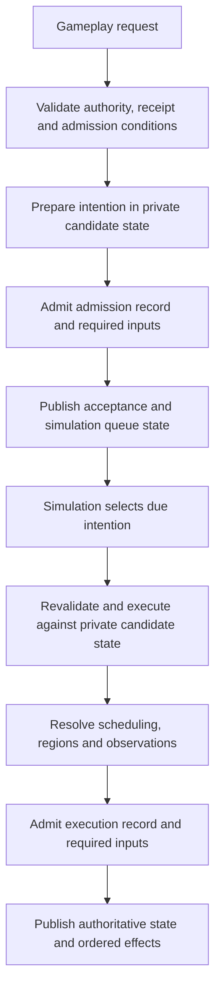

# Refactor plan

This is the accepted refactor scope. Implementation proceeds in verified
increments; a listed design is not a claim that it is implemented. Text-client
improvements and a scripting runtime are deferred.

## Contracts to preserve

The server owns authority, world topology, scheduling, and disclosure. Gameplay
requests admit intentions to a simulation-owned action queue. Admission and
execution are distinct: the scheduler resolves due actions and publishes their
effects. Queries, annotations, and session operations can finish immediately.
Player, AI, travel, and eventual script intentions should use the same execution
path. Submit-time checks do not replace execution-time checks when intervening
actions can change targets, timing, or authority.

Every authoritative mutation is prepared against private candidate state. Its
journal record and required content must be admitted to persistence before state
and ordered effects are published. Retries resolve existing receipts; reconnect
must not duplicate an uncertain action. Queue, cancellation, restart, rewind,
and region-freezing semantics belong in deterministic saved state.

The target gameplay flow has two persistence/publication boundaries. This is the
planned architecture; the general intent-admission queue is not implemented yet.

Immediate queries and metadata operations use their own request paths. An
acceptance acknowledges the queued intention. Clients use simulation effects and
authoritative readiness to determine when subsequent gameplay intentions are available.

Spatial indexes are backend-only derived data. Keys use region-local locations;
no global Euclidean distance is assumed. Occupancy includes every portal-resolved
body cell and its frame. Queries crossing regions follow portal topology. Clients
may index disclosed opaque identities and relative projections, never private
region identities or authoritative occupancy.

## Work sequence

1. **Explicit boundaries and focused responsibilities.** Replace implicit JSON
   conversions with exhaustive typed mappings. Separate transport, backend
   commands, simulation outcomes, journal entries, disclosed views, authoring
   schemas, compiled content, and persistence schemas. Extract responsibilities
   from the engine and session without changing ordering or durability.
2. **Reuse derived work.** Build each actor's observation once per boundary and
   reuse it for revision comparison, navigation knowledge, and client publication.
   Preserve observer privacy and intermediate memory. Prepare an AI decision once
   at its valid boundary. Share route searches. Add spatial and historical indexes
   with centralized mutation and rebuild after load, replay, rewind, and region
   transitions. Compare optimized queries with reference scans.
3. **Admission, scheduling, and stream recovery.** Make action admission and
   completion explicit; bound mailbox work and output queues with fair scheduling.
   Define slow-controller and spectator policies. Add stream identities, reset
   epochs, exact delta bases, readiness revisions, contextual receipts, and
   resynchronization. Validate snapshots and deltas centrally, including duplicate
   identifiers, arithmetic overflow, bounds, and collection invariants. Measure
   collection deltas against encoded full snapshots. Keep projected occurrences
   separate from underlying entities and protect journal identity from disclosure.
   Bound decode bytes and nesting and outbound bytes as well as message counts.
   Make integer encoding safe for future JavaScript clients. Add explicit
   capabilities and opaque, typed interaction identifiers without exposing
   private topology or eventual script functions.
4. **Scenario compilation.** Decouple authoring types from simulation internals.
   Normalize defaults and inheritance, resolve references with source diagnostics,
   and compile immutable content. Pin dependencies by identity and digest.
   Derive generation seeds from semantic parameters, stable region identity,
   generator version, and an explicit salt; use named random streams for geometry,
   population, and loot. Keep structural metadata and identifiers independent of
   activation order. Preserve lazy construction and distinguish sampled validation
   from proof of all possible generated worlds.
5. **Persistence and history.** Introduce explicit save DTOs and independent
   format/version axes. Pool immutable content across rewind boundaries. Keep the
   journal authoritative and receipts/indexes reconstructible. Bound decoding and
   reject duplicate/unknown fields in one validation path. Admit source blobs and
   journal records atomically; paths are locators, digests are identity. Measure
   compression and chunking before adoption. Add indexed, privacy-filtered history
   pagination without silently pruning retained history.
   Design portable save export separately from runtime storage. Bound resident
   history using storage-backed access when measurements justify it.
6. **Latency and extension seams.** Remove synchronous diagnostics from hot paths,
   shorten storage lock scope, and measure region fallback and checkpoint capture.
   Retain existing workload targets and investigate timing tails. Define future
   extension contracts around scoped queries, validated effects, deterministic RNG,
   named handlers, persistent typed state, scheduling, and region suspension.
   No language, VM, or package script support is added in this refactor.

## Future scenario extension contracts

These constraints guide the refactor; no scripting language, runtime, package
syntax or handler API is implemented. Adding those formats remains a separate
explicit compatibility decision. Authors should be able to choose declarative
rules and reusable behavior templates, then opt into named handlers for behavior
that needs code. Both forms should compile to the same backend concepts rather
than introducing a second mutation or scheduling system.

**Queries and authority.** Controller handlers should query an actor's disclosed
observations and remembered navigation. Scenario-world handlers may need broader
authority, such as maintaining a hidden encounter, through explicitly granted
region-scoped queries. A query's scope must therefore be part of its contract;
restricting every author hook to player visibility would prevent useful scenario
rules. Neither form grants clients access to private state. Locations remain
region-local, with explicit portal traversal and frame conversion. Queries must
distinguish unknown, unloaded and absent data without eagerly constructing every
referenced region. Authority to activate or modify another region is a separate
validated effect, subject to the normal lifecycle rules.

**Effects and ordering.** Handlers produce bounded, typed proposed effects or
gameplay intentions. They do not obtain mutable engine, store, socket or world
references. Validate effects against private candidate state; revalidate queued
intentions when the simulation executes them. Persist the operation's required
inputs, state changes and result before publishing observations. Handler failure
must reject its enclosing transaction rather than publish a partial effect batch.
Use named hooks at documented simulation boundaries, with deterministic ordering
and limits on recursive event production. Wall-clock callbacks and thread
completion must not decide authoritative order. Clients invoke authorized opaque
interaction identities, never arbitrary handler names or interpreter functions.

**Determinism and limits.** Supply explicit named random streams whose identity
and state survive save/replay/rewind. The runtime must not read wall-clock time,
filesystem, network or ambient randomness. Define deterministic instruction/work,
effect-count and persistent-state limits, including a total budget for an event
cascade. A wall-clock timeout may protect the host but cannot select a different
successful game outcome. Exhaustion follows an explicit failure policy; it must
not silently drop effects or resume half an invocation in live state.

**Persistence and lifecycle.** Persistent handler state should have a declared,
bounded typed schema keyed by stable content and owner identities. Save values
and scheduled intentions rather than interpreter stacks, closures or native
handles. Pin handler inputs by content digest and eventual runtime/API identity;
reject unsupported identities using the existing current-format policy. A
handler's actor, region or scenario ownership determines its lifetime and clock.
Regional timers and progress must follow freeze/thaw rules, and rewind must
restore state and pending work together. Lazy regions must not allocate handler
state before activation. Restoring progress must preserve the existing policy
requiring fresh human input where appropriate. Historical runtime support or
state migration requires its own future compatibility milestone.

The immediate refactor consequences are to retain typed command/effect boundaries,
private transaction state, simulation-owned scheduling, immutable prepared
definitions, independent format axes and backend-controlled disclosure. Avoid
persisting implementation-specific controller objects or exposing a general
world-mutation escape hatch merely to make a future runtime easy to connect.

## Verification

Use the repository verification tiers and process tests for touched boundaries.
Exercise retries, save/reload, replay, rewind, disclosure, reconnect, generated
regions, portal transforms, and scheduling. Prove scaling with operation counts
at multiple world sizes and compare release workload measurements before claiming
performance improvements. Windows and Linux CI remain required before merge.
Compatibility-breaking decisions must be stated explicitly before adoption.

## Current checkpoint: region acquisition attribution

Profiled transitions now distinguish successful synchronous reads/builds from
prepared reads/builds, with separate fallback durations nested within total
region-transition time. Resident record-cache hits are excluded. These details
are diagnostic data; they are not saved, disclosed or used to resolve gameplay.
Ordinary commands do not enable the additional acquisition clocks. Existing
checkpoint-capture timing/counts remain in place.

The failing-first regression now verifies count partitions and duration bounds
while playing with disabled, settled, racing and stopped preloading, including
cold restart and identical region rows. A separate check prevents nested timings
from entering the exclusive phase sum. Report-validation regressions failed
first on eight inconsistent/missing/invalid acquisition reports and now reject
them. A real streaming benchmark process emits and validates the new profiles
and timing summaries. Quick Windows verification passed, including the Rust
workspace suite and 122 actual-process tests. Full Windows verification also
passed, including 236 debug Python/process tests, Rust documentation and workspace
tests in debug and release, and 122 release process tests. All twenty-one
deployed-client/validator checks passed. No performance improvement is claimed.

Three interleaved release rounds compared this increment with the preceding
shared-restoration checkpoint on the same Windows host. All twelve runs
validated, with equal comparable work, saved-byte and disclosure counts.
Timings are milliseconds, baseline to refactor:

| Workload / metric | n per side | p50 | p95 | max |
| --- | ---: | --- | --- | --- |
| stream-r16-durable / command | 2,100 | 0.2542 → 0.2432 | 0.4785 → 0.4522 | 1.3219 → 1.1993 |
| stream-r16-durable / save | 3 | 117.3947 → 87.4694 | 217.6047 → 107.0672 | 217.6047 → 107.0672 |
| stream-r16-durable / restart/replay | 3 | 170.8364 → 169.6671 | 183.5708 → 180.0609 | 183.5708 → 180.0609 |
| stream-r256-durable / command | 2,100 | 0.2337 → 0.2383 | 0.4176 → 0.4301 | 0.9718 → 0.9213 |
| stream-r256-durable / save | 3 | 100.1786 → 110.5751 | 120.1458 → 117.3521 | 120.1458 → 117.3521 |
| stream-r256-durable / restart/replay | 3 | 166.3087 → 166.6488 | 185.2140 → 176.5394 | 185.2140 → 176.5394 |

The 256-region command median rose 2.0% and p95 rose 3.0%; its save median rose
10.4% while p95 fell 2.3%. The 16-region command p95 fell 5.5%. Save and restart
samples number only three per side, so their tails have limited evidential weight.
These diagnostics do not establish a broad latency or memory improvement, and
earlier unresolved restore and falling-command tails remain open.

Across each candidate workload's 2,100 samples, all nine builds were prepared
and there were no synchronous reads or builds. The comparison therefore measures
the prepared path, not synchronous fallback costs. The disabled/racing preloader
regressions exercise fallback attribution separately. No raw samples or ledger
results were published.

## Shared checkpoint restoration

A restore-scoped context now shares decoded worlds, navigation and item stores
by their existing pool indexes across the current game and retained rewind
states. Item location indexes are reconstructed from each decoded item pool once
and remain copy-on-write. Equal body definitions share ownership through a
value-ordered pool; the entire authored cell sequence, eye and mass participate
in equality. Pooling never sorts body cells or uses pointer identity for game
decisions. Temporary context references are released after restoration, and
restored games retain only the values they use. The serialized schema and normal
game validation are unchanged.

The failing-first decoded-body regression now passes at 16, 256 and 4,096 actors.
Focused checks cover complete game equality, byte-identical recapture, sharing
across decoded states, mutation isolation, distinct cell order/eye/mass and
corrupt-body rejection. The server checkpoint test restores every retained
exploration boundary through the production context and recaptures the same
bytes. A real-process test checkpoints portal physics, restarts, rewinds,
reproduces the crossing and restarts again with matching state and history.
Quick verification passed, including 121 actual-process tests. Full Windows
verification passed too, including 233 debug Python/process tests, Rust
workspace debug/release checks and 121 release process tests. All twenty-one
deployed-client/validator checks passed. The initial quick attempt failed on two
Clippy warnings in test assertions; the corrected quick and full runs passed.
No lower latency, decoder-allocation or resident-memory claim is made.

This shares loaded checkpoint content. Detached-region records have their own
decoding and ownership path; broader immutable-content pooling remains open.
Restoration does not eagerly load those records or alter lazy region activation.

### Shared restoration release comparison

Three interleaved rounds compared shared restoration with the preceding scenario
compiler checkpoint on the same Windows host. All twenty-four runs validated,
with unchanged work, saved-byte and disclosure counts. A controlled repeat of
256-region streaming and combat used identical binaries and the same machine;
all twelve repeat runs validated with matching counts. Timings below are
milliseconds, baseline to refactor. Combat decision and command are separate
phases; their quantiles must not be added.

| Workload / metric | n per side | p50 | p95 | max |
| --- | ---: | --- | --- | --- |
| stream-r16-durable / command | 2,100 | 0.2313 → 0.2281 | 0.4090 → 0.4203 | 1.2750 → 1.3015 |
| stream-r16-durable / save | 3 | 66.7226 → 79.0118 | 127.5680 → 112.2398 | 127.5680 → 112.2398 |
| stream-r16-durable / restart/replay | 3 | 177.4863 → 177.2945 | 180.4089 → 177.6369 | 180.4089 → 177.6369 |
| stream-r256-durable / command | 2,100 | 0.2257 → 0.2303 | 0.4299 → 0.4098 | 0.8385 → 1.0987 |
| stream-r256-durable / save | 3 | 79.3078 → 68.2169 | 116.9602 → 289.4145 | 116.9602 → 289.4145 |
| stream-r256-durable / restart/replay | 3 | 165.0301 → 166.1065 | 183.3521 → 177.3497 | 183.3521 → 177.3497 |
| a2-h0 / client apply | 576 | 0.2731 → 0.2720 | 0.4587 → 0.3770 | 1.5868 → 0.8572 |
| a2-h0 / client draw | 576 | 0.6557 → 0.6615 | 1.1042 → 0.9659 | 2.4978 → 2.1910 |
| a2-h0 / command | 576 | 0.2075 → 0.2089 | 0.3327 → 0.3119 | 0.8806 → 0.7299 |
| a2-h0 / decision | 576 | 0.0004 → 0.0004 | 0.6391 → 0.6114 | 2.1168 → 1.8309 |
| a2-h0 / resume | 9 | 21.7924 → 25.6572 | 38.1904 → 39.5009 | 38.1904 → 39.5009 |
| a2-h0 / save | 9 | 36.1467 → 23.4552 | 264.6201 → 35.4481 | 264.6201 → 35.4481 |
| a2-h1000 / client apply | 576 | 0.2753 → 0.2761 | 0.4271 → 0.3863 | 0.8873 → 0.5836 |
| a2-h1000 / client draw | 576 | 0.6433 → 0.6455 | 1.0282 → 0.8532 | 6.4363 → 1.3523 |
| a2-h1000 / command | 576 | 0.2026 → 0.2004 | 0.3628 → 0.2627 | 0.7564 → 0.5603 |
| a2-h1000 / decision | 576 | 0.0004 → 0.0003 | 0.5510 → 0.5641 | 1.2852 → 0.8108 |
| a2-h1000 / resume | 9 | 65.5766 → 64.4968 | 75.9848 → 76.1618 | 75.9848 → 76.1618 |
| a2-h1000 / save | 9 | 70.6924 → 103.1569 | 314.3081 → 251.3498 | 314.3081 → 251.3498 |
| a8-h0 / client apply | 459 | 0.2819 → 0.2842 | 0.3544 → 0.3471 | 0.6995 → 0.7699 |
| a8-h0 / client draw | 459 | 0.6922 → 0.7068 | 0.9688 → 0.9779 | 1.7292 → 2.0895 |
| a8-h0 / command | 576 | 0.6412 → 0.6469 | 3.7285 → 3.6400 | 6.2673 → 7.0739 |
| a8-h0 / decision | 576 | 0.0004 → 0.0004 | 0.5448 → 0.5595 | 2.0680 → 2.2094 |
| a8-h0 / resume | 9 | 106.6356 → 107.5638 | 118.2698 → 120.7544 | 118.2698 → 120.7544 |
| a8-h0 / save | 9 | 23.0300 → 21.8864 | 43.4433 → 46.8050 | 43.4433 → 46.8050 |
| a8-h1000 / client apply | 495 | 0.2881 → 0.2891 | 0.3441 → 0.3424 | 0.4737 → 0.4761 |
| a8-h1000 / client draw | 495 | 0.6773 → 0.6853 | 0.8953 → 0.9266 | 1.1273 → 1.0433 |
| a8-h1000 / command | 576 | 0.5264 → 0.5296 | 3.3072 → 3.2596 | 3.4772 → 3.4309 |
| a8-h1000 / decision | 576 | 0.0004 → 0.0004 | 0.5409 → 0.5466 | 0.7444 → 0.6166 |
| a8-h1000 / resume | 9 | 210.9147 → 201.1872 | 219.6432 → 219.8359 | 219.6432 → 219.8359 |
| a8-h1000 / save | 9 | 109.1385 → 395.7784 | 220.5126 → 431.1857 | 220.5126 → 431.1857 |
| a8-i128-c8-falling / client apply | 144 | 0.7374 → 0.7291 | 0.8821 → 0.8795 | 1.2058 → 1.1131 |
| a8-i128-c8-falling / client draw | 144 | 1.1886 → 1.1638 | 1.4280 → 1.3611 | 1.6262 → 1.5443 |
| a8-i128-c8-falling / command | 576 | 0.0846 → 0.0832 | 11.7443 → 11.9579 | 20.3153 → 19.8607 |
| a8-i128-c8-falling / resume | 9 | 239.4075 → 232.1165 | 257.4475 → 256.1336 | 257.4475 → 256.1336 |
| a8-i128-c8-falling / save | 9 | 231.5130 → 71.8067 | 302.4876 → 304.0111 | 302.4876 → 304.0111 |

The controlled repeat retained the following results:

| Workload / metric | n per side | p50 | p95 | max |
| --- | ---: | --- | --- | --- |
| stream-r256-durable / command | 2,100 | 0.2303 → 0.2365 | 0.4101 → 0.4401 | 0.8019 → 0.9431 |
| stream-r256-durable / save | 3 | 99.9884 → 102.4694 | 119.6959 → 222.7252 | 119.6959 → 222.7252 |
| stream-r256-durable / restart/replay | 3 | 164.8181 → 163.0968 | 181.2101 → 177.8812 | 181.2101 → 177.8812 |
| a2-h0 / client apply | 576 | 0.2702 → 0.2695 | 0.3596 → 0.3837 | 0.7240 → 0.7621 |
| a2-h0 / client draw | 576 | 0.6511 → 0.6470 | 0.9421 → 0.9399 | 1.8953 → 1.8036 |
| a2-h0 / command | 576 | 0.2043 → 0.2073 | 0.3034 → 0.2889 | 0.6967 → 0.6936 |
| a2-h0 / decision | 576 | 0.0004 → 0.0004 | 0.5954 → 0.6160 | 2.1142 → 1.9027 |
| a2-h0 / resume | 9 | 23.7854 → 19.2432 | 32.8376 → 36.5165 | 32.8376 → 36.5165 |
| a2-h0 / save | 9 | 25.6813 → 35.7903 | 41.1061 → 121.1002 | 41.1061 → 121.1002 |
| a2-h1000 / client apply | 576 | 0.2707 → 0.2760 | 0.3087 → 0.3151 | 0.4961 → 0.5363 |
| a2-h1000 / client draw | 576 | 0.6458 → 0.6462 | 0.8300 → 0.8342 | 3.2831 → 1.0445 |
| a2-h1000 / command | 576 | 0.1999 → 0.2018 | 0.2638 → 0.2702 | 0.4780 → 0.4703 |
| a2-h1000 / decision | 576 | 0.0003 → 0.0004 | 0.5496 → 0.5494 | 0.8010 → 0.9403 |
| a2-h1000 / resume | 9 | 62.6262 → 59.8232 | 77.2919 → 78.2093 | 77.2919 → 78.2093 |
| a2-h1000 / save | 9 | 162.9250 → 245.9855 | 236.8769 → 280.9693 | 236.8769 → 280.9693 |
| a8-h0 / client apply | 459 | 0.2817 → 0.2859 | 0.3333 → 0.3574 | 0.6012 → 0.7963 |
| a8-h0 / client draw | 459 | 0.7048 → 0.7165 | 0.9832 → 0.9959 | 1.4560 → 1.6758 |
| a8-h0 / command | 576 | 0.6357 → 0.6536 | 3.6883 → 3.6898 | 5.5992 → 6.2546 |
| a8-h0 / decision | 576 | 0.0004 → 0.0004 | 0.5581 → 0.5535 | 1.4198 → 2.2142 |
| a8-h0 / resume | 9 | 108.1658 → 107.2482 | 120.2836 → 128.0854 | 120.2836 → 128.0854 |
| a8-h0 / save | 9 | 25.3829 → 36.9062 | 51.0235 → 74.9945 | 51.0235 → 74.9945 |
| a8-h1000 / client apply | 495 | 0.2889 → 0.2907 | 0.3380 → 0.3466 | 0.5112 → 0.5151 |
| a8-h1000 / client draw | 495 | 0.6775 → 0.6795 | 0.9041 → 0.9207 | 1.0724 → 1.4587 |
| a8-h1000 / command | 576 | 0.5267 → 0.5340 | 3.2998 → 3.2969 | 3.5117 → 3.7694 |
| a8-h1000 / decision | 576 | 0.0004 → 0.0004 | 0.5417 → 0.5457 | 0.5666 → 0.7755 |
| a8-h1000 / resume | 9 | 202.5139 → 196.6607 | 219.0961 → 214.7730 | 219.0961 → 214.7730 |
| a8-h1000 / save | 9 | 401.8290 → 353.0054 | 457.4747 → 439.9117 | 457.4747 → 439.9117 |

The repeat's 256-region command p95 rose 7.3%; its save p95 rose 86.1%, following
an initial 147.4% save-tail increase. The initial eight-actor history save p95
increase of 95.5% reversed in the repeat, while other combat save groups still
had higher tails. Small-combat resume p95 rose 11.2% in the repeat; eight-actor
no-history resume p95 rose 6.5%. Falling command p95 rose 1.8% in the initial
comparison. Both result sets are retained, including adverse samples.

The harness flushes each fresh save before reopening it, so save samples do not
directly time the new restore context. These measurements do not isolate the
cause of save variation or establish a general restore improvement. Stream
restart samples number three and combat/physics save and resume samples number
nine per group. Decoder allocations and resident memory remain unmeasured.
Earlier body-sharing restore and compiler falling-command regressions remain
unresolved. Raw samples remain local and unpublished.

## Scenario compilation follow-up

Prepared definitions now represent external, omitted and AI control explicitly.
AI references share immutable compiled profiles; missing references are reported
at the existing configuration boundary, preserving earlier-error precedence and
the treatment of unused profiles on selected characters. Characters and regional
actors use one creature installation path. Item inheritance, seeded names,
appearance, properties and instance constraints are normalized by the compiler.
An omitted-character index replaces repeated manifest scans during identity and
inventory preparation. Inherited creature definitions remain borrowed until
installation; inline definitions are converted once and moved into the game.

Construction errors identify the character or indexed region file and actor/item.
Palette validation retains its original reference-check order and adds context
for authored archetype references. The actual validator regression verifies
these diagnostics and unchanged package bytes; the existing compiled-inheritance
save/restart acceptance test passes. Quick verification passed, including 120
actual-process tests. Full Windows verification also passed, including 232 debug
Python/process tests, Rust workspace tests in debug and release, and 120 release
process tests. All twenty deployed-client/validator checks passed. No format,
generation seed or scripting contract changes are
part of this increment. Broader generator/reference diagnostics remain open.

Three interleaved release rounds compared this increment with the previous
checkpoint. All eighteen runs validated, with matching work, saved-byte and
disclosure counts. Timings below are milliseconds, baseline to refactor:

| Workload / metric | n per side | p50 | p95 | max |
| --- | ---: | --- | --- | --- |
| 16-region streaming / command | 2,100 | .2263 → .2308 | .4040 → .4136 | 1.1881 → .8454 |
| 256-region streaming / command | 2,100 | .2284 → .2261 | .4196 → .3914 | 1.2668 → .8130 |
| Falling bodies / command | 576 | .0977 → .0972 | 12.1394 → 12.0582 | 20.4284 → 21.2233 |
| Falling bodies / client apply | 144 | .7166 → .7200 | .8849 → .9148 | 1.1201 → 1.1859 |
| Falling bodies / client draw | 144 | 1.0932 → 1.0953 | 1.2712 → 1.3391 | 1.4016 → 1.6299 |
| Falling bodies / resume | 9 | 229.590 → 235.054 | 241.012 → 256.117 | 241.012 → 256.117 |
| Falling bodies / save | 9 | 253.462 → 87.095 | 328.401 → 314.131 | 328.401 → 314.131 |
| 16-region streaming / save | 3 | 114.376 → 109.846 | 114.377 → 126.161 | 114.377 → 126.161 |
| 16-region streaming / replay | 3 | 162.644 → 164.832 | 164.070 → 175.729 | 164.070 → 175.729 |
| 256-region streaming / save | 3 | 84.811 → 74.395 | 121.632 → 291.211 | 121.632 → 291.211 |
| 256-region streaming / replay | 3 | 164.313 → 167.040 | 169.797 → 170.319 | 169.797 → 170.319 |

The 256-region save p95 increase of 139.4% prompted one controlled repeat with
the same binaries and machine/storage fingerprint. All six repeated runs
validated with matching counts. Command p50/p95/max were .2337/.4363/.8863
versus .2300/.3963/.7677 (2,100 samples per side). Save median/p95/max were
40.222/46.079/46.079 versus 38.123/41.730/41.730; replay was
163.946/166.553/166.553 versus 168.300/174.617/174.617 (three samples each).
The save spike did not repeat, while replay p95 rose 4.8% in the repeat. Both
sets and adverse values are retained. These workloads do not isolate compiler
construction costs or resident memory. No broad latency, construction-speed or
memory improvement is claimed; earlier unresolved timing tails remain open.

## Proposed compatibility decision: queued gameplay and stream recovery

This proposal is awaiting maintainer authorization; current formats remain
unchanged. Implementing the admission/execution contract requires the next
protocol and save versions rather than silently changing protocol 22 and save
format 15. Their version constants advance only after authorization.
The package format is unchanged by this proposal. No old-format reader is added.

- Gameplay admission returns a stable intention identity and admission receipt.
  The acknowledgement means accepted into the simulation queue, not executed.
  Simulation updates carry execution effects and the corresponding intention
  identity. Immediate queries, annotations and session commands retain immediate
  completion. Travel submits its individual simulated steps through the same
  execution path as player and AI actions.
- The simulation owns deterministic queue ordering and due-time selection.
  Admission validates authority, request identity, branch, revision, disclosed
  targets and timing. Execution revalidates actor availability, target identity,
  topology and timing against the then-current state. It never silently changes
  a target. Submit-time revisions are not treated as perpetual execution guards.
  Queue capacity is bounded; rejection publishes neither queue state nor effects.
- Saved state includes queued intentions, their identities/order and lifecycle.
  Admission, execution and cancellation have separate journal records and
  persistence/publication boundaries. Retries resolve the original admission;
  restart cannot duplicate execution. Restored human-controlled intentions remain
  suspended until fresh authorized input. Region suspension preserves applicable
  queued work; rewind restores the selected queue and discards abandoned-future
  work without reusing identities.
- Each attachment has an opaque stream identity; each reset has a distinct epoch.
  Snapshots establish that context, and deltas name their exact base within it.
  Readiness and acceptance are explicit and versioned. Clients reject late old-
  attachment/reset messages, wrong-base deltas and invalid reconstructed state,
  then resynchronize. Collection identities remain separate from disclosed
  occurrences. Numeric identities and counters use a defined lossless wire
  representation suitable for future JavaScript clients.
- Existing clients are updated together at the shared protocol boundary, with
  real-process acceptance/recovery coverage. This authorizes required transport
  adaptations in the text client, not its deferred parser/prose refactor.
  No scripting language, VM, package handlers or scripting API are introduced.
- Existing saves and previous executables are preserved. Unsupported versions
  fail explicitly. Updated desktop targets use separate new-format save
  locations, so adopting the new build cannot overwrite an existing game.

The schema and execution changes receive focused regressions, full Windows
verification, actual-client save/retry/reconnect/rewind tests, and both-platform
CI before merge. Publication still requires its separate authorization.

## Outbound output budgets

Outgoing queues now retain one bounded encoded frame rather than a message DTO
plus later serialization. Per-client and shared byte leases cover queued and
in-flight payloads, including timeout, write failure, close drain and task abort;
socket destruction precedes release of a canceled write's charge. The host can
configure lower limits; defaults are 16 MiB/frame (matching the existing native
receiver), 64 MiB/client and 256 MiB total. Existing message-count limits remain.
The simulation waits on each attached client's own byte/slot headroom and keeps
handling mail; global exhaustion rejects admission rather than delaying an
unrelated actor. Streams that cannot admit output disconnect and recover through
the existing fresh-snapshot path. Host limits and budgets are not saved state.

A failing-first service regression retained over 64 MiB below the old slot limit;
it now disconnects only the overloaded client and preserves another client's
snapshot and authoritative branch/revision. Queue tests cover 16/256/4,096 slots,
UTF-8/escaping, encoding failures, shared exhaustion and ownership release;
transport tests prove lease lifetime through failed/canceled writes and task
abort. Real clients passed slow-reader recovery and durable restart with small
byte budgets; invalid host limits neither create a save nor change an existing
save. Quick/full Windows verification passed, including 231 debug Python/process
and 119 release process tests; all nineteen deployed-client/validator checks
passed. These are encoded-payload bounds, not
resident-memory measurements; fair allocation under aggregate exhaustion remains
open.

Three alternating pairs of real-client release captures exercised the changed
service/socket path at 16 regions with eight actors. Every capture correlated all
495 accepted actions, with identical action sequences, 368,640 saved bytes, and
client remembered-cell counts of 105 initially and 266 finally. Binary hashes
stayed fixed throughout; headless and ASCII client binaries matched between
sides. Both sides used the same machine/storage fingerprint. The following
end-to-end timings pool all three runs; presentation samples cover the primary
actor. Raw captures remain local and all adverse values are retained.

| Actual-client boundary | n per side | Baseline p50/p95/max ms | Candidate p50/p95/max ms |
| --- | ---: | ---: | ---: |
| Request to acknowledgement | 1,485 | 9.294 / 26.799 / 38.053 | 9.440 / 26.728 / 36.940 |
| Request to ready frame | 1,485 | 10.402 / 29.051 / 40.441 | 10.528 / 29.078 / 39.351 |
| Request to presentation | 183 | 70.097 / 92.240 / 102.634 | 68.787 / 86.194 / 92.992 |

Median acknowledgement/readiness increased about 0.15/0.13 ms. Their p95 values
were essentially unchanged; presentation p95 fell 6.6% in this workload. This
does not establish a general latency gain, large-frame throughput, or fairness
under aggregate exhaustion. Encoding now belongs to `server_handled`, while
`server_ack_sent` measures send/flush of an already prepared frame; individual
phase durations are not directly comparable to the earlier encoding placement.

The standard engine comparison also validated all 12 runs at 16/256 regions,
with identical work, save and disclosure counts. These examples call the engine
directly and do not exercise the changed transport path. Their 2,100 commands
per side had p50/p95/max ms of 0.225/0.418/1.036 versus 0.228/0.403/1.255 at 16
regions, and 0.224/0.415/2.474 versus 0.228/0.390/0.859 at 256. Saved bytes stayed
610,304/679,936. Three-run save medians/p95 were 120.7/153.3 versus 113.8/171.4 ms
at 16 regions (p95 +11.8%), and 147.7/313.0 versus 131.3/191.5 ms at 256. Replay
medians/p95 were 162.0/178.2 versus 177.7/177.8 ms at 16 regions (median +9.7%),
and 176.5/181.5 versus 182.8/182.8 ms at 256. These small save/replay samples and
their variation are retained without attributing them to transport or claiming
a persistence improvement.

Runtime timing records and save warnings now use a server-owned, bounded host
worker. Producers use nonblocking admission, preserve original timing fields and
timestamps, and never perform console writes. Record ownership accounts for loss
through queued, in-flight and concurrently failed delivery. Capacity is 256
records with 16 KiB variable-detail limits; loss reports are coalesced and timing
correlation rejects incomplete captures. Shutdown does not wait for a blocked
writer, and diagnostic delivery has no durability guarantee. Client warnings,
gameplay and saved state retain their existing paths and formats.

The failing-first real-process case reproduced client timeout with unread stderr.
It now completes 256 queries, gameplay, a forced background-save failure and
client warning, explicit save retry, matching restart state/history and continued
play with stderr still blocked. Worker tests cover capacity, byte limits, writer
failure, sender lifetime and lost queued/in-flight ownership. Timing analyzers
reject dropped or malformed loss reports. A healthy real-client capture correlated
all 495 accepted acknowledgements at 16 regions with eight actors. Quick/full
Windows verification passed, including 229 debug Python/process and 117 release
process tests; all seventeen deployed-client/validator checks passed. No
normal-workload latency improvement is claimed.

Mailbox draining is now bounded by channel capacity, preserving FIFO ordering
and handling every request already queued at the start of a pass before a due
action. Newly arriving mail cannot indefinitely postpone save polling or
simulation work. Closing the last sender and draining its final message still
stops before another action. A failing-first, self-replenishing-mail regression
now passes at capacities 4, 16 and 256; queued rewind ordering and closed-full
mailbox tests pass. Actual concurrent spectator reads preserve AI progress,
matching client states and save/restart behavior. Quick/full Windows verification
passed, including 226 debug Python/process tests and all 116 release process
tests; all sixteen deployed-client/validator checks passed. This establishes
bounded mailbox work, not lower normal command latency. Existing engine benchmark
examples do not exercise the runner. This does not implement the saved intention
queue or change any formats.

Declaration validation now identifies the manifest file and failing faction, AI
profile, character or archetype. Region actor controller and combat failures name
the indexed source file, region and actor. Context is constructed only on failure;
the original error codes, predicates and first-failure order remain unchanged.
This reads no additional region files. A failing-first regression covers combined
errors and their precedence; actual validator processes check four rejected
packages, their JSON error messages and unchanged package bytes. Quick Windows
verification passed, including all 115 process tests. Full Windows verification
passed with 225 debug Python/process tests, debug/release Rust checks and all 115
release process tests. All fifteen deployed-client/validator checks passed.
Construction and remaining reference diagnostics still need work; this change
does not claim a performance improvement.

Scenario declarations now own combat, attack, body, AI and damage schemas instead
of embedding simulation types. Explicit conversions preserve field values,
canonical serialization, defaults, required nested fields and unknown-field
rejection. The manifest's prepared character, AI and archetype definitions are
immutable and shared through the package index; region construction resolves
instance overrides against those definitions. Author edits require fresh
preparation. Prepared definitions are reconstructed and never enter saved state.
Region instances and their geometry remain lazy, with existing portal frames,
identity reservation, generator seeds and validation ordering.

The failing-first regression reproduced one whole-archetype copy per prepared
region build at 16, 256 and 4,096 unrelated definitions; the updated path copies
zero whole declarations. This does not eliminate the simulation values copied
into a newly built actor or measure resident memory. Focused tests passed for
snapshot isolation, compiled attributes, serialization and every package's
whole-versus-lazy construction across seeds and activation orders. An actual
client validated an edited package, exercised inherited and overridden items,
saved, restarted with matching state/history and continued play. Runtime tests
also verify all inherited and overridden combat/body fields, timing, AI profiles,
assets and hidden item-property merging against authoritative checkpoint values.
Quick and full Windows verification passed, including debug/release Rust tests,
224 debug Python/process tests and all 114 release process tests. Release
comparisons validated with unchanged work, disclosure and saved-byte counts.
All fourteen deployed-client checks passed after including the scenario validator
in the local deployment. Source diagnostics and further compiler responsibility extraction remain
open; this is not a claim that the entire scenario compiler refactor is complete.

The compiler comparison used three interleaved rounds of 16- and 256-region
streaming, combat and falling physics. A controlled combat/physics repeat reused
the same binaries to investigate higher physics tails and long-history save
medians. All 24 initial runs and 12 repeat runs validated. Raw samples stay local;
no latency, initial-construction or resident-memory improvement is claimed.

Streaming command timings (2,100 samples per side and case) changed from
.219 / .407 / 1.017 to .221 / .422 / 1.082 milliseconds at 16 regions, and from
.221 / .398 / 1.440 to .220 / .384 / .924 at 256 regions (p50 / p95 / maximum).
Replay has only three samples per side: median/p95 changed 160.3 / 162.8 →
160.4 / 165.0 and 162.6 / 180.4 → 165.6 / 182.6 respectively. Both retained
700 history entries, 128 rewind boundaries and identical region work. Save sizes
stayed 610,304 and 679,936 bytes respectively.

Paired combat decision-and-command timings have 576 samples per side and case.
Values are p50 / p95 / maximum in milliseconds, baseline → updated:

| Case | Initial comparison | Same-binary repeat |
| --- | --- | --- |
| Two actors, no history | .2544 / .8217 / 2.4275 → .2379 / .7960 / 2.6461 | .2407 / .7916 / 3.0327 → .2338 / .7950 / 2.8993 |
| Two actors, 1,000 history | .2318 / .7404 / 1.1968 → .2313 / .7307 / 1.4506 | .2329 / .7330 / 1.2132 → .2316 / .7393 / 1.1670 |
| Eight actors, no history | .7928 / 3.9377 / 7.5889 → .7955 / 3.9751 / 7.1784 | .7918 / 3.8655 / 5.9716 → .7969 / 3.9992 / 6.6346 |
| Eight actors, 1,000 history | .5605 / 3.3878 / 3.9653 → .5457 / 3.4075 / 4.8898 | .5604 / 3.4209 / 3.9400 → .5501 / 3.4124 / 4.3294 |

Falling-physics command timings (576 samples per side) changed from
.095 / 11.789 / 23.552 to .092 / 12.671 / 21.225 initially, and from
.094 / 11.866 / 19.697 to .094 / 13.040 / 21.403 in the repeat. The 7.5% and
9.9% p95 increases remain unresolved. Physics work stayed 97,512 steps,
233,064 body cells and 381 scenes; saved/disclosed bytes were unchanged.

Restore and save have only nine samples per side and case. Falling restore
median rose 1.8% initially and 7.2% in the repeat, while p95 fell 10.6% and 8.3%.
Falling repeat save p95 rose 12.8%. Long-history combat save median initially
rose 93.3% for two actors and 72.8% for eight, then fell 22.6% and 15.6% in the
repeat. Other repeat tails increased: no-history two-actor save p95 +62.6%,
restore p95 +14.9%, standalone command p95 +8.8% and client-apply p95 +16.0%.
Eight-actor no-history client-apply p95 rose 13.0%. These variations and the
retained physics regression remain open performance work. The copying regression
proves avoided whole-declaration copies rather than faster complete commands.

Saved-data acquisition now checks SQL value types and byte lengths before
selecting payloads, then checks borrowed bytes before Rust-owned copies. Source
limits count UTF-8 bytes. Retry reconciliation compares bounded borrowed values;
checkpoint metadata and payload are read together. Package chunks stream into a
bounded buffer, and copied-source identifiers are validated against the pinned
index while reading. Package-file reads use the opened handle and stop at the
existing limit plus one byte, including if a file grows after its metadata check.

Regressions reproduced oversized index acceptance, copied region/retry bytes,
oversized Unicode sources and chunks, file growth, and unknown copied-region
identifiers. Focused tests pass. An actual server previously advertised a listener
after accepting an oversized saved-index chunk; the updated server rejects startup
and leaves the save unchanged. Quick and full Windows verification passed,
including debug/release workspace tests, 223 debug Python/process tests and all
113 release process tests. Two three-round release comparisons validated with
identical workload, disclosure and saved-byte counts; the second reused the same
binaries. All thirteen deployed-client checks passed. Existing saves and builds
are preserved. No format versions or scripting support change.

Paired combat decision-and-command timings have 576 samples per side and case.
Values below are p50 / p95 / maximum in milliseconds, baseline → updated:

| Case | Initial comparison | Same-binary repeat |
| --- | --- | --- |
| Two actors, no history | .2392 / .7970 / 3.3456 → .2484 / .8202 / 2.9661 | .2420 / .8220 / 2.5885 → .2476 / .8013 / 3.0169 |
| Two actors, 1,000 history | .2313 / .7171 / 1.1098 → .2327 / .7309 / 1.2991 | .2330 / .7682 / 1.7140 → .2347 / .7473 / 1.9759 |
| Eight actors, no history | .8172 / 3.9379 / 5.8918 → .7979 / 3.9144 / 6.7353 | .9846 / 5.7038 / 6.5776 → .8227 / 3.8484 / 6.1316 |
| Eight actors, 1,000 history | .5521 / 3.3530 / 3.7932 → .5575 / 3.3891 / 4.0832 | .5652 / 3.3828 / 4.4254 → .5588 / 3.3892 / 4.7431 |

Standalone small-combat command p95 rose 15.5% initially and fell 8.6% in the
repeat. Falling-physics command timings (576 samples per side) changed from
.093 / 11.995 / 20.194 to .095 / 11.762 / 21.393 initially, and from
.095 / 12.347 / 21.646 to .097 / 15.262 / 37.654 in the repeat. Falling client
apply p95 rose 1.8% initially and 38.4% in the repeat (144 samples per side).

Restore and save measurements have only nine samples per side and case. The
large-history eight-actor save median changed 207.6 → 418.4 initially but
109.9 → 112.2 in the repeat; its save p95 changed 459.0 → 503.0 and
232.4 → 462.2 respectively. Repeat restore p95 rose 31.9% in that case.
Other repeat save p95 increases include 29.6% for two actors with history and
49.0% for eight actors without history. Falling restore median rose 0.9%
initially and 5.3% in the repeat. Timing variation and these higher tails remain
recorded; no latency improvement is claimed. Raw measurements stay local.

The regressions establish avoided Rust-owned copies of rejected payloads and
bounded file reads. SQLite allocations, vector capacity, typed JSON trees and
whole-server resident memory are not measured; retained history remains resident.

Save framing, checksums and strict JSON validation now have a focused codec
module. SQLite admission, checkpoint row planning and worker transactions remain
in storage. The existing typed parse, duplicate-free JSON parse and canonical-value
comparison are retained, including duplicate-key, unknown/default-field,
numeric-key and nesting rejection rules. Stored formats remain unchanged.

A proposed single-parse reader passed quick/full Windows verification and
equivalence tests, but release measurements retained a falling-physics restore
regression. It was removed before adoption. The codec boundary retains scaling
round trips at 16, 256 and 4,096 entries and stronger malformed-input comparisons.
An actual headless client verifies state/history through two cold restores, with
continued play between them. Quick and full Windows verification of the retained
implementation passed, including debug/release workspace tests, 222 debug
Python/process tests and all 112 release process tests. Release comparisons and
a controlled repeat validated; all twelve deployed-client checks passed. Timing
limits are recorded below. Reducing temporary JSON trees and pooling immutable
content remain open; acquisition guards are described above.

Autonomous execution now chooses an AI action once inside private candidate state
and uses the same journal admission, revision, region-transition and publication
pipeline as ordinary actions. The decision never escapes across a mutation or
scheduler boundary. Recorded actions still revalidate through the ordinary
simulation path during replay. This removes duplicated preparation; it does not
implement the proposed general intention queue.

The baseline regression performed two route searches for one autonomous turn;
the new path performs one. Focused equivalence checks preserve simulation state,
disclosures, events and checkpoint/tail restoration. Repeated storage rejection
preserves published state and journal sequence. The actual headless-client check
preserves AI state/history across restart and continues play. Complete simulation
and backend tests passed, followed by quick Windows verification, including all
112 process tests. Full Windows verification also passed, including 222 debug
Python/process tests and 112 release process tests. Release comparisons and a
controlled repeat validated; the deployed desktop build passed twelve real-client
checks. Their timings and limits are recorded below. Combat timing now places AI preparation inside
simulation execution; combined decision-and-command time is needed to compare
the old and new paths without mistaking phase movement for improvement.

Structural observation validation now lives in the protocol crate and runs at
every shared-client state publication boundary, including after delta expansion.
It checks duplicate projected occurrences, inventory/place identities, item
quantities and conflicting ground/carried identities, combat consistency, and
motion scale. Repeated cell keys and entity identities at distinct projected
offsets remain valid, as do unordered full views. Canonically ordered occurrence
checks need no temporary set. This is structural validation, not a reconstruction
of hidden topology or a new collection-size policy.

The baseline regression accepted duplicate cell offsets into client memory.
Focused tests now reject twelve malformed-state cases at initial snapshots,
replacement snapshots, full updates and representable reconstructed deltas,
preserving the entire existing client model. Recorded complete wire views and
repeated portal projections still validate. Actual ASCII/text clients reject a
zero-quantity inventory delta, retain their prior state/history and reconnect to
the correct server boundary. Two existing ASCII fixtures were corrected to use
distinct ground/carried item identities and avoid repeated map offsets. Focused
Rust and real-client checks passed, followed by quick Windows verification,
including all 112 process tests. Full Windows verification also passed, including
222 debug Python/process tests and 112 release process tests. The deployed desktop
build passed twelve real-client checks. Release comparisons and their controlled
repeat are recorded below under structural-validation release comparison.

Observation deltas now use checked coordinate arithmetic for translation and
translation voting. Overflow rejects an incoming delta before client state is
published; an unrepresentable outgoing delta falls back to the full observation.
Repeated portal projections keep their existing correspondence rules. Regression
checks cover every axis and both integer limits, removed cells, representable
edge translations, preservation of the entire client model, and real ASCII/text
clients rejecting a corrupted delta and reconnecting to a fresh snapshot.
Focused Rust and real-client checks passed. Quick formatting, lint, architecture,
tooling and Rust checks passed; 109 of 110 process checks passed initially, with
one unable to write logs because the host disk was full. That check passed after
generated incremental compiler caches were cleared. Full Windows verification
passed, including 220 debug Python/process tests and 110 release process tests.
The deployed desktop build passed ten real-client checks. No format version
changes are needed for this correction; no latency improvement is claimed.

The ordinary wire/backend command mapping is explicit. Developer command text
still uses its existing parser and opaque wire representation. No wire, package,
save, or ruleset format has changed. Action broadcasts resolve disclosed state
once per watched actor while retaining each client's independent delta base and
stream sequence. A derived boundary cache shares the observation and exact scene
between reads and revision detection; committed ordinary actions publish their
already-computed post-action views. Region transitions invalidate those views,
and load, rewind, and diagnostic seeding start from fresh derived data. The action
queue and remaining items above are pending.

Backend request metadata now has a focused checking stage before candidate
capture. Wizard authorization and identity labels precede receipt resolution;
matching receipts still resolve before branch and revision checks. Fresh action,
travel, rename, and wizard requests reject stale revisions before copying private
state. The command variants explicitly state whether a revision is required.
A private executor consumes the checked-request type in the uninterrupted command
pipeline; this transient proof is not a queued intention.
Operation-specific targets and timing remain validated against candidate state,
and session attachment/controller authority stays in the session layer.
Full Windows checks passed, including 217 debug Python/process tests and 107
release process tests. The updated desktop targets passed seven real-client
connection/frame checks. Release measurements and their limits are below.
Regressions check zero candidate captures for
stale requests, unchanged error precedence and retry results, and real-client
state/history preservation across rejection and restart.

Successful background-save transactions now release the pending-byte capacity
of both journal frames and copied region sources. Previously, source copies
remained charged after the queue drained, eventually rejecting later gameplay
with a false full-queue error. Journal-byte statistics continue to count frames
alone. Failed transactions retain their pending capacity for retry; sources and
records still commit together.

A regression failed with 993 pending bytes after a completed corridor save and
now verifies zero pending bytes, restored state, and continued play. A real-client
regression reproduced the rejection with a small queue despite explicit saves
between moves; it now crosses regions, saves, restarts and continues. Quick and
full Windows verification passed, including 218 debug Python/process tests and
108 release process tests. Updated desktop targets passed eight real-client
checks. This fixes incorrect capacity accounting; no latency improvement is
claimed.

Storage producers now use a separate admission gate to preserve sequence and
checkpoint ordering. Record encoding and checkpoint capture release the shared
status lock, allowing the writer and status readers to proceed. Admission checks
error, closing state and capacity again before publishing the prepared record
and checkpoint. A failure during preparation does not consume a sequence or
publish candidate state.

The baseline concurrency regression blocked a status read until capture was
released; the refactor allows the read while capture remains blocked. Further
checks cover failure during capture, retry without a sequence gap, eight
concurrent producers, checkpoint restoration and a real controller/spectator
pair across frequent checkpoints, small-queue saves and restart. Focused checks
passed. Quick and full Windows verification passed, including 218 debug
Python/process tests and 108 release process tests. Updated desktop targets passed
eight real-client checks. Release comparisons and their limits are below.

Item mutations now pass through a private store that maintains ground-location
and inventory-owner indexes. Observation, stack matching, corpse inventory
release, and item occupancy checks use these indexes. Candidate and rewind clones
share index storage; mutation copies the affected region map and location bucket.
Partial views merge ordered bucket iterators without a temporary identity set.
When those buckets cover every item, views iterate the authoritative item table
directly, avoiding an identity lookup per disclosed item. Unrelated items never
enter partial-view identification or rendering work.
Checkpoint restoration rebuilds indexes from the unchanged authoritative item
table. Item ordering, quantities, portal-local positions, and disclosure remain
unchanged. Reference-scan, interrupted-edit, clone-isolation, portal-transfer,
checkpoint, and actual-client save/resume/drop tests cover the new store.
Scaling regressions at 16, 256, and 4,096 unrelated items and regions examine one
disclosed candidate, zero candidates for an empty destination inventory, and one
matching ground stack.

Actor mutations now pass through a private store with anchor-region membership
and derived body-cell occupancy. Body cells retain their portal-resolved frames
and authored order, using the same resolver as uncached physics rules. Edits mark
an actor dirty; unchanged pose/body definitions reuse their mapping. Geometry
witnesses reuse the world's existing process-local cache versions and never
enter saved state or decide game behavior. Geometry changes conservatively
rebuild mappings for loaded actors. Clone, restore, and region transitions retain
the authoritative actor table and rebuild or update derived data.

Occupancy, body fitting, collision identity, and region freeze/thaw queries use
the indexes. Actor disclosure selects only visible region buckets, using the
smaller occupied-cell or visible-cell set within each region, then preserves
identity and authored cell order. Combat shares those selected body mappings.
Each caller retains its existing life/freeze rules; cached mappings include dead actors.
At 16, 256, and 4,096 unrelated actors, repeated warm occupancy queries resolve
no bodies, and an isolated observer examines only its own body candidate.
Reference comparisons cover cell/frame mappings, partial disclosure, geometry
edits, interrupted edits, and clone isolation. A real-client sideways-portal
save/restart test checks body projections, continued motion, and topology privacy.

This stage passed full Windows verification. The index uses memory proportional to loaded
body cells; resident memory is not yet measured. Shared root maps can still copy
their entries on first mutation, and geometry edits can incur a complete body
rebuild. These changes do not establish constant-time whole commands.

Actor bodies and derived body entries now share immutable body definitions across
in-memory snapshots. Readiness and pose changes retain that storage; body edits
detach it through copy-on-write. The public body API and transparent checkpoint
encoding retain their existing values. This does not pool definitions in encoded
saves or intern independently authored actors' definitions.

At 16, 256, and 4,096 unrelated actors, a readiness-changing action copies zero
body definitions instead of copying every actor's cell vector. A regression
checks body-edit isolation, occupancy invalidation, the encoded body value and
checkpoint restoration. The portal physics process test now saves and restarts
twice, checking continued motion at both restored boundaries. Quick and full
Windows verification passed, including 217 debug Python/process tests and 107
release process tests. Updated desktop targets passed seven real-client checks.
Release measurements and their limits are below.
Root-map entries can still copy on first mutation; resident memory has not been
measured.

AI target ranking, pursuit, and retreat-distance lookup now share one incremental
minimum-tick route search within a decision. The frontier borrows authoritative
actor state and remembered navigation, so it cannot outlive a game mutation. It
uses the existing direction order, orientation composition, diagonal rules,
movement costs, and discovery-order tie breaks; it reads no hidden terrain.
Completed destinations reuse the first settled frame and predecessor chain.
Search memory lasts only for that decision and is not saved.

Reference comparisons cover target-order changes, repeated lookups, directed
cycles, portal frames, blocked cells, and unreachable destinations. A public
simulation regression with fifteen visible targets starts one search instead of
one per target. A real headless client verifies AI-scoped history and saves,
restarts, and continues at an authoritative decision boundary. Full Windows
checks passed, including 216 debug Python/process tests and 106 release process
tests. The updated desktop targets passed six real-client connection/frame checks.
Release measurements and their limits are below. Route construction still
allocates each returned path. The later autonomous-execution checkpoint removes
the duplicated decision between selection and execution.

Historical queries now use a derived entry-ID lookup and ordered buckets for
each branch, actor, and private author. Pages merge actor-wide and own-private
entries in journal order; pagination anchors still require branch and disclosure
checks. Annotation anchors and replay duplicate-ID checks use the same lookup.
One append boundary updates both history and receipt indexes. Ordinary candidate
transactions do not copy the indexes, and checkpoint restoration rebuilds them
from retained journal records. No entries are pruned and the saved representation
is unchanged.

Reference-filter comparisons cover interleaved branches, actors, user/frontend/
backend authors, privacy, limits, and anchors. Scaling regressions with 16, 256,
and 4,096 unrelated private entries visit one returned record, or two records
when a pagination anchor is supplied. This count excludes the logarithmic bucket
search and entry-ID lookup. Checkpoint/tail replay and actual-client restart
tests cover pagination and rejection of inaccessible anchors. The index itself
uses memory proportional to retained entries; storage-backed history and direct
resident-memory measurement remain pending.

The command, item, history, and actor/body checkpoints passed full Windows
verification in debug and release, including 215 debug Python/process tests and
105 release process tests for the actor/body stage. The updated desktop targets
passed five real-client connection/frame tests, including portal-body restart.
Linux CI is still required before merge. No merge or raw-measurement publication
has occurred.

### Initial release measurements

Three interleaved baseline/refactor rounds on the same Windows host compared
ordinary play and region streaming. Values below are milliseconds, baseline to
refactor; `n` is the number of command samples on each side.

| Case | n | p50 | p95 | max | Scene/perception calls per run |
| --- | ---: | --- | --- | --- | --- |
| 8 regions, 1 actor, 100 history entries | 915 | 0.615 → 0.559 | 0.893 → 0.819 | 1.512 → 1.015 | 640 → 340 |
| 64 regions, 8 actors, 100 history entries | 7,500 | 0.020 → 0.026 | 2.751 → 2.632 | 8.076 → 9.997 | 9,848 → 6,759 |
| Streaming, 256 regions | 2,100 | 0.229 → 0.217 | 0.412 → 0.394 | 0.763 → 0.906 | 1,710 → 890 |

All runs validated; history, client memory, and saved byte counts were unchanged.
The eight-actor median increased by six microseconds, and maxima rose in two
cases; these measurements establish reduced derived work and lower sampled p95,
not improvement in every timing statistic. Server cache memory has not yet been
measured directly. Raw samples remain local; publication requires separate
maintainer authorization under the performance policy.

### Item-index release comparison

Three interleaved rounds compared this item-store implementation with the earlier
command-mapping and boundary-cache checkpoint. Timings are milliseconds; `n` is
the command or transfer sample count on each side. These are diagnostic local
measurements, not a published performance-ledger entry.

| Case | n | p50 | p95 | max |
| --- | ---: | --- | --- | --- |
| Transfers, 16 items / 8 identities | 1,200 | 0.052 → 0.058 | 0.111 → 0.118 | 0.199 → 0.211 |
| Transfers, 1,000 items / 256 identities | 1,200 | 0.603 → 0.616 | 0.724 → 0.743 | 0.994 → 0.956 |
| 64 regions, 8 actors, 100 history entries | 7,500 | 0.025 → 0.026 | 2.561 → 2.544 | 7.334 → 6.868 |
| Falling, 8 actors / 128 items / 8 body cells | 576 | 0.088 → 0.084 | 11.803 → 11.638 | 22.209 → 21.020 |

All runs validated. Each item benchmark run contains 20 samples of 20 transfers.
Stack candidates fell from 3,400 to 200 for the small pile, and from 200,200 to
200 for the dense pile. Those fixtures disclose the whole pile, so observation
and identity-work counts remain equal; the sparse-disclosure regressions prove
bounded candidate work separately. Saved and disclosed byte counts, history,
client memory, body-cell work, and physics steps were unchanged.

Item transfers retain a small maintenance cost: dense p95 increased by 2.7% and
small-pile p95 by seven microseconds. A temporary-set implementation initially
increased dense p95 by 11%; ordered bucket merging and the complete-view fast path
removed most of that overhead. Dense falling resume p95 increased from 248.3 to
256.1 ms. Save timings varied widely, so these runs do not establish a save-time
improvement. Server index memory has not been measured directly.

### History-index release comparison

Three interleaved rounds compared history indexing with the item-store checkpoint
on the same Windows host. Command samples number 915 on each side of each case;
restart samples number only three. Timings are milliseconds, baseline to refactor.

| Case / metric | n | p50 | p95 | max |
| --- | ---: | --- | --- | --- |
| 100 entries, memory / command | 915 | 0.546 → 0.541 | 0.800 → 0.811 | 1.719 → 2.726 |
| 10,000 entries, memory / command | 915 | 0.536 → 0.533 | 0.767 → 0.757 | 1.530 → 1.220 |
| 10,000 entries, durable / command | 915 | 0.520 → 0.521 | 0.737 → 0.740 | 2.358 → 1.028 |
| 100 entries, memory / restart | 3 | 163.2 → 164.2 | 165.5 → 169.3 | 165.5 → 169.3 |
| 10,000 entries, memory / restart | 3 | 682.2 → 417.7 | 693.2 → 428.4 | 693.2 → 428.4 |
| 10,000 entries, durable / restart | 3 | 390.6 → 382.1 | 408.9 → 391.9 | 408.9 → 391.9 |

All runs validated. Saved bytes, history, memory, derived-work counts, and replay
record counts were unchanged. The long memory case replays 10,305 records; its
median restart time fell by 38.8%. The durable case restores a checkpoint and
replays 304 records, with a smaller improvement. Small-history command p95 rose
by eleven microseconds and its maximum increased, so these runs do not establish
an improvement in every timing statistic. Restart samples are too few to establish
stable tail behavior. Page-request latency and resident index memory were not
measured; bounded page work is established by the scaling regressions above.
These remain diagnostic local measurements, with raw samples unpublished.

### Actor/body-index release comparison

Three interleaved rounds compared actor/body indexing with the history checkpoint
on the same Windows host. Timings are milliseconds, baseline to refactor.

| Case / metric | n | p50 | p95 | max |
| --- | ---: | --- | --- | --- |
| 8 regions, 1 actor / command | 915 | 0.557 → 0.562 | 0.801 → 0.788 | 1.728 → 1.457 |
| 64 regions, 8 actors / command | 7,500 | 0.027 → 0.029 | 2.535 → 2.582 | 6.137 → 17.851 |
| Falling, 8 actors / 128 items / 8 cells / command | 576 | 0.087 → 0.087 | 11.774 → 11.757 | 21.391 → 20.272 |
| Falling / resume | 9 | 249.6 → 258.5 | 264.2 → 283.7 | 264.2 → 283.7 |
| Falling / save | 9 | 74.649 → 102.2 | 276.7 → 317.2 | 276.7 → 317.2 |
| 64 regions, 8 actors / restart | 3 | 1544.2 → 1551.1 | 1554.4 → 1625.6 | 1554.4 → 1625.6 |

All runs validated. Dense falling resolved 233,064 body cells instead of 380,328,
a 38.7% reduction; physics steps, scenes, disclosed bytes, and saved bytes were
unchanged. Ordinary-case perception and revision work were unchanged. Eight-actor
command p95 rose 1.9% and its maximum increased. Dense falling resume p95 rose
7.4%; save timings varied substantially between rounds and increased overall.
Restart samples number only three per latency case, and save/resume samples number
nine per physics case. These measurements do not establish a broad latency or
save-time improvement. The scaling regressions establish bounded local query work;
resident cache memory remains unmeasured. Raw samples remain local and unpublished.

### Shared-route release comparison

Three interleaved rounds compared decision-local shared searches with the
actor/body checkpoint on the same Windows host. A further three rounds repeated
the unexpectedly slower small case using the same verified binaries. Timings
are milliseconds, baseline to refactor; both result sets are retained.

| Case / metric | n | p50 | p95 | max |
| --- | ---: | --- | --- | --- |
| 8 regions, 1 actor / command | 915 | 0.559 → 0.582 | 0.804 → 0.852 | 1.946 → 3.903 |
| Same small case, repeat / command | 915 | 0.544 → 0.564 | 0.786 → 0.815 | 1.307 → 2.242 |
| 64 regions, 8 actors / command | 7,500 | 0.029 → 0.028 | 2.583 → 2.537 | 7.264 → 7.205 |
| Combat, 8 actors / 1,000 history / command | 576 | 0.507 → 0.522 | 3.356 → 3.288 | 4.125 → 3.906 |
| Same combat / decision | 576 | 0.076 → 0.084 | 0.549 → 0.546 | 0.771 → 0.694 |
| Same combat / resume | 9 | 192.5 → 194.6 | 201.9 → 206.0 | 201.9 → 206.0 |
| Same combat / save | 9 | 403.4 → 202.3 | 446.7 → 371.6 | 446.7 → 371.6 |

All runs validated. Combat body-cell work, scenes, navigation refreshes, saved
bytes, and disclosed bytes were unchanged; ordinary-case workload counts were
also unchanged. Small-case p95 increased 5.9% initially and 3.8% on repeat, or
48 and 29 microseconds. Eight-actor play and combat command p95 decreased by
about 2%, but combat decision p95 was almost unchanged and decision median rose
by eight microseconds. Save timings varied substantially between rounds; these
runs do not establish a save-time improvement. Save/resume samples number only
nine per combat case. Multi-target latency, isolated single-route latency, and
resident frontier memory remain unmeasured. The regression tests establish one
search per fifteen-target decision and exact route equivalence. These remain
diagnostic local measurements, with raw samples unpublished.

### Checked-request release comparison

Three interleaved rounds compared early request checks and the private executor
with the shared-route checkpoint on the same Windows host. These are valid
workloads; stale-request latency and throughput were not measured. Timings are
milliseconds, baseline to refactor.

| Case / metric | n | p50 | p95 | max |
| --- | ---: | --- | --- | --- |
| 8 regions, 1 actor / command | 915 | 0.573 → 0.556 | 0.829 → 0.799 | 1.460 → 1.871 |
| 64 regions, 8 actors / command | 7,500 | 0.029 → 0.028 | 2.551 → 2.558 | 6.411 → 6.591 |
| Combat, 8 actors / 1,000 history / command | 576 | 0.518 → 0.521 | 3.276 → 3.330 | 3.487 → 3.976 |
| Same combat / decision | 576 | 0.081 → 0.085 | 0.546 → 0.547 | 0.604 → 1.251 |
| Same combat / resume | 9 | 193.1 → 199.2 | 207.3 → 213.2 | 207.3 → 213.2 |
| Same combat / save | 9 | 424.9 → 191.4 | 472.3 → 449.4 | 472.3 → 449.4 |

All runs validated. Saved/disclosed bytes, body-cell work, scenes, navigation
refreshes, and valid-command workload counts were unchanged. Eight-actor command
p95 increased 0.3%, and combat command p95 increased 1.6%; small-case p95 fell
by 30 microseconds but its maximum increased. Combat resume p95 increased 2.8%,
and decision maximum increased. Save timings varied substantially between rounds;
these runs do not establish a save-time improvement. Save/resume samples number
only nine per combat case. The stale-request regression establishes zero
candidate captures instead of one for action, travel, rename and wizard requests;
it does not establish an invalid-request timing or throughput improvement.
Raw samples remain local and unpublished.

### Immutable-body release comparison

Three interleaved rounds compared immutable body sharing with the checked-request
checkpoint on the same Windows host. Timings are milliseconds, baseline to refactor.

| Case / metric | n | p50 | p95 | max |
| --- | ---: | --- | --- | --- |
| 8 regions, 1 actor / command | 915 | 0.557 → 0.553 | 0.827 → 0.786 | 3.388 → 1.357 |
| 64 regions, 8 actors / command | 7,500 | 0.028 → 0.027 | 2.568 → 2.541 | 8.523 → 6.503 |
| Falling, 8 actors / 128 items / 8 cells / command | 576 | 0.086 → 0.086 | 11.711 → 11.702 | 20.085 → 19.837 |
| Same falling / resume | 9 | 243.0 → 255.6 | 251.4 → 292.4 | 251.4 → 292.4 |
| Same falling / save | 9 | 72.639 → 137.4 | 260.5 → 290.3 | 260.5 → 290.3 |
| Same falling, repeat / command | 576 | 0.087 → 0.087 | 11.923 → 12.666 | 20.280 → 21.910 |
| Same falling, repeat / resume | 9 | 238.9 → 253.9 | 250.2 → 285.4 | 250.2 → 285.4 |
| Same falling, repeat / save | 9 | 65.562 → 141.8 | 110.0 → 324.8 | 110.0 → 324.8 |

All runs validated. Saved/disclosed bytes, body-cell work, scenes, physics steps,
and ordinary-command workload counts were unchanged. Small-case command p95 fell
5.0%, eight-actor command p95 fell 1.1%, and dense-falling command p95 was almost
unchanged. Dense-falling resume p95 increased 16.3% and save p95 increased 11.4%;
save timings varied substantially between rounds. These results do not establish
a broad latency or save-time improvement. A controlled repeat using the same
verified binaries retained a 14.1% resume p95 increase, a 6.2% command p95 increase
and highly variable save timings. Both comparisons are retained. Sharing adds an
allocation when decoding each inline body definition; its contribution to these
timings has not been isolated. Encoded definitions are still repeated across
boundaries, and restore currently validates through multiple decoded trees.
Reducing decode work and pooling immutable definitions remain follow-up work;
the measured restore regression is unresolved. Save/resume samples number only
nine per comparison; resident memory remains unmeasured. The scaling regression
establishes avoided definition copies. Raw samples remain local and unpublished.

### Storage-admission release comparison

Three interleaved rounds compared the separate producer gate with the
queue-accounting checkpoint on the same Windows host. Both ordinary cases use
background SQLite journal storage. Timings are milliseconds, baseline to refactor.

| Case / metric | n | p50 | p95 | max |
| --- | ---: | --- | --- | --- |
| 8 regions, 1 actor, durable / command | 915 | 0.563 → 0.560 | 0.797 → 0.793 | 2.272 → 2.411 |
| 64 regions, 8 actors, durable / command | 7,500 | 0.043 → 0.043 | 2.560 → 2.540 | 7.168 → 8.013 |
| Same eight-actor case / restart | 3 | 528.0 → 505.8 | 553.6 → 512.7 | 553.6 → 512.7 |
| Falling, 8 actors / 128 items / 8 cells / command | 576 | 0.092 → 0.093 | 11.884 → 12.024 | 21.948 → 20.952 |
| Same falling / resume | 9 | 248.2 → 252.5 | 261.8 → 278.1 | 261.8 → 278.1 |
| Same falling / save | 9 | 119.4 → 257.3 | 268.7 → 344.9 | 268.7 → 344.9 |
| Same falling, repeat / command | 576 | 0.093 → 0.096 | 12.451 → 12.158 | 20.862 → 21.941 |
| Same falling, repeat / resume | 9 | 256.8 → 266.1 | 315.6 → 274.2 | 315.6 → 274.2 |
| Same falling, repeat / save | 9 | 71.768 → 80.173 | 264.6 → 265.1 | 264.6 → 265.1 |

All runs validated. Saved/disclosed bytes, body-cell work, scenes, physics steps,
and ordinary-command workload counts were unchanged. Durable command p95 fell
0.5% in the small case and 0.8% with eight actors, while maxima increased in both.
Falling command p95 increased 1.2%, resume p95 increased 6.2%, and save p95
increased 28.3%. Save timings varied substantially between rounds. A controlled
repeat using the same verified binaries did not retain the large save-tail
increase: save p95 rose 0.2% and median rose 8.4 ms. Repeat command p95 fell 2.4%,
with a higher median and maximum; resume p95 fell 13.1%, with a higher median.
Both result sets are retained, and workload/saved/disclosed counts remained equal.
Restart samples number only three, and save/resume samples number nine per comparison.
These results do not establish a broad command or save-time improvement. The
concurrency regression establishes status progress while capture is blocked;
resident memory and lock-wait distributions remain unmeasured. Raw samples remain
local and unpublished.

### Structural-validation release comparison

Three interleaved rounds compared structural validation with the preceding
checked-delta implementation on the same Windows host. A controlled repeat used
the same verified binaries for client and falling-physics cases. All runs
validated; workload, memory/chart, saved/disclosed byte and physics counts were
unchanged. Timings are milliseconds, baseline to refactor.

| Case / metric | n | p50 | p95 | max |
| --- | ---: | --- | --- | --- |
| 8 regions, 1 actor, durable / command | 915 | 0.543 → 0.562 | 0.787 → 0.795 | 1.150 → 2.541 |
| 64 regions, 8 actors, durable / command | 7,500 | 0.043 → 0.043 | 2.535 → 2.583 | 9.147 → 6.642 |
| Same small case / client apply | 915 | 0.228 → 0.231 | 0.304 → 0.311 | 0.485 → 0.507 |
| Same eight-actor case / client apply | 2,373 | 0.230 → 0.232 | 0.324 → 0.354 | 1.005 → 0.732 |
| Client, 64 remembered cells, 64 updates / apply | 60 | 3.425 → 3.588 | 3.468 → 4.309 | 3.489 → 5.442 |
| Same client, repeat / apply | 60 | 3.422 → 3.577 | 3.817 → 3.654 | 5.191 → 3.849 |
| Client, 20,956 remembered cells, single update / apply | 60 | 0.567 → 0.568 | 0.702 → 1.035 | 3.722 → 3.758 |
| Same client, repeat / apply | 60 | 0.567 → 0.564 | 0.687 → 0.829 | 3.672 → 3.930 |
| Client, 20,956 remembered cells, 64 updates / apply | 60 | 35.073 → 34.965 | 38.452 → 37.988 | 39.270 → 41.599 |
| Same client, repeat / apply | 60 | 35.202 → 35.035 | 38.084 → 38.433 | 38.716 → 39.646 |
| Falling, 8 actors / 128 items / 8 cells / command | 576 | 0.095 → 0.096 | 12.280 → 13.633 | 25.339 → 24.561 |
| Same falling, repeat / command | 576 | 0.094 → 0.094 | 12.040 → 12.804 | 21.059 → 22.269 |
| Same falling / resume | 9 | 254.219 → 260.827 | 279.985 → 314.069 | 279.985 → 314.069 |
| Same falling, repeat / resume | 9 | 263.497 → 252.967 | 271.709 → 265.503 | 271.709 → 265.503 |
| Same falling / save | 9 | 258.758 → 207.164 | 413.211 → 343.410 | 413.211 → 343.410 |
| Same falling, repeat / save | 9 | 251.523 → 67.218 | 309.405 → 395.980 | 309.405 → 395.980 |

Client-matrix samples are batches, with 64 visible cells per update; the large
history bootstrap is outside timing. The small 64-update median rose about
4.5–4.8%, or 2.4–2.6 microseconds per update. Its initial 24.2% p95 increase did
not persist in the repeat. Large-memory single-update p95 rose in both runs
(47.4% and 20.6%), despite nearly unchanged medians. Actual server-generated
updates showed client-apply p95 increases of about seven and thirty microseconds
in the small and eight-actor cases. These measurements include complete client
application, not isolated validator execution.

Falling command p95 rose 11.0% initially and 6.4% in the repeat; its cause was
not isolated. The initial resume-tail increase did not persist. Save timings
varied substantially, with repeat p95 28.0% higher despite a lower median. Both
result sets are retained; no broad command, restore or save-time improvement is
claimed. Restart samples number three per ordinary case, and physics save/resume
samples number nine. Bootstrap latency, isolated validation time, allocations
and resident memory remain unmeasured. Raw samples remain local and unpublished.

### Single-preparation AI release comparison

Three interleaved rounds compared single-preparation execution with the preceding
structural-validation checkpoint on the same Windows host. A controlled combat
repeat used identical verified binaries. Both comparisons validated completely.
The combat benchmark now invokes the production autonomous operation. Its AI
preparation is included in simulation/command time, so the paired sum of decision
and command samples is used below. Comparing the standalone decision phase would
misrepresent that change. Timings are milliseconds, baseline to refactor.

| Case / metric | n | p50 | p95 | max |
| --- | ---: | --- | --- | --- |
| 2 actors, no prior history / decision + command | 576 | 0.315 → 0.241 | 0.824 → 0.798 | 3.055 → 3.362 |
| Same two-actor case, repeat / decision + command | 576 | 0.293 → 0.243 | 0.789 → 0.814 | 2.861 → 2.355 |
| 2 actors, 1,000 prior actions / decision + command | 576 | 0.291 → 0.230 | 0.734 → 0.734 | 1.741 → 1.465 |
| Same two-actor history case, repeat / decision + command | 576 | 0.287 → 0.230 | 0.747 → 0.725 | 1.407 → 1.148 |
| 8 actors, no prior history / decision + command | 576 | 0.896 → 0.800 | 4.015 → 3.854 | 7.001 → 6.558 |
| Same eight-actor case, repeat / decision + command | 576 | 0.953 → 0.800 | 3.983 → 3.946 | 7.422 → 6.372 |
| 8 actors, 1,000 prior actions / decision + command | 576 | 0.622 → 0.552 | 3.519 → 3.362 | 5.188 → 5.288 |
| Same eight-actor history case, repeat / decision + command | 576 | 0.609 → 0.551 | 3.462 → 3.341 | 6.478 → 5.298 |
| 256-region streamed play, durable / command | 2,100 | 0.229 → 0.231 | 0.429 → 0.410 | 1.432 → 6.127 |
| Same streamed play / restart | 3 | 167.341 → 169.753 | 181.184 → 175.541 | 181.184 → 175.541 |
| 2 actors, no prior history / resume | 9 | 18.169 → 26.807 | 29.123 → 37.785 | 29.123 → 37.785 |
| Same two-actor case, repeat / resume | 9 | 26.338 → 21.802 | 33.291 → 33.329 | 33.291 → 33.329 |
| 8 actors, 1,000 prior actions / resume | 9 | 195.864 → 200.723 | 205.755 → 283.502 | 205.755 → 283.502 |
| Same eight-actor history case, repeat / resume | 9 | 195.209 → 208.203 | 215.765 → 224.742 | 215.765 → 224.742 |
| Same eight-actor history case / save | 9 | 413.086 → 437.248 | 905.609 → 506.162 | 905.609 → 506.162 |
| Same eight-actor history case, repeat / save | 9 | 127.430 → 109.534 | 220.810 → 353.949 | 220.810 → 353.949 |

In the long-history eight-actor case, paired median time fell 11.2% initially and
9.6% in the repeat; paired p95 fell 4.5% and 3.5%. The small no-history case's
paired p95 rose 3.2% in the repeat despite a lower median. Long-history client
application p95 fell 6.6% initially but rose 6.0% in the repeat. These are complete
turn/application measurements, not isolated AI timings. Streamed command p95 fell
4.4%, while its maximum increased substantially.

The eight-actor history workload performed 365,055 body-cell operations instead
of 415,200 and built 59,748 scenes instead of 65,394, reductions of 12.1% and
8.6%. Disclosed bytes and navigation-refresh counts were unchanged in every
combat group; all streamed workload, memory, saved-byte and replay counts were
unchanged. The benchmark's autonomous receipts now use production source labels
and UUIDs. Its eight-actor history database grew from 7,925,760 to 8,196,096 bytes
(3.4%); other combat database lengths were unchanged. This stored-metadata change
is included in save/restore measurements, and their causes were not isolated.

The initial small-case resume increase did not persist in the repeat. The
eight-actor history resume p95 increase narrowed from 37.8% to 4.2%, with a 6.7%
median increase in the repeat. Save timings varied substantially: the repeat's
eight-actor history save p95 rose 60.3% despite a lower median. Both result sets
are retained; no restore or save-time improvement is claimed. Save/resume samples
number nine per group and streamed restarts number three. Resident memory and
isolated AI-decision costs remain unmeasured. Raw samples remain local and
unpublished. Earlier restore regressions remain a follow-up for save decoding
and immutable content pooling.

### Save codec boundary release comparison

Three interleaved rounds compared the retained codec extraction with the preceding
autonomous-execution checkpoint on the same Windows host. A controlled repeat used
identical binaries. Every run validated; body-cell, scene, navigation, physics,
disclosed-byte and saved-byte counts were unchanged in both comparisons. The
reader still uses the original decode algorithm. Timings are milliseconds,
baseline to refactor; combat timings pair each decision and command sample.

| Case / metric | n | p50 | p95 | max |
| --- | ---: | --- | --- | --- |
| 2 actors, no history / decision + command | 576 | 0.244 → 0.242 | 0.841 → 0.798 | 3.169 → 2.221 |
| Same case, repeat | 576 | 0.245 → 0.245 | 0.829 → 0.816 | 3.404 → 2.489 |
| 2 actors, 1,000 prior actions / decision + command | 576 | 0.231 → 0.232 | 0.729 → 0.739 | 1.319 → 1.409 |
| Same history case, repeat | 576 | 0.231 → 0.233 | 0.730 → 0.779 | 1.288 → 1.434 |
| 8 actors, no history / decision + command | 576 | 0.813 → 0.990 | 3.887 → 5.721 | 6.149 → 8.781 |
| Same eight-actor case, repeat | 576 | 0.799 → 0.820 | 3.882 → 3.965 | 6.185 → 5.837 |
| 8 actors, 1,000 prior actions / decision + command | 576 | 0.552 → 0.554 | 3.391 → 3.352 | 4.097 → 5.927 |
| Same eight-actor history case, repeat | 576 | 0.552 → 0.552 | 3.388 → 3.387 | 4.414 → 4.160 |
| 8 actors, no history / resume | 9 | 106.4 → 109.4 | 130.9 → 161.8 | 130.9 → 161.8 |
| Same case, repeat / resume | 9 | 108.8 → 109.7 | 132.1 → 121.0 | 132.1 → 121.0 |
| Falling physics / command | 576 | 0.093 → 0.093 | 11.796 → 12.270 | 20.193 → 19.985 |
| Falling physics, repeat / command | 576 | 0.094 → 0.095 | 11.775 → 12.265 | 19.884 → 20.395 |
| Falling physics / resume | 9 | 237.1 → 240.2 | 254.2 → 265.5 | 254.2 → 265.5 |
| Falling physics, repeat / resume | 9 | 248.9 → 240.7 | 261.7 → 251.7 | 261.7 → 251.7 |

The initial eight-actor no-history command p95 increase of 48.1% narrowed to 2.4%
in the repeat; its paired decision/command p95 increased 2.1% in the repeat.
Falling command p95 remained about 4% higher in both sets. Two-actor history
paired p95 rose 6.8% in the repeat. Client application tails varied: eight-actor
no-history p95 rose 61.5% initially and 11.2% in the repeat; two-actor history
repeat p95 rose 39.1%, with a nearly unchanged median. Causes were not isolated.

Save and restore timings varied substantially. The repeat's two-actor history
save p95 rose from 67.751 to 161.4 ms, while falling save p95 fell from 237.9 to
115.5 ms. Each save/restore group has only nine samples. The earlier body-sharing
restore regression remains unresolved. This extraction establishes a focused
format-validation boundary, with no broad latency or allocation improvement
claimed. Raw samples remain local and unpublished; resident memory was not measured.
