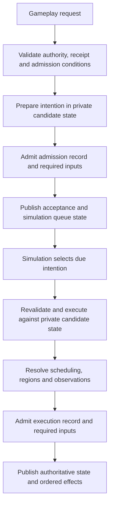

# Refactor plan

This is the accepted refactor scope. Implementation proceeds in verified
increments; a listed design is not a claim that it is implemented. Text-client
improvements and a scripting runtime are deferred.

## Contracts to preserve

The server owns authority, world topology, scheduling, and disclosure. Gameplay
requests admit intentions to a simulation-owned action queue. Admission and
execution are distinct: the scheduler resolves due actions and publishes their
effects. Queries, annotations, and session operations can finish immediately.
Player, AI, travel, and eventual script intentions should use the same execution
path. Submit-time checks do not replace execution-time checks when intervening
actions can change targets, timing, or authority.

Every authoritative mutation is prepared against private candidate state. Its
journal record and required content must be admitted to persistence before state
and ordered effects are published. Retries resolve existing receipts; reconnect
must not duplicate an uncertain action. Queue, cancellation, restart, rewind,
and region-freezing semantics belong in deterministic saved state.

Each increment must have clear ownership, explicit domain states and cohesive
interfaces. Review repeated decisions and special cases at their owning boundary.
An abstraction should make the permitted operations easier to follow and reduce
duplicated rules. Regression tests establish behavior; architectural review and
measurements establish maintainability and performance within their stated scope.

The gameplay flow has two persistence/publication boundaries. The merged queue
foundation connects human intentions, backend admission and execution, journal
replay, and client lifecycle tracking. Published preparation recovery adds
original-identity resume/cancel, durable interruption facts, explicit paused
preparation, and a typed lifecycle proof shared by replay and checkpoint recovery.
Autonomous decisions use the published common queue path. Native travel integration
is published, along with stream contexts and recovery. The remaining work
sequences stay in scope.

Immediate queries and metadata operations use their own request paths. An
acceptance acknowledges the queued intention. Clients use simulation effects and
authoritative readiness to determine when subsequent gameplay intentions are available.

Spatial indexes are backend-only derived data. Keys use region-local locations;
no global Euclidean distance is assumed. Occupancy includes every portal-resolved
body cell and its frame. Queries crossing regions follow portal topology. Clients
may index disclosed opaque identities and relative projections, never private
region identities or authoritative occupancy.

## Work sequence

1. **Explicit boundaries and focused responsibilities.** Replace implicit JSON
   conversions with exhaustive typed mappings. Separate transport, backend
   commands, simulation outcomes, journal entries, disclosed views, authoring
   schemas, compiled content, and persistence schemas. Extract responsibilities
   from the engine and session without changing ordering or durability.
2. **Reuse derived work.** Build each actor's observation once per boundary and
   reuse it for revision comparison, navigation knowledge, and client publication.
   Preserve observer privacy and intermediate memory. Prepare an AI decision once
   at its valid boundary. Share route searches. Add spatial and historical indexes
   with centralized mutation and rebuild after load, replay, rewind, and region
   transitions. Compare optimized queries with reference scans.
3. **Admission, scheduling, and stream recovery.** Make action admission and
   completion explicit; bound mailbox work and output queues with fair scheduling.
   Define slow-controller and spectator policies. Add stream identities, reset
   epochs, exact delta bases, readiness revisions, contextual receipts, and
   resynchronization. Validate snapshots and deltas centrally, including duplicate
   identifiers, arithmetic overflow, bounds, and collection invariants. Measure
   collection deltas against encoded full snapshots. Keep projected occurrences
   separate from underlying entities and protect journal identity from disclosure.
   Bound decode bytes and nesting and outbound bytes as well as message counts.
   Make integer encoding safe for future JavaScript clients. Add explicit
   capabilities and opaque, typed interaction identifiers without exposing
   private topology or eventual script functions.
4. **Scenario compilation.** Decouple authoring types from simulation internals.
   Normalize defaults and inheritance, resolve references with source diagnostics,
   and compile immutable content. Pin dependencies by identity and digest.
   Derive generation seeds from semantic parameters, stable region identity,
   generator version, and an explicit salt; use named random streams for geometry,
   population, and loot. Keep structural metadata and identifiers independent of
   activation order. Preserve lazy construction and distinguish sampled validation
   from proof of all possible generated worlds.
5. **Persistence and history.** Introduce explicit save DTOs and independent
   format/version axes. Pool immutable content across rewind boundaries. Keep the
   journal authoritative and receipts/indexes reconstructible. Bound decoding and
   reject duplicate/unknown fields in one validation path. Admit source blobs and
   journal records atomically; paths are locators, digests are identity. Measure
   compression and chunking before adoption. Add indexed, privacy-filtered history
   pagination without silently pruning retained history.
   Design portable save export separately from runtime storage. Bound resident
   history using storage-backed access when measurements justify it.
6. **Latency and extension seams.** Remove synchronous diagnostics from hot paths,
   shorten storage lock scope, and measure region fallback and checkpoint capture.
   Retain existing workload targets and investigate timing tails. Define future
   extension contracts around scoped queries, validated effects, deterministic RNG,
   named handlers, persistent typed state, scheduling, and region suspension.
   No language, VM, or package script support is added in this refactor.

## Future scenario extension contracts

These constraints guide the refactor; no scripting language, runtime, package
syntax or handler API is implemented. Adding those formats remains a separate
explicit compatibility decision. Authors should be able to choose declarative
rules and reusable behavior templates, then opt into named handlers for behavior
that needs code. Both forms should compile to the same backend concepts rather
than introducing a second mutation or scheduling system.

**Queries and authority.** Controller handlers should query an actor's disclosed
observations and remembered navigation. Scenario-world handlers may need broader
authority, such as maintaining a hidden encounter, through explicitly granted
region-scoped queries. A query's scope must therefore be part of its contract;
restricting every author hook to player visibility would prevent useful scenario
rules. Neither form grants clients access to private state. Locations remain
region-local, with explicit portal traversal and frame conversion. Queries must
distinguish unknown, unloaded and absent data without eagerly constructing every
referenced region. Authority to activate or modify another region is a separate
validated effect, subject to the normal lifecycle rules.

**Effects and ordering.** Handlers produce bounded, typed proposed effects or
gameplay intentions. They do not obtain mutable engine, store, socket or world
references. Validate effects against private candidate state; revalidate queued
intentions when the simulation executes them. Persist the operation's required
inputs, state changes and result before publishing observations. Handler failure
must reject its enclosing transaction rather than publish a partial effect batch.
Use named hooks at documented simulation boundaries, with deterministic ordering
and limits on recursive event production. Wall-clock callbacks and thread
completion must not decide authoritative order. Clients invoke authorized opaque
interaction identities, never arbitrary handler names or interpreter functions.

**Determinism and limits.** Supply explicit named random streams whose identity
and state survive save/replay/rewind. The runtime must not read wall-clock time,
filesystem, network or ambient randomness. Define deterministic instruction/work,
effect-count and persistent-state limits, including a total budget for an event
cascade. A wall-clock timeout may protect the host but cannot select a different
successful game outcome. Exhaustion follows an explicit failure policy; it must
not silently drop effects or resume half an invocation in live state.

**Persistence and lifecycle.** Persistent handler state should have a declared,
bounded typed schema keyed by stable content and owner identities. Save values
and scheduled intentions rather than interpreter stacks, closures or native
handles. Pin handler inputs by content digest and eventual runtime/API identity;
reject unsupported identities using the existing current-format policy. A
handler's actor, region or scenario ownership determines its lifetime and clock.
Regional timers and progress must follow freeze/thaw rules, and rewind must
restore state and pending work together. Lazy regions must not allocate handler
state before activation. Restoring progress must preserve the existing policy
requiring fresh human input where appropriate. Historical runtime support or
state migration requires its own future compatibility milestone.

The immediate refactor consequences are to retain typed command/effect boundaries,
private transaction state, simulation-owned scheduling, immutable prepared
definitions, independent format axes and backend-controlled disclosure. Avoid
persisting implementation-specific controller objects or exposing a general
world-mutation escape hatch merely to make a future runtime easy to connect.

## Verification

Use the repository verification tiers and process tests for touched boundaries.
Exercise retries, save/reload, replay, rewind, disclosure, reconnect, generated
regions, portal transforms, and scheduling. Prove scaling with operation counts
at multiple world sizes and compare release workload measurements before claiming
performance improvements. Windows and Linux CI remain required before merge.
Compatibility-breaking decisions must be stated explicitly before adoption.

## Work in progress: saved intentions

The simulation now separates bounded intention admission from scheduled execution.
Admission does not apply gameplay effects. Execution rebuilds preparation against
current state, preserves actor scheduling order, and records the original intention
alongside either its outcome or a failure. Human work can be suspended/resumed;
checkpoint state preserves the queue, and rewinds continue its identity watermark.
Focused tests pass, including capacity/rejection atomicity, malformed saved
action rejection, single-decision AI execution and resolution of dead queued actors.
Session uses the simulation's selection to resolve dead queued work even when
no actor is due or controlled. Attack preparation retains its admission identity
before wind-up advances, and impact/interruption facts carry the same identity.
Tests cover restored progress, impact during execution, interruption and rejection
of missing, zero or future saved identities. Backend journal entries now retain
terminal intention facts atomically with the effects that produced them. Running
attack contexts appear in snapshots, and completion during another actor's turn
updates the original receipt and ordered lifecycle stream. Checkpoint restoration
validates terminal identities, actors and outcomes against retained state boundaries.
Server unit tests and a real server/text combat process test pass.
Backend admission now uses the checked-request/candidate/persistence/publication
boundary. Its distinct journal record retains a retryable receipt without claiming
an action effect or appearing in disclosed history. Focused tests cover admission
without state changes, retry, replay/checkpoint recovery, storage rejection and
corrupted receipt/queue linkage. Backend scheduled execution now shares action
reconciliation and candidate publication with immediate operations. Typed start
and failure records link to the admission; no synthetic RPC receipt is persisted
for execution. Tests cover exact replay/checkpoint restore, duplicate/foreign
linkage rejection, rejected execution preserving work, durable restart/retry and
rewind identity continuation. Wire actions now admit work; session simulation steps
execute it. Protocol receipts distinguish immediate completion from admitted work,
with opaque admission identities and branch context. Ordered lifecycle updates and
pending snapshots drive shared client state and input guards. A real server,
headless player and spectator test proves acceptance before effects and ordered
resolution; protocol and shared/native/text client suites pass. Text changes are
limited to transport and execution-failure handling.
Scripted transport and the performance driver now wait for the matching actor,
branch and intention lifecycle before inspecting effects. Driver acknowledgement
timestamps remain separate from execution completion. Focused real-process tests
cover piped input, save/restart and single/multiple-client performance workloads.
Persistence process tests cover rollback, admission-only and completed-action
durable prefixes, plus checkpoint-and-tail recovery with continued play.
Queued movement retains its region-local origin, orientation, destination and
portal frame change. Execution checks this guard against its fresh preparation;
teleports and changed mappings fail instead of reinterpreting the direction.
The guard is required in saved work and contains no cached permission or prepared
action. Simulation tests cover restored context, rotated portals and rejection
without state/time/RNG effects; a real multi-actor process test covers teleport
while work waits in the queue.
Queued human work now suspends durably on restart, control loss and rewind.
Separate lifecycle facts replay without fabricated execution receipts or disclosed
gameplay history. Explicit protocol resume/cancel commands validate current
branch/revision, controller authority and original admission linkage. Cancellation
preserves simulation time and does not enable autonomous progress. Storage rejection
preserves queue/archive state; startup refuses to run if required suspension cannot
be journaled. Server tests cover recovery, retries, corrupted linkage and atomicity;
real-process tests cover control reacquisition, restart, observer denial, resume,
cancellation and a rewound branch that survives another restart.
Shared client state builds explicit queued controls from the current disclosed
identity, branch and revision. ASCII exposes F8/F9 with a persistent queue-state
hint; headless exposes strict JSON input forms without identity overrides. Tests
cover abandoned contexts, control loss, read-only protection, genuine native key
events and real server recovery through the new input forms.
Validated lifecycle updates also refresh the ASCII action status after execution;
rejected updates leave it unchanged, and spectator status remains read-only.
Unit and real-window regressions cover a completed action leaving an empty queue.
Private queue traffic no longer consumes the selectable rewind budget. Retention
keeps the union of 128 selectable gameplay states and 128 recent raw transaction
states, capped at 256 shared boundaries. Checkpoint restore derives the exact set
in one archive pass and replays private metadata through any gaps. Tests cover
admission traffic, repeated suspend/resume, expiry, checkpoint/replay/rewind and
corrupt metadata outside the raw window. Format checks passed in the full tier.
The release comparison and real queued trace below evaluate ordinary costs;
maximum-retention resident memory and queue-only flood costs remain follow-up
measurements.
Running-preparation recovery, AI/travel migration, region lifecycle edge cases,
complete lifecycle linkage and stream recovery remain
pending. Broad server/process verification and format/CI gates remain
required before publishing this integration branch. The latest full run completed
all steps with passing non-mouse checks; the maintainer waived local native mouse
verification because Windows LockApp covers the owned game window. CI retains
the ordinary Windows/Linux suite. Push and CI gates remain pending.

Three interleaved release rounds compared checkpoint 23 (`9ec78718`) with the
queue integration working tree on the same Windows host and SSD (fingerprint
`cfb2fdc044dc`). All twelve runs passed their workload validators. The head was
dirty; these are local diagnostic measurements, not published ledger claims.
The benchmark uses trusted direct-engine actions, so its command endpoint does
not measure TCP admission or queue execution. Times below are milliseconds;
each timing cell lists p50 / p95 / maximum.

| Case | Metric | n per side | Checkpoint 23 | Queue integration |
| --- | --- | ---: | ---: | ---: |
| 64 regions, 8 actors, 1,000 seeded history | Command | 7,488 | 0.0413 / 2.5158 / 6.8817 | 0.0429 / 2.4839 / 9.5632 |
| Same | Final flush | 3 | 711.411 / 757.416 / 757.416 | 629.578 / 703.025 / 703.025 |
| Same | Restart/replay | 3 | 427.022 / 450.456 / 450.456 | 415.139 / 421.276 / 421.276 |
| 256-region streaming | Command | 2,100 | 0.2276 / 0.4135 / 0.8615 | 0.2333 / 0.4283 / 1.7190 |
| Same | Final flush | 3 | 106.992 / 129.618 / 129.618 | 114.292 / 153.720 / 153.720 |
| Same | Restart/replay | 3 | 165.686 / 181.259 / 181.259 | 183.285 / 183.812 / 183.812 |

Operation, observation, transition, revision-comparison and rewind counts stayed
equal. Ordinary journal bytes rose from 1,492,887 to 1,542,807; checkpoint bytes
rose from 630,163 to 635,323 and final file bytes from 4,964,352 to 5,156,864.
Streaming journal bytes rose from 477,018 to 491,018 while final file bytes stayed
679,936. New required intention metadata therefore has a measurable encoding
cost. Ordinary command p95 was similar, but command maxima increased in both
cases. Streaming flush tails and restore median also increased. Three flush and
restore samples per side do not establish a broad performance improvement;
these tails remain part of the latency investigation.

A separate current-release TCP trace completed one cycle with eight actors and
eight regions: 495 successful actions, two deliberate rejections, 495 correlated
acknowledgements, and 61 checked spectator presentations. Diagnostics were
retained in memory during measurement. The saved file was 704,512 bytes with
991 journal rows. This is a current-path measurement, without a matched old-path
comparison. The historical `request_to_ready_ms` field measures receipt of the
matching execution lifecycle update for these actions.

| Queued trace endpoint | n | p50 ms | p95 ms | Maximum ms |
| --- | ---: | ---: | ---: | ---: |
| Admission acknowledgement line | 495 | 4.741 | 10.151 | 74.563 |
| Execution update receipt | 495 | 11.205 | 32.879 | 88.413 |
| Actor-1 spectator presentation | 61 | 85.293 | 188.801 | 225.774 |

Presentation includes the ASCII client's configured observation pacing. Admission
acknowledgement is a different endpoint from the older synchronous completion
acknowledgement; comparing those as a latency gain would be misleading. The
trace does not measure attack-impact completion or peak resident memory.

The measurements above describe the merged queue foundation at the stated
commits. The preparation-recovery slice advances protocol and save/archive
versions and pins the current ruleset; see the [format registry](milestones.md).
The authored validator schema, scenario package version 2 and binary frame
version 6 are unchanged. Required queue, movement, execution-context and derived
lifecycle fields have no legacy-reader defaults. Previous saves and builds remain
preserved; unsupported versions fail explicitly. Full verification and publication
of the recovery slice completed in [PR #66](https://github.com/KCall360/thresholds-of-ruin/pull/66).
Its tested head `e1c1081` passed full local verification and all five Windows/Linux
CI checks; the desktop launchers use that head after 28 deployed-build smoke tests.

The current recovery implementation resumes and cancels paused attack progress
under its original identity, records interruption facts atomically, and shares
one actor-owned lifecycle model between replay and checkpoint validation. Actor
and queue checkpoint pools compare full values and retain copy-on-write isolation;
large retained-window save/reopen diagnostics and their memory limits are recorded
in [checkpoints](checkpoints.md). Client controls and ASCII hints select queued
work before independent preparation through one shared selector, independent of
delivery order. Focused regressions, affected client suites and real intention
process tests pass. Recovery publication verification and both-platform CI passed.
AI/travel migration, stream context, scenario compiler work, persistence scaling
and latency/memory investigations remain within the full refactor scope.

## Autonomous scheduling integration (published)

AI decisions now enter the simulation-owned queue through a private, typed backend
admission. Admission chooses no action and changes no time, RNG, observation or
physics state. The existing queue execution path chooses the action once, reconciles
effects, admits the journal and publishes observations. No authenticated RPC receipt
is fabricated. Session admits and executes the due decision within its existing
bounded scheduling step; queued human work still requires its controller, while
autonomous work requires enabled play and a living controlled player.

Replay, checkpoint private-boundary recovery and retained-state validation share
admission ownership and execution-target checks. A driver retry reuses the admitted
identity. Focused tests cover effect-free admission, exact queue restoration,
execution rejection without publication, retry after reopen, retained queue rewind
with allocator high-water marks, and forged actor, author and preparation target.
Actual-process tests verify private backend admissions, receipt-free linked
execution, spectator disclosure, and exact state/history after restart. The existing one-decision/one-route-search/one-
simulation-transition contracts pass. A release-comparison failure exposed attacks
started and interrupted inside one simulation boundary: the old suspension derivation
only considered preparation already present before execution. Derivation now includes
successful starts and continuations, preserving strict checkpoint phase validation.
A permanent combat regression checks replay and checkpoint recovery at every boundary.
Effect-free admissions retain already-built committed observations. A failing-first
work-count regression exposed cache invalidation that rebuilt all pre-action views;
shared admission publication now preserves those views. Navigation refresh accounting
belongs to common action reconciliation for both immediate and queued execution.
Fresh admission and execution are separate journaled command boundaries and capture
two candidates; a queued retry captures only execution. They use the existing
[asynchronous save policy](background-saving.md) and can share a storage batch.
Ordinary publication does not wait for disk; an explicit save provides the barrier.

This integration advances the current save and ruleset versions in the
[format registry](milestones.md), with all 33 scenario certificates regenerated.
Protocol, authored validator schema and binary framing are unchanged. Full and
both-platform CI gates passed for publication. No broad performance gain is
claimed; native travel and the remaining work sequences stay in scope.

## Native travel scheduling integration (merged, PR #68)

Each journey step now has a private backend admission linked to the accepted
travel request and a consecutive step ordinal. The simulation owns its queue,
region-local movement context and shared execution. Session retains disclosed
routing, controller/hazard policy and client travel status. Admission changes no
time or journey progress. Only the original committed scheduler result advances
the route. No synthetic client RPC or separate movement executor remains.

Live indexed admission and chronological recovery share a predecessor proof:
only a successfully resolved step permits the next ordinal. Checkpoint validation
also matches the queued destination to its original journal record. Native work
is separate from human resume/cancel controls. Backend cancellation settles a
stopped journey; startup settles saved pending steps before control acquisition.
Travel route jobs do not resume automatically. Rejected admission, execution and
cancellation retain authoritative state, revisions, receipts and queue identity.
A failed stop settlement blocks simulation while reads and save polling continue.

Tests cover effect-free admission, execution-based progress, release between
boundaries, mismatched pending identity, unloaded cancellation facts, exact
replay/checkpoint restoration, real storage rejection/reopen in checkpoint and
journal modes, and startup rejection/retry. Actual server/headless tests verify
private admission, receipt-free linked execution, observer disclosure and durable
state/history. The integration is merged after required verification and
Windows/Linux CI, and the desktop launchers use its verified immutable build.
Remaining persistence and restoration tails stay in scope. Text-client fixes
and scripting runtime implementation remain deferred.

## Stream context and exact observation bases (merged, PR #69)

Snapshots and updates require an opaque attachment identity and reset epoch.
The host allocates identities outside simulation randomness and saved state;
reset counters use checked arithmetic. Shared validation atomically rejects
foreign or obsolete contexts. Deltas name the exact previous observation cursor
and revision, independently of intervening control, annotation, travel and
intention messages. Snapshot resets establish a fresh observation base.

Shared transport requests one matching repair snapshot with a bounded deadline.
Stored queue, flush and reply phases survive cancellation. Old updates and query
payloads are quarantined during repair. Foreign actors and attachments remain
fatal. Shared pending requests retain typed confirmed receipts or rejections;
an unanswered request remains unknown after repair. No gameplay is automatically
replayed, and admission never claims simulation completion. Immediate receipts
retain original journal actor and branch identity through rewind and restart.

Readiness combines one simulation-owned queue/control query with session
ownership, role, actor validity, run and travel policy. Resume/cancel availability
uses the validators that select the actual mutation. Suspended queue entries
reuse their capacity and identity. Resuming paused preparation needs capacity to
insert its continuation while preserving its identity and spent progress. New
actions need capacity and a fresh identity. Queue capacity does not grant
authority or validate targets and timing. Required snapshot readiness and
ordered updates use a generation independent of observation revisions, including
ownership changes when permissions remain empty. Publication queries each actor
once per pass and repeats only when output rejection removes clients.

Commands name their originating stream, epoch and readiness generation.
Authenticated role/actor checks and authorized original receipt lookup precede
freshness. New input must match both published and current generations and the
published admission/resume/cancel permissions. Predicted unpublished generations
and stale ownership, reset or stream contexts reject without mutation. Native
queued input retains its captured context rather than restamping at send time.
Native/headless admission and native work controls honor disclosed permissions
independently of turn scheduling. Gameplay remains simulation-owned queued work.

Typed receipts, history and palette replies share a permission-before-reply
publication boundary. Deferred save acknowledgements publish as a batch; output
disconnects trigger a conditional follow-up permission pass. Successful replies
require current cached disclosure context, independently of original receipt
identity. Errors explicitly distinguish transport, unattached host and attached
host scope. Shared transport validates contextual rejections, retains outcomes
through repair and withholds query contents until synchronized.

Shared requests and server output use one bounded JSON encoder. Common request
and response ceilings also bound WebSocket frame and fragmented-message assembly.
The existing single-encoding server output leases cover queued/in-flight bytes,
write failures and cancellation. Collection deltas, encoded full/delta selection,
numeric encoding, typed capabilities and fair aggregate output pressure remain
open work rather than implied completion of the protocol recommendations.

Failing-first schema, model, transport, session, native worker and actual-process
regressions cover these contracts. Existing text gameplay completion consumes the
permission boundary before chaining input and retains known failures if permission
delivery times out; parser, prose and pacing improvements remain deferred.
Actual-client recovery holds one repair snapshot to prove unchanged native state
and history, exactly one repair, same-process continuation, independent relaunch,
and continued authoritative progress. Gap, overflowing-delta and invalid-inventory
cases remain in both debug and release application suites.

The refreshed local full run passed all 824 Rust tests in each profile, formatting,
lint, architecture and rustdoc. Debug Python passed 252 of 253 cases; release
applications passed 134 of 135. The only failure in each profile was the native
mouse test intercepted by the Windows overlay, expressly waived by the maintainer.
Tests remain enabled in ordinary CI. This is qualified local evidence, not an
unqualified full pass. Exact head `c114373` subsequently passed all five required
Windows/Linux CI checks and merged in PR #69. Its immutable candidate passed 43
process checks; the three desktop launchers now use the hash-verified build and
matching scenario files. Earlier builds and saves remain retained. All other
refactor work sequences remain in scope.

Subsequent cancellation review exposed a lost presentation boundary: when TCP
output blocked an automatic palette query, cancellation after applying an
observation discarded the observation before the frontend received it. A real
socket regression proved both the lost delivery and the missing playback guard.
Snapshot and palette queries now share stored queue/flush phases with bounded
send deadlines. Applied observations remain pending until query output completes;
they are presented exactly once without being reapplied. Pending presentation
also keeps playback active. Focused shared-client, real application recovery and
palette checks pass. The refreshed full run above includes this correction;
the final-commit Windows/Linux CI also passed.

### Stream context release comparison

Three interleaved rounds compared this implementation with the preceding travel
checkpoint on the same Windows host and HDD save volume. All eighteen runs
validated, with no competing builds. Cases used eight actors, 8 and 256 regions
with 100 initial history entries, and the combat group with 1,000 history entries.
Timings are milliseconds, baseline to refactor.

| Metric | n | p50 | p95 | max |
| --- | ---: | --- | --- | --- |
| Authoritative transition, 8 regions | 4,509 | 0.0245 → 0.0244 | 2.281 → 2.304 | 4.158 → 4.779 |
| Authoritative transition, 256 regions | 4,509 | 0.0340 → 0.0336 | 2.628 → 2.655 | 6.780 → 6.662 |
| Combat command | 576 | 0.574 → 0.569 | 3.308 → 3.250 | 3.684 → 5.189 |
| Combat client application | 495 | 0.289 → 0.287 | 0.317 → 0.333 | 0.494 → 0.713 |
| Combat client draw | 495 | 0.674 → 0.670 | 0.739 → 0.752 | 1.018 → 1.146 |
| Combat restart | 9 | 250.5 → 249.7 | 259.7 → 262.5 | 259.7 → 262.5 |
| Combat explicit save | 9 | 285.5 → 324.7 | 359.2 → 351.0 | 359.2 → 351.0 |

All operation and retained-byte counts match across sides and rounds. Combat
retained 365,055 body-cell visits, 59,748 scene calls, 36 navigation refreshes,
130,431 disclosed state bytes and 11,415,552 saved bytes. Authoritative transition
p95 increased about 1% at both world sizes; combat command p95 decreased 1.8%,
while its maximum increased. Client application p95 increased 4.9%; save p50
increased 13.7%. Restart/save groups contain only nine samples, so their tails
remain weak evidence. No broad latency or memory improvement is claimed.

These benchmarks exercise engine transitions and disclosed-state application;
they bypass session admission, WebSocket transport and automatic repair. Equal
state-byte counts do not establish equal protocol envelope sizes or wire costs.
These measurements preceded the cancellation correction. Actual-process
acceptance covers transport behavior; comparative host and repair
latency measurements remain open. Raw samples remain local; no release assets
or performance ledger entries were published.

A repeat on the cancellation-corrected code used the same baseline, cases,
three interleaved rounds and storage volume. All eighteen runs validated, with
identical operation and retained-byte counts and no competing builds. Both sets
are retained rather than selecting the favorable comparison.

| Metric | n | p50 | p95 | max |
| --- | ---: | --- | --- | --- |
| Authoritative transition, 8 regions | 4,509 | 0.0243 → 0.0244 | 2.283 → 2.319 | 6.172 → 3.887 |
| Authoritative transition, 256 regions | 4,509 | 0.0346 → 0.0334 | 2.650 → 2.631 | 4.389 → 6.396 |
| Combat command | 576 | 0.5788 → 0.5815 | 3.368 → 3.283 | 6.181 → 3.706 |
| Combat client application | 495 | 0.2908 → 0.2914 | 0.566 → 0.332 | 0.787 → 0.533 |
| Combat client draw | 495 | 0.6830 → 0.6753 | 0.992 → 0.769 | 1.397 → 3.507 |
| Combat restart | 9 | 253.4978 → 252.5717 | 308.283 → 254.535 | 308.283 → 254.535 |
| Combat explicit save | 9 | 282.9195 → 330.2182 | 1238.367 → 1224.887 | 1238.367 → 1224.887 |

In this repeat, transition p95 rose 1.6% at 8 regions and fell 0.7% at 256;
combat command p95 fell 2.5%. Save median rose 16.7%, and both sides had save
tails above 1.2 seconds. Client application/draw p95 fell, while maximum draw
time increased. The small persistence sample and baseline variability prevent
attributing these changes to the refactor. These engine/model benchmarks still
do not measure session, WebSocket or repair latency, and establish no broad
latency or resident-memory improvement. Raw results remain local and unpublished.

## Shared item and combat definitions

Runtime item and combat definitions use transparent shared ownership. Public
scenario configuration values remain owned. Stack splits and damage detach mutable
instance state without copying unrelated definition strings, maps or sets. Decoded
checkpoint restoration interns equal item and combat definitions across distinct
retained boundaries using their complete values, including appearance/assets,
properties, attack rules, defenses and faction. Mutation remains copy-on-write.
There is no process-global cache or pointer-based gameplay ordering.

Failing-first regressions measured 17 item-definition copies and 16 combat-definition
copies at 16 entities. After sharing, both count zero at 16, 256 and 4,096 entities.
Fifty simulation unit tests pass, including decoded pooling, byte-identical
checkpoint encoding and isolated edits. A new real-client acceptance test splits
a stack, checkpoints, restarts, drops part, rewinds, saves and restarts again.
Quick Windows verification passed, including 123 actual-process tests. Full Windows
verification passed 237 debug Python/process checks, Rust documentation and all
workspace debug/release tests, plus 123 release-process tests. All twenty-two
deployed-client/validator checks passed against the updated desktop binaries.

The ownership change preserves the current serialized formats. It does not pool
encoded definitions, eliminate temporary decode allocations, or share all detached
region records; those records retain a separate lazy decoding path. No resident-
memory improvement is established by copy counts or latency measurements.

The standard release comparison used three rounds and five streaming cycles
against the preceding region-attribution checkpoint on machine `cfb2fdc044dc`.
All eighteen runs validated; comparable work, saved-byte and disclosure counts
matched. Compiler reference caches used the data drive; measured binaries and save
workloads stayed on the same default system volume. All samples were retained,
with no repeat run. Times below are milliseconds, before → after.

| Case / metric | n per side | p50 | p95 | max |
| --- | ---: | ---: | ---: | ---: |
| stream-r256-durable / authoritative_total | 2,100 | 0.2356 → 0.2294 | 0.4147 → 0.4146 | 0.7392 → 1.4182 |
| stream-r256-durable / final_flush_ms | 3 | 111.7968 → 113.8685 | 130.7798 → 163.2841 | 130.7798 → 163.2841 |
| stream-r256-durable / restart_replay_ms | 3 | 180.0120 → 178.7986 | 193.6108 → 180.2188 | 193.6108 → 180.2188 |
| i1000-id256 / client_apply_ms | 1,200 | 0.6089 → 0.6024 | 1.1218 → 0.7739 | 1.9160 → 1.5549 |
| i1000-id256 / client_render_ms | 1,200 | 0.9442 → 0.9032 | 1.5529 → 1.2074 | 2.5739 → 2.0397 |
| i1000-id256 / construction_ms | 60 | 8.8279 → 8.1906 | 11.4654 → 8.9861 | 18.5332 → 21.5841 |
| i1000-id256 / knowledge_ms | 60 | 0.4361 → 0.4522 | 0.7698 → 0.6058 | 1.1708 → 0.9271 |
| i1000-id256 / resume_ms | 60 | 50.6426 → 57.3056 | 64.0587 → 63.1765 | 69.3901 → 67.9808 |
| i1000-id256 / save_ms | 60 | 138.9392 → 68.8905 | 203.6661 → 177.3764 | 273.4241 → 185.0448 |
| i1000-id256 / transfer_ms | 1,200 | 0.6333 → 0.3864 | 1.1126 → 0.5280 | 1.6895 → 0.9662 |
| i16-id8 / client_apply_ms | 1,200 | 0.1370 → 0.1392 | 0.2355 → 0.2312 | 0.5441 → 0.5067 |
| i16-id8 / client_render_ms | 1,200 | 0.6539 → 0.6695 | 1.0646 → 1.0587 | 1.7071 → 2.4435 |
| i16-id8 / construction_ms | 60 | 1.6619 → 1.4930 | 2.1583 → 2.2769 | 2.8173 → 3.1521 |
| i16-id8 / knowledge_ms | 60 | 0.2793 → 0.2705 | 0.3689 → 0.3948 | 0.4767 → 0.6250 |
| i16-id8 / resume_ms | 60 | 13.1094 → 9.9498 | 15.6822 → 15.9973 | 15.9842 → 19.4393 |
| i16-id8 / save_ms | 60 | 57.3441 → 16.9439 | 101.1263 → 72.0126 | 165.4632 → 663.4923 |
| i16-id8 / transfer_ms | 1,200 | 0.0591 → 0.0537 | 0.1152 → 0.1001 | 0.1857 → 0.2140 |
| a8-h1000 / client_apply_ms | 495 | 0.3128 → 0.2934 | 0.5853 → 0.3892 | 0.8649 → 0.6871 |
| a8-h1000 / client_draw_ms | 495 | 0.7478 → 0.7116 | 1.1470 → 0.9870 | 1.5209 → 1.2629 |
| a8-h1000 / command_ms | 576 | 0.5756 → 0.5475 | 3.6663 → 3.5451 | 5.0189 → 4.2099 |
| a8-h1000 / decision_ms | 576 | 0.0005 → 0.0004 | 0.5827 → 0.5625 | 1.2133 → 1.1178 |
| a8-h1000 / resume_ms | 9 | 218.5121 → 209.5823 | 273.3757 → 226.6014 | 273.3757 → 226.6014 |
| a8-h1000 / save_ms | 9 | 258.9126 → 253.8188 | 427.9217 → 495.8015 | 427.9217 → 495.8015 |

The dense 1,000-item transfer median fell 39.0% and p95 fell 52.5%; the small
16-item transfer median fell 9.1% and p95 fell 13.1%. These are workload-specific
results. Small-item save max rose from 165.5 to 663.5 ms despite lower median/p95;
eight-actor combat save p95 rose 15.9%, and streaming flush p95 rose 24.9% (only
three samples per side). Streaming command p95 was effectively unchanged but its
maximum rose 91.9%. Construction, knowledge and resume results are also mixed.
No broad latency or memory gain is claimed; the previously recorded body-restore
and falling-physics tails remain unresolved.

## Region acquisition attribution

Profiled transitions now distinguish successful synchronous reads/builds from
prepared reads/builds, with separate fallback durations nested within total
region-transition time. Resident record-cache hits are excluded. These details
are diagnostic data; they are not saved, disclosed or used to resolve gameplay.
Ordinary commands do not enable the additional acquisition clocks. Existing
checkpoint-capture timing/counts remain in place.

The failing-first regression now verifies count partitions and duration bounds
while playing with disabled, settled, racing and stopped preloading, including
cold restart and identical region rows. A separate check prevents nested timings
from entering the exclusive phase sum. Report-validation regressions failed
first on eight inconsistent/missing/invalid acquisition reports and now reject
them. A real streaming benchmark process emits and validates the new profiles
and timing summaries. Quick Windows verification passed, including the Rust
workspace suite and 122 actual-process tests. Full Windows verification also
passed, including 236 debug Python/process tests, Rust documentation and workspace
tests in debug and release, and 122 release process tests. All twenty-one
deployed-client/validator checks passed. No performance improvement is claimed.

Three interleaved release rounds compared this increment with the preceding
shared-restoration checkpoint on the same Windows host. All twelve runs
validated, with equal comparable work, saved-byte and disclosure counts.
Timings are milliseconds, baseline to refactor:

| Workload / metric | n per side | p50 | p95 | max |
| --- | ---: | --- | --- | --- |
| stream-r16-durable / command | 2,100 | 0.2542 → 0.2432 | 0.4785 → 0.4522 | 1.3219 → 1.1993 |
| stream-r16-durable / save | 3 | 117.3947 → 87.4694 | 217.6047 → 107.0672 | 217.6047 → 107.0672 |
| stream-r16-durable / restart/replay | 3 | 170.8364 → 169.6671 | 183.5708 → 180.0609 | 183.5708 → 180.0609 |
| stream-r256-durable / command | 2,100 | 0.2337 → 0.2383 | 0.4176 → 0.4301 | 0.9718 → 0.9213 |
| stream-r256-durable / save | 3 | 100.1786 → 110.5751 | 120.1458 → 117.3521 | 120.1458 → 117.3521 |
| stream-r256-durable / restart/replay | 3 | 166.3087 → 166.6488 | 185.2140 → 176.5394 | 185.2140 → 176.5394 |

The 256-region command median rose 2.0% and p95 rose 3.0%; its save median rose
10.4% while p95 fell 2.3%. The 16-region command p95 fell 5.5%. Save and restart
samples number only three per side, so their tails have limited evidential weight.
These diagnostics do not establish a broad latency or memory improvement, and
earlier unresolved restore and falling-command tails remain open.

Across each candidate workload's 2,100 samples, all nine builds were prepared
and there were no synchronous reads or builds. The comparison therefore measures
the prepared path, not synchronous fallback costs. The disabled/racing preloader
regressions exercise fallback attribution separately. No raw samples or ledger
results were published.

## Shared checkpoint restoration

A restore-scoped context now shares decoded worlds, navigation and item stores
by their existing pool indexes across the current game and retained rewind
states. Item location indexes are reconstructed from each decoded item pool once
and remain copy-on-write. Equal body definitions share ownership through a
value-ordered pool; the entire authored cell sequence, eye and mass participate
in equality. Pooling never sorts body cells or uses pointer identity for game
decisions. Temporary context references are released after restoration, and
restored games retain only the values they use. The serialized schema and normal
game validation are unchanged.

The failing-first decoded-body regression now passes at 16, 256 and 4,096 actors.
Focused checks cover complete game equality, byte-identical recapture, sharing
across decoded states, mutation isolation, distinct cell order/eye/mass and
corrupt-body rejection. The server checkpoint test restores every retained
exploration boundary through the production context and recaptures the same
bytes. A real-process test checkpoints portal physics, restarts, rewinds,
reproduces the crossing and restarts again with matching state and history.
Quick verification passed, including 121 actual-process tests. Full Windows
verification passed too, including 233 debug Python/process tests, Rust
workspace debug/release checks and 121 release process tests. All twenty-one
deployed-client/validator checks passed. The initial quick attempt failed on two
Clippy warnings in test assertions; the corrected quick and full runs passed.
No lower latency, decoder-allocation or resident-memory claim is made.

This shares loaded checkpoint content. Detached-region records have their own
decoding and ownership path; broader immutable-content pooling remains open.
Restoration does not eagerly load those records or alter lazy region activation.

### Shared restoration release comparison

Three interleaved rounds compared shared restoration with the preceding scenario
compiler checkpoint on the same Windows host. All twenty-four runs validated,
with unchanged work, saved-byte and disclosure counts. A controlled repeat of
256-region streaming and combat used identical binaries and the same machine;
all twelve repeat runs validated with matching counts. Timings below are
milliseconds, baseline to refactor. Combat decision and command are separate
phases; their quantiles must not be added.

| Workload / metric | n per side | p50 | p95 | max |
| --- | ---: | --- | --- | --- |
| stream-r16-durable / command | 2,100 | 0.2313 → 0.2281 | 0.4090 → 0.4203 | 1.2750 → 1.3015 |
| stream-r16-durable / save | 3 | 66.7226 → 79.0118 | 127.5680 → 112.2398 | 127.5680 → 112.2398 |
| stream-r16-durable / restart/replay | 3 | 177.4863 → 177.2945 | 180.4089 → 177.6369 | 180.4089 → 177.6369 |
| stream-r256-durable / command | 2,100 | 0.2257 → 0.2303 | 0.4299 → 0.4098 | 0.8385 → 1.0987 |
| stream-r256-durable / save | 3 | 79.3078 → 68.2169 | 116.9602 → 289.4145 | 116.9602 → 289.4145 |
| stream-r256-durable / restart/replay | 3 | 165.0301 → 166.1065 | 183.3521 → 177.3497 | 183.3521 → 177.3497 |
| a2-h0 / client apply | 576 | 0.2731 → 0.2720 | 0.4587 → 0.3770 | 1.5868 → 0.8572 |
| a2-h0 / client draw | 576 | 0.6557 → 0.6615 | 1.1042 → 0.9659 | 2.4978 → 2.1910 |
| a2-h0 / command | 576 | 0.2075 → 0.2089 | 0.3327 → 0.3119 | 0.8806 → 0.7299 |
| a2-h0 / decision | 576 | 0.0004 → 0.0004 | 0.6391 → 0.6114 | 2.1168 → 1.8309 |
| a2-h0 / resume | 9 | 21.7924 → 25.6572 | 38.1904 → 39.5009 | 38.1904 → 39.5009 |
| a2-h0 / save | 9 | 36.1467 → 23.4552 | 264.6201 → 35.4481 | 264.6201 → 35.4481 |
| a2-h1000 / client apply | 576 | 0.2753 → 0.2761 | 0.4271 → 0.3863 | 0.8873 → 0.5836 |
| a2-h1000 / client draw | 576 | 0.6433 → 0.6455 | 1.0282 → 0.8532 | 6.4363 → 1.3523 |
| a2-h1000 / command | 576 | 0.2026 → 0.2004 | 0.3628 → 0.2627 | 0.7564 → 0.5603 |
| a2-h1000 / decision | 576 | 0.0004 → 0.0003 | 0.5510 → 0.5641 | 1.2852 → 0.8108 |
| a2-h1000 / resume | 9 | 65.5766 → 64.4968 | 75.9848 → 76.1618 | 75.9848 → 76.1618 |
| a2-h1000 / save | 9 | 70.6924 → 103.1569 | 314.3081 → 251.3498 | 314.3081 → 251.3498 |
| a8-h0 / client apply | 459 | 0.2819 → 0.2842 | 0.3544 → 0.3471 | 0.6995 → 0.7699 |
| a8-h0 / client draw | 459 | 0.6922 → 0.7068 | 0.9688 → 0.9779 | 1.7292 → 2.0895 |
| a8-h0 / command | 576 | 0.6412 → 0.6469 | 3.7285 → 3.6400 | 6.2673 → 7.0739 |
| a8-h0 / decision | 576 | 0.0004 → 0.0004 | 0.5448 → 0.5595 | 2.0680 → 2.2094 |
| a8-h0 / resume | 9 | 106.6356 → 107.5638 | 118.2698 → 120.7544 | 118.2698 → 120.7544 |
| a8-h0 / save | 9 | 23.0300 → 21.8864 | 43.4433 → 46.8050 | 43.4433 → 46.8050 |
| a8-h1000 / client apply | 495 | 0.2881 → 0.2891 | 0.3441 → 0.3424 | 0.4737 → 0.4761 |
| a8-h1000 / client draw | 495 | 0.6773 → 0.6853 | 0.8953 → 0.9266 | 1.1273 → 1.0433 |
| a8-h1000 / command | 576 | 0.5264 → 0.5296 | 3.3072 → 3.2596 | 3.4772 → 3.4309 |
| a8-h1000 / decision | 576 | 0.0004 → 0.0004 | 0.5409 → 0.5466 | 0.7444 → 0.6166 |
| a8-h1000 / resume | 9 | 210.9147 → 201.1872 | 219.6432 → 219.8359 | 219.6432 → 219.8359 |
| a8-h1000 / save | 9 | 109.1385 → 395.7784 | 220.5126 → 431.1857 | 220.5126 → 431.1857 |
| a8-i128-c8-falling / client apply | 144 | 0.7374 → 0.7291 | 0.8821 → 0.8795 | 1.2058 → 1.1131 |
| a8-i128-c8-falling / client draw | 144 | 1.1886 → 1.1638 | 1.4280 → 1.3611 | 1.6262 → 1.5443 |
| a8-i128-c8-falling / command | 576 | 0.0846 → 0.0832 | 11.7443 → 11.9579 | 20.3153 → 19.8607 |
| a8-i128-c8-falling / resume | 9 | 239.4075 → 232.1165 | 257.4475 → 256.1336 | 257.4475 → 256.1336 |
| a8-i128-c8-falling / save | 9 | 231.5130 → 71.8067 | 302.4876 → 304.0111 | 302.4876 → 304.0111 |

The controlled repeat retained the following results:

| Workload / metric | n per side | p50 | p95 | max |
| --- | ---: | --- | --- | --- |
| stream-r256-durable / command | 2,100 | 0.2303 → 0.2365 | 0.4101 → 0.4401 | 0.8019 → 0.9431 |
| stream-r256-durable / save | 3 | 99.9884 → 102.4694 | 119.6959 → 222.7252 | 119.6959 → 222.7252 |
| stream-r256-durable / restart/replay | 3 | 164.8181 → 163.0968 | 181.2101 → 177.8812 | 181.2101 → 177.8812 |
| a2-h0 / client apply | 576 | 0.2702 → 0.2695 | 0.3596 → 0.3837 | 0.7240 → 0.7621 |
| a2-h0 / client draw | 576 | 0.6511 → 0.6470 | 0.9421 → 0.9399 | 1.8953 → 1.8036 |
| a2-h0 / command | 576 | 0.2043 → 0.2073 | 0.3034 → 0.2889 | 0.6967 → 0.6936 |
| a2-h0 / decision | 576 | 0.0004 → 0.0004 | 0.5954 → 0.6160 | 2.1142 → 1.9027 |
| a2-h0 / resume | 9 | 23.7854 → 19.2432 | 32.8376 → 36.5165 | 32.8376 → 36.5165 |
| a2-h0 / save | 9 | 25.6813 → 35.7903 | 41.1061 → 121.1002 | 41.1061 → 121.1002 |
| a2-h1000 / client apply | 576 | 0.2707 → 0.2760 | 0.3087 → 0.3151 | 0.4961 → 0.5363 |
| a2-h1000 / client draw | 576 | 0.6458 → 0.6462 | 0.8300 → 0.8342 | 3.2831 → 1.0445 |
| a2-h1000 / command | 576 | 0.1999 → 0.2018 | 0.2638 → 0.2702 | 0.4780 → 0.4703 |
| a2-h1000 / decision | 576 | 0.0003 → 0.0004 | 0.5496 → 0.5494 | 0.8010 → 0.9403 |
| a2-h1000 / resume | 9 | 62.6262 → 59.8232 | 77.2919 → 78.2093 | 77.2919 → 78.2093 |
| a2-h1000 / save | 9 | 162.9250 → 245.9855 | 236.8769 → 280.9693 | 236.8769 → 280.9693 |
| a8-h0 / client apply | 459 | 0.2817 → 0.2859 | 0.3333 → 0.3574 | 0.6012 → 0.7963 |
| a8-h0 / client draw | 459 | 0.7048 → 0.7165 | 0.9832 → 0.9959 | 1.4560 → 1.6758 |
| a8-h0 / command | 576 | 0.6357 → 0.6536 | 3.6883 → 3.6898 | 5.5992 → 6.2546 |
| a8-h0 / decision | 576 | 0.0004 → 0.0004 | 0.5581 → 0.5535 | 1.4198 → 2.2142 |
| a8-h0 / resume | 9 | 108.1658 → 107.2482 | 120.2836 → 128.0854 | 120.2836 → 128.0854 |
| a8-h0 / save | 9 | 25.3829 → 36.9062 | 51.0235 → 74.9945 | 51.0235 → 74.9945 |
| a8-h1000 / client apply | 495 | 0.2889 → 0.2907 | 0.3380 → 0.3466 | 0.5112 → 0.5151 |
| a8-h1000 / client draw | 495 | 0.6775 → 0.6795 | 0.9041 → 0.9207 | 1.0724 → 1.4587 |
| a8-h1000 / command | 576 | 0.5267 → 0.5340 | 3.2998 → 3.2969 | 3.5117 → 3.7694 |
| a8-h1000 / decision | 576 | 0.0004 → 0.0004 | 0.5417 → 0.5457 | 0.5666 → 0.7755 |
| a8-h1000 / resume | 9 | 202.5139 → 196.6607 | 219.0961 → 214.7730 | 219.0961 → 214.7730 |
| a8-h1000 / save | 9 | 401.8290 → 353.0054 | 457.4747 → 439.9117 | 457.4747 → 439.9117 |

The repeat's 256-region command p95 rose 7.3%; its save p95 rose 86.1%, following
an initial 147.4% save-tail increase. The initial eight-actor history save p95
increase of 95.5% reversed in the repeat, while other combat save groups still
had higher tails. Small-combat resume p95 rose 11.2% in the repeat; eight-actor
no-history resume p95 rose 6.5%. Falling command p95 rose 1.8% in the initial
comparison. Both result sets are retained, including adverse samples.

The harness flushes each fresh save before reopening it, so save samples do not
directly time the new restore context. These measurements do not isolate the
cause of save variation or establish a general restore improvement. Stream
restart samples number three and combat/physics save and resume samples number
nine per group. Decoder allocations and resident memory remain unmeasured.
Earlier body-sharing restore and compiler falling-command regressions remain
unresolved. Raw samples remain local and unpublished.

## Scenario compilation follow-up

Prepared definitions now represent external, omitted and AI control explicitly.
AI references share immutable compiled profiles; missing references are reported
at the existing configuration boundary, preserving earlier-error precedence and
the treatment of unused profiles on selected characters. Characters and regional
actors use one creature installation path. Item inheritance, seeded names,
appearance, properties and instance constraints are normalized by the compiler.
An omitted-character index replaces repeated manifest scans during identity and
inventory preparation. Inherited creature definitions remain borrowed until
installation; inline definitions are converted once and moved into the game.

Construction errors identify the character or indexed region file and actor/item.
Palette validation retains its original reference-check order and adds context
for authored archetype references. The actual validator regression verifies
these diagnostics and unchanged package bytes; the existing compiled-inheritance
save/restart acceptance test passes. Quick verification passed, including 120
actual-process tests. Full Windows verification also passed, including 232 debug
Python/process tests, Rust workspace tests in debug and release, and 120 release
process tests. All twenty deployed-client/validator checks passed. No format,
generation seed or scripting contract changes are
part of this increment. Broader generator/reference diagnostics remain open.

Three interleaved release rounds compared this increment with the previous
checkpoint. All eighteen runs validated, with matching work, saved-byte and
disclosure counts. Timings below are milliseconds, baseline to refactor:

| Workload / metric | n per side | p50 | p95 | max |
| --- | ---: | --- | --- | --- |
| 16-region streaming / command | 2,100 | .2263 → .2308 | .4040 → .4136 | 1.1881 → .8454 |
| 256-region streaming / command | 2,100 | .2284 → .2261 | .4196 → .3914 | 1.2668 → .8130 |
| Falling bodies / command | 576 | .0977 → .0972 | 12.1394 → 12.0582 | 20.4284 → 21.2233 |
| Falling bodies / client apply | 144 | .7166 → .7200 | .8849 → .9148 | 1.1201 → 1.1859 |
| Falling bodies / client draw | 144 | 1.0932 → 1.0953 | 1.2712 → 1.3391 | 1.4016 → 1.6299 |
| Falling bodies / resume | 9 | 229.590 → 235.054 | 241.012 → 256.117 | 241.012 → 256.117 |
| Falling bodies / save | 9 | 253.462 → 87.095 | 328.401 → 314.131 | 328.401 → 314.131 |
| 16-region streaming / save | 3 | 114.376 → 109.846 | 114.377 → 126.161 | 114.377 → 126.161 |
| 16-region streaming / replay | 3 | 162.644 → 164.832 | 164.070 → 175.729 | 164.070 → 175.729 |
| 256-region streaming / save | 3 | 84.811 → 74.395 | 121.632 → 291.211 | 121.632 → 291.211 |
| 256-region streaming / replay | 3 | 164.313 → 167.040 | 169.797 → 170.319 | 169.797 → 170.319 |

The 256-region save p95 increase of 139.4% prompted one controlled repeat with
the same binaries and machine/storage fingerprint. All six repeated runs
validated with matching counts. Command p50/p95/max were .2337/.4363/.8863
versus .2300/.3963/.7677 (2,100 samples per side). Save median/p95/max were
40.222/46.079/46.079 versus 38.123/41.730/41.730; replay was
163.946/166.553/166.553 versus 168.300/174.617/174.617 (three samples each).
The save spike did not repeat, while replay p95 rose 4.8% in the repeat. Both
sets and adverse values are retained. These workloads do not isolate compiler
construction costs or resident memory. No broad latency, construction-speed or
memory improvement is claimed; earlier unresolved timing tails remain open.

## Proposed compatibility decision: queued gameplay and stream recovery

The maintainer authorized this proposal and protocol, save, gameplay and scenario
version changes on 2026-10-04. Implement the admission/execution contract with
explicitly versioned protocol and save schemas. The persisted simulation queue
advances the save version first; advance other version constants with the
corresponding server/client implementation.
The package format is unchanged by this proposal. No old-format reader is added.

- Gameplay admission returns a stable intention identity and admission receipt.
  The acknowledgement means accepted into the simulation queue, not executed.
  Simulation updates carry execution effects and the corresponding intention
  identity. Immediate queries, annotations and session commands retain immediate
  completion. Travel submits its individual simulated steps through the same
  execution path as player and AI actions.
- The simulation owns deterministic queue ordering and due-time selection.
  Admission validates authority, request identity, branch, revision, disclosed
  targets and timing. Execution revalidates actor availability, target identity,
  topology and timing against the then-current state. It never silently changes
  a target. Submit-time revisions are not treated as perpetual execution guards.
  Queue capacity is bounded; rejection publishes neither queue state nor effects.
- Saved state includes queued intentions, their identities/order and lifecycle.
  Admission, execution and cancellation have separate journal records and
  persistence/publication boundaries. Retries resolve the original admission;
  restart cannot duplicate execution. Restored human-controlled intentions remain
  suspended until fresh authorized input. Region suspension preserves applicable
  queued work; rewind restores the selected queue and discards abandoned-future
  work without reusing identities.
- Each attachment has an opaque stream identity; each reset has a distinct epoch.
  Snapshots establish that context, and deltas name their exact base within it.
  Readiness and acceptance are explicit and versioned. Clients reject late old-
  attachment/reset messages, wrong-base deltas and invalid reconstructed state,
  then resynchronize. Collection identities remain separate from disclosed
  occurrences. Numeric identities and counters use a defined lossless wire
  representation suitable for future JavaScript clients.
- Existing clients are updated together at the shared protocol boundary, with
  real-process acceptance/recovery coverage. This authorizes required transport
  adaptations in the text client, not its deferred parser/prose refactor.
  No scripting language, VM, package handlers or scripting API are introduced.
- Existing saves and previous executables are preserved. Unsupported versions
  fail explicitly. Updated desktop targets use separate new-format save
  locations, so adopting the new build cannot overwrite an existing game.

The schema and execution changes receive focused regressions, full Windows
verification, actual-client save/retry/reconnect/rewind tests, and both-platform
CI before merge. The maintainer also explicitly authorized pushes and PR merges
on 2026-10-04; verification and CI remain required.

## Outbound output budgets

Outgoing queues now retain one bounded encoded frame rather than a message DTO
plus later serialization. Per-client and shared byte leases cover queued and
in-flight payloads, including timeout, write failure, close drain and task abort;
socket destruction precedes release of a canceled write's charge. The host can
configure lower limits; defaults are 16 MiB/frame (matching the existing native
receiver), 64 MiB/client and 256 MiB total. Existing message-count limits remain.
The simulation waits on each attached client's own byte/slot headroom and keeps
handling mail; global exhaustion rejects admission rather than delaying an
unrelated actor. Streams that cannot admit output disconnect and recover through
the existing fresh-snapshot path. Host limits and budgets are not saved state.

A failing-first service regression retained over 64 MiB below the old slot limit;
it now disconnects only the overloaded client and preserves another client's
snapshot and authoritative branch/revision. Queue tests cover 16/256/4,096 slots,
UTF-8/escaping, encoding failures, shared exhaustion and ownership release;
transport tests prove lease lifetime through failed/canceled writes and task
abort. Real clients passed slow-reader recovery and durable restart with small
byte budgets; invalid host limits neither create a save nor change an existing
save. Quick/full Windows verification passed, including 231 debug Python/process
and 119 release process tests; all nineteen deployed-client/validator checks
passed. These are encoded-payload bounds, not
resident-memory measurements; fair allocation under aggregate exhaustion remains
open.

Three alternating pairs of real-client release captures exercised the changed
service/socket path at 16 regions with eight actors. Every capture correlated all
495 accepted actions, with identical action sequences, 368,640 saved bytes, and
client remembered-cell counts of 105 initially and 266 finally. Binary hashes
stayed fixed throughout; headless and ASCII client binaries matched between
sides. Both sides used the same machine/storage fingerprint. The following
end-to-end timings pool all three runs; presentation samples cover the primary
actor. Raw captures remain local and all adverse values are retained.

| Actual-client boundary | n per side | Baseline p50/p95/max ms | Candidate p50/p95/max ms |
| --- | ---: | ---: | ---: |
| Request to acknowledgement | 1,485 | 9.294 / 26.799 / 38.053 | 9.440 / 26.728 / 36.940 |
| Request to ready frame | 1,485 | 10.402 / 29.051 / 40.441 | 10.528 / 29.078 / 39.351 |
| Request to presentation | 183 | 70.097 / 92.240 / 102.634 | 68.787 / 86.194 / 92.992 |

Median acknowledgement/readiness increased about 0.15/0.13 ms. Their p95 values
were essentially unchanged; presentation p95 fell 6.6% in this workload. This
does not establish a general latency gain, large-frame throughput, or fairness
under aggregate exhaustion. Encoding now belongs to `server_handled`, while
`server_ack_sent` measures send/flush of an already prepared frame; individual
phase durations are not directly comparable to the earlier encoding placement.

The standard engine comparison also validated all 12 runs at 16/256 regions,
with identical work, save and disclosure counts. These examples call the engine
directly and do not exercise the changed transport path. Their 2,100 commands
per side had p50/p95/max ms of 0.225/0.418/1.036 versus 0.228/0.403/1.255 at 16
regions, and 0.224/0.415/2.474 versus 0.228/0.390/0.859 at 256. Saved bytes stayed
610,304/679,936. Three-run save medians/p95 were 120.7/153.3 versus 113.8/171.4 ms
at 16 regions (p95 +11.8%), and 147.7/313.0 versus 131.3/191.5 ms at 256. Replay
medians/p95 were 162.0/178.2 versus 177.7/177.8 ms at 16 regions (median +9.7%),
and 176.5/181.5 versus 182.8/182.8 ms at 256. These small save/replay samples and
their variation are retained without attributing them to transport or claiming
a persistence improvement.

Runtime timing records and save warnings now use a server-owned, bounded host
worker. Producers use nonblocking admission, preserve original timing fields and
timestamps, and never perform console writes. Record ownership accounts for loss
through queued, in-flight and concurrently failed delivery. Capacity is 256
records with 16 KiB variable-detail limits; loss reports are coalesced and timing
correlation rejects incomplete captures. Shutdown does not wait for a blocked
writer, and diagnostic delivery has no durability guarantee. Client warnings,
gameplay and saved state retain their existing paths and formats.

The failing-first real-process case reproduced client timeout with unread stderr.
It now completes 256 queries, gameplay, a forced background-save failure and
client warning, explicit save retry, matching restart state/history and continued
play with stderr still blocked. Worker tests cover capacity, byte limits, writer
failure, sender lifetime and lost queued/in-flight ownership. Timing analyzers
reject dropped or malformed loss reports. A healthy real-client capture correlated
all 495 accepted acknowledgements at 16 regions with eight actors. Quick/full
Windows verification passed, including 229 debug Python/process and 117 release
process tests; all seventeen deployed-client/validator checks passed. No
normal-workload latency improvement is claimed.

Mailbox draining is now bounded by channel capacity, preserving FIFO ordering
and handling every request already queued at the start of a pass before a due
action. Newly arriving mail cannot indefinitely postpone save polling or
simulation work. Closing the last sender and draining its final message still
stops before another action. A failing-first, self-replenishing-mail regression
now passes at capacities 4, 16 and 256; queued rewind ordering and closed-full
mailbox tests pass. Actual concurrent spectator reads preserve AI progress,
matching client states and save/restart behavior. Quick/full Windows verification
passed, including 226 debug Python/process tests and all 116 release process
tests; all sixteen deployed-client/validator checks passed. This establishes
bounded mailbox work, not lower normal command latency. Existing engine benchmark
examples do not exercise the runner. This does not implement the saved intention
queue or change any formats.

Declaration validation now identifies the manifest file and failing faction, AI
profile, character or archetype. Region actor controller and combat failures name
the indexed source file, region and actor. Context is constructed only on failure;
the original error codes, predicates and first-failure order remain unchanged.
This reads no additional region files. A failing-first regression covers combined
errors and their precedence; actual validator processes check four rejected
packages, their JSON error messages and unchanged package bytes. Quick Windows
verification passed, including all 115 process tests. Full Windows verification
passed with 225 debug Python/process tests, debug/release Rust checks and all 115
release process tests. All fifteen deployed-client/validator checks passed.
Construction and remaining reference diagnostics still need work; this change
does not claim a performance improvement.

Scenario declarations now own combat, attack, body, AI and damage schemas instead
of embedding simulation types. Explicit conversions preserve field values,
canonical serialization, defaults, required nested fields and unknown-field
rejection. The manifest's prepared character, AI and archetype definitions are
immutable and shared through the package index; region construction resolves
instance overrides against those definitions. Author edits require fresh
preparation. Prepared definitions are reconstructed and never enter saved state.
Region instances and their geometry remain lazy, with existing portal frames,
identity reservation, generator seeds and validation ordering.

The failing-first regression reproduced one whole-archetype copy per prepared
region build at 16, 256 and 4,096 unrelated definitions; the updated path copies
zero whole declarations. This does not eliminate the simulation values copied
into a newly built actor or measure resident memory. Focused tests passed for
snapshot isolation, compiled attributes, serialization and every package's
whole-versus-lazy construction across seeds and activation orders. An actual
client validated an edited package, exercised inherited and overridden items,
saved, restarted with matching state/history and continued play. Runtime tests
also verify all inherited and overridden combat/body fields, timing, AI profiles,
assets and hidden item-property merging against authoritative checkpoint values.
Quick and full Windows verification passed, including debug/release Rust tests,
224 debug Python/process tests and all 114 release process tests. Release
comparisons validated with unchanged work, disclosure and saved-byte counts.
All fourteen deployed-client checks passed after including the scenario validator
in the local deployment. Source diagnostics and further compiler responsibility extraction remain
open; this is not a claim that the entire scenario compiler refactor is complete.

The compiler comparison used three interleaved rounds of 16- and 256-region
streaming, combat and falling physics. A controlled combat/physics repeat reused
the same binaries to investigate higher physics tails and long-history save
medians. All 24 initial runs and 12 repeat runs validated. Raw samples stay local;
no latency, initial-construction or resident-memory improvement is claimed.

Streaming command timings (2,100 samples per side and case) changed from
.219 / .407 / 1.017 to .221 / .422 / 1.082 milliseconds at 16 regions, and from
.221 / .398 / 1.440 to .220 / .384 / .924 at 256 regions (p50 / p95 / maximum).
Replay has only three samples per side: median/p95 changed 160.3 / 162.8 →
160.4 / 165.0 and 162.6 / 180.4 → 165.6 / 182.6 respectively. Both retained
700 history entries, 128 rewind boundaries and identical region work. Save sizes
stayed 610,304 and 679,936 bytes respectively.

Paired combat decision-and-command timings have 576 samples per side and case.
Values are p50 / p95 / maximum in milliseconds, baseline → updated:

| Case | Initial comparison | Same-binary repeat |
| --- | --- | --- |
| Two actors, no history | .2544 / .8217 / 2.4275 → .2379 / .7960 / 2.6461 | .2407 / .7916 / 3.0327 → .2338 / .7950 / 2.8993 |
| Two actors, 1,000 history | .2318 / .7404 / 1.1968 → .2313 / .7307 / 1.4506 | .2329 / .7330 / 1.2132 → .2316 / .7393 / 1.1670 |
| Eight actors, no history | .7928 / 3.9377 / 7.5889 → .7955 / 3.9751 / 7.1784 | .7918 / 3.8655 / 5.9716 → .7969 / 3.9992 / 6.6346 |
| Eight actors, 1,000 history | .5605 / 3.3878 / 3.9653 → .5457 / 3.4075 / 4.8898 | .5604 / 3.4209 / 3.9400 → .5501 / 3.4124 / 4.3294 |

Falling-physics command timings (576 samples per side) changed from
.095 / 11.789 / 23.552 to .092 / 12.671 / 21.225 initially, and from
.094 / 11.866 / 19.697 to .094 / 13.040 / 21.403 in the repeat. The 7.5% and
9.9% p95 increases remain unresolved. Physics work stayed 97,512 steps,
233,064 body cells and 381 scenes; saved/disclosed bytes were unchanged.

Restore and save have only nine samples per side and case. Falling restore
median rose 1.8% initially and 7.2% in the repeat, while p95 fell 10.6% and 8.3%.
Falling repeat save p95 rose 12.8%. Long-history combat save median initially
rose 93.3% for two actors and 72.8% for eight, then fell 22.6% and 15.6% in the
repeat. Other repeat tails increased: no-history two-actor save p95 +62.6%,
restore p95 +14.9%, standalone command p95 +8.8% and client-apply p95 +16.0%.
Eight-actor no-history client-apply p95 rose 13.0%. These variations and the
retained physics regression remain open performance work. The copying regression
proves avoided whole-declaration copies rather than faster complete commands.

Saved-data acquisition now checks SQL value types and byte lengths before
selecting payloads, then checks borrowed bytes before Rust-owned copies. Source
limits count UTF-8 bytes. Retry reconciliation compares bounded borrowed values;
checkpoint metadata and payload are read together. Package chunks stream into a
bounded buffer, and copied-source identifiers are validated against the pinned
index while reading. Package-file reads use the opened handle and stop at the
existing limit plus one byte, including if a file grows after its metadata check.

Regressions reproduced oversized index acceptance, copied region/retry bytes,
oversized Unicode sources and chunks, file growth, and unknown copied-region
identifiers. Focused tests pass. An actual server previously advertised a listener
after accepting an oversized saved-index chunk; the updated server rejects startup
and leaves the save unchanged. Quick and full Windows verification passed,
including debug/release workspace tests, 223 debug Python/process tests and all
113 release process tests. Two three-round release comparisons validated with
identical workload, disclosure and saved-byte counts; the second reused the same
binaries. All thirteen deployed-client checks passed. Existing saves and builds
are preserved. No format versions or scripting support change.

Paired combat decision-and-command timings have 576 samples per side and case.
Values below are p50 / p95 / maximum in milliseconds, baseline → updated:

| Case | Initial comparison | Same-binary repeat |
| --- | --- | --- |
| Two actors, no history | .2392 / .7970 / 3.3456 → .2484 / .8202 / 2.9661 | .2420 / .8220 / 2.5885 → .2476 / .8013 / 3.0169 |
| Two actors, 1,000 history | .2313 / .7171 / 1.1098 → .2327 / .7309 / 1.2991 | .2330 / .7682 / 1.7140 → .2347 / .7473 / 1.9759 |
| Eight actors, no history | .8172 / 3.9379 / 5.8918 → .7979 / 3.9144 / 6.7353 | .9846 / 5.7038 / 6.5776 → .8227 / 3.8484 / 6.1316 |
| Eight actors, 1,000 history | .5521 / 3.3530 / 3.7932 → .5575 / 3.3891 / 4.0832 | .5652 / 3.3828 / 4.4254 → .5588 / 3.3892 / 4.7431 |

Standalone small-combat command p95 rose 15.5% initially and fell 8.6% in the
repeat. Falling-physics command timings (576 samples per side) changed from
.093 / 11.995 / 20.194 to .095 / 11.762 / 21.393 initially, and from
.095 / 12.347 / 21.646 to .097 / 15.262 / 37.654 in the repeat. Falling client
apply p95 rose 1.8% initially and 38.4% in the repeat (144 samples per side).

Restore and save measurements have only nine samples per side and case. The
large-history eight-actor save median changed 207.6 → 418.4 initially but
109.9 → 112.2 in the repeat; its save p95 changed 459.0 → 503.0 and
232.4 → 462.2 respectively. Repeat restore p95 rose 31.9% in that case.
Other repeat save p95 increases include 29.6% for two actors with history and
49.0% for eight actors without history. Falling restore median rose 0.9%
initially and 5.3% in the repeat. Timing variation and these higher tails remain
recorded; no latency improvement is claimed. Raw measurements stay local.

The regressions establish avoided Rust-owned copies of rejected payloads and
bounded file reads. SQLite allocations, vector capacity, typed JSON trees and
whole-server resident memory are not measured; retained history remains resident.

Save framing, checksums and strict JSON validation now have a focused codec
module. SQLite admission, checkpoint row planning and worker transactions remain
in storage. The existing typed parse, duplicate-free JSON parse and canonical-value
comparison are retained, including duplicate-key, unknown/default-field,
numeric-key and nesting rejection rules. Stored formats remain unchanged.

A proposed single-parse reader passed quick/full Windows verification and
equivalence tests, but release measurements retained a falling-physics restore
regression. It was removed before adoption. The codec boundary retains scaling
round trips at 16, 256 and 4,096 entries and stronger malformed-input comparisons.
An actual headless client verifies state/history through two cold restores, with
continued play between them. Quick and full Windows verification of the retained
implementation passed, including debug/release workspace tests, 222 debug
Python/process tests and all 112 release process tests. Release comparisons and
a controlled repeat validated; all twelve deployed-client checks passed. Timing
limits are recorded below. Reducing temporary JSON trees and pooling immutable
content remain open; acquisition guards are described above.

Autonomous execution now chooses an AI action once inside private candidate state
and uses the same journal admission, revision, region-transition and publication
pipeline as ordinary actions. The decision never escapes across a mutation or
scheduler boundary. Recorded actions still revalidate through the ordinary
simulation path during replay. This removes duplicated preparation; it does not
implement the proposed general intention queue.

The baseline regression performed two route searches for one autonomous turn;
the new path performs one. Focused equivalence checks preserve simulation state,
disclosures, events and checkpoint/tail restoration. Repeated storage rejection
preserves published state and journal sequence. The actual headless-client check
preserves AI state/history across restart and continues play. Complete simulation
and backend tests passed, followed by quick Windows verification, including all
112 process tests. Full Windows verification also passed, including 222 debug
Python/process tests and 112 release process tests. Release comparisons and a
controlled repeat validated; the deployed desktop build passed twelve real-client
checks. Their timings and limits are recorded below. Combat timing now places AI preparation inside
simulation execution; combined decision-and-command time is needed to compare
the old and new paths without mistaking phase movement for improvement.

Structural observation validation now lives in the protocol crate and runs at
every shared-client state publication boundary, including after delta expansion.
It checks duplicate projected occurrences, inventory/place identities, item
quantities and conflicting ground/carried identities, combat consistency, and
motion scale. Repeated cell keys and entity identities at distinct projected
offsets remain valid, as do unordered full views. Canonically ordered occurrence
checks need no temporary set. This is structural validation, not a reconstruction
of hidden topology or a new collection-size policy.

The baseline regression accepted duplicate cell offsets into client memory.
Focused tests now reject twelve malformed-state cases at initial snapshots,
replacement snapshots, full updates and representable reconstructed deltas,
preserving the entire existing client model. Recorded complete wire views and
repeated portal projections still validate. Actual ASCII/text clients reject a
zero-quantity inventory delta, retain their prior state/history and reconnect to
the correct server boundary. Two existing ASCII fixtures were corrected to use
distinct ground/carried item identities and avoid repeated map offsets. Focused
Rust and real-client checks passed, followed by quick Windows verification,
including all 112 process tests. Full Windows verification also passed, including
222 debug Python/process tests and 112 release process tests. The deployed desktop
build passed twelve real-client checks. Release comparisons and their controlled
repeat are recorded below under structural-validation release comparison.

Observation deltas now use checked coordinate arithmetic for translation and
translation voting. Overflow rejects an incoming delta before client state is
published; an unrepresentable outgoing delta falls back to the full observation.
Repeated portal projections keep their existing correspondence rules. Regression
checks cover every axis and both integer limits, removed cells, representable
edge translations, preservation of the entire client model, and real ASCII/text
clients rejecting a corrupted delta and reconnecting to a fresh snapshot.
Focused Rust and real-client checks passed. Quick formatting, lint, architecture,
tooling and Rust checks passed; 109 of 110 process checks passed initially, with
one unable to write logs because the host disk was full. That check passed after
generated incremental compiler caches were cleared. Full Windows verification
passed, including 220 debug Python/process tests and 110 release process tests.
The deployed desktop build passed ten real-client checks. No format version
changes are needed for this correction; no latency improvement is claimed.

The ordinary wire/backend command mapping is explicit. Developer command text
still uses its existing parser and opaque wire representation. No wire, package,
save, or ruleset format has changed. Action broadcasts resolve disclosed state
once per watched actor while retaining each client's independent delta base and
stream sequence. A derived boundary cache shares the observation and exact scene
between reads and revision detection; committed ordinary actions publish their
already-computed post-action views. Region transitions invalidate those views,
and load, rewind, and diagnostic seeding start from fresh derived data. The action
queue and remaining items above are pending.

Backend request metadata now has a focused checking stage before candidate
capture. Wizard authorization and identity labels precede receipt resolution;
matching receipts still resolve before branch and revision checks. Fresh action,
travel, rename, and wizard requests reject stale revisions before copying private
state. The command variants explicitly state whether a revision is required.
A private executor consumes the checked-request type in the uninterrupted command
pipeline; this transient proof is not a queued intention.
Operation-specific targets and timing remain validated against candidate state,
and session attachment/controller authority stays in the session layer.
Full Windows checks passed, including 217 debug Python/process tests and 107
release process tests. The updated desktop targets passed seven real-client
connection/frame checks. Release measurements and their limits are below.
Regressions check zero candidate captures for
stale requests, unchanged error precedence and retry results, and real-client
state/history preservation across rejection and restart.

Successful background-save transactions now release the pending-byte capacity
of both journal frames and copied region sources. Previously, source copies
remained charged after the queue drained, eventually rejecting later gameplay
with a false full-queue error. Journal-byte statistics continue to count frames
alone. Failed transactions retain their pending capacity for retry; sources and
records still commit together.

A regression failed with 993 pending bytes after a completed corridor save and
now verifies zero pending bytes, restored state, and continued play. A real-client
regression reproduced the rejection with a small queue despite explicit saves
between moves; it now crosses regions, saves, restarts and continues. Quick and
full Windows verification passed, including 218 debug Python/process tests and
108 release process tests. Updated desktop targets passed eight real-client
checks. This fixes incorrect capacity accounting; no latency improvement is
claimed.

Storage producers now use a separate admission gate to preserve sequence and
checkpoint ordering. Record encoding and checkpoint capture release the shared
status lock, allowing the writer and status readers to proceed. Admission checks
error, closing state and capacity again before publishing the prepared record
and checkpoint. A failure during preparation does not consume a sequence or
publish candidate state.

The baseline concurrency regression blocked a status read until capture was
released; the refactor allows the read while capture remains blocked. Further
checks cover failure during capture, retry without a sequence gap, eight
concurrent producers, checkpoint restoration and a real controller/spectator
pair across frequent checkpoints, small-queue saves and restart. Focused checks
passed. Quick and full Windows verification passed, including 218 debug
Python/process tests and 108 release process tests. Updated desktop targets passed
eight real-client checks. Release comparisons and their limits are below.

Item mutations now pass through a private store that maintains ground-location
and inventory-owner indexes. Observation, stack matching, corpse inventory
release, and item occupancy checks use these indexes. Candidate and rewind clones
share index storage; mutation copies the affected region map and location bucket.
Partial views merge ordered bucket iterators without a temporary identity set.
When those buckets cover every item, views iterate the authoritative item table
directly, avoiding an identity lookup per disclosed item. Unrelated items never
enter partial-view identification or rendering work.
Checkpoint restoration rebuilds indexes from the unchanged authoritative item
table. Item ordering, quantities, portal-local positions, and disclosure remain
unchanged. Reference-scan, interrupted-edit, clone-isolation, portal-transfer,
checkpoint, and actual-client save/resume/drop tests cover the new store.
Scaling regressions at 16, 256, and 4,096 unrelated items and regions examine one
disclosed candidate, zero candidates for an empty destination inventory, and one
matching ground stack.

Actor mutations now pass through a private store with anchor-region membership
and derived body-cell occupancy. Body cells retain their portal-resolved frames
and authored order, using the same resolver as uncached physics rules. Edits mark
an actor dirty; unchanged pose/body definitions reuse their mapping. Geometry
witnesses reuse the world's existing process-local cache versions and never
enter saved state or decide game behavior. Geometry changes conservatively
rebuild mappings for loaded actors. Clone, restore, and region transitions retain
the authoritative actor table and rebuild or update derived data.

Occupancy, body fitting, collision identity, and region freeze/thaw queries use
the indexes. Actor disclosure selects only visible region buckets, using the
smaller occupied-cell or visible-cell set within each region, then preserves
identity and authored cell order. Combat shares those selected body mappings.
Each caller retains its existing life/freeze rules; cached mappings include dead actors.
At 16, 256, and 4,096 unrelated actors, repeated warm occupancy queries resolve
no bodies, and an isolated observer examines only its own body candidate.
Reference comparisons cover cell/frame mappings, partial disclosure, geometry
edits, interrupted edits, and clone isolation. A real-client sideways-portal
save/restart test checks body projections, continued motion, and topology privacy.

This stage passed full Windows verification. The index uses memory proportional to loaded
body cells; resident memory is not yet measured. Shared root maps can still copy
their entries on first mutation, and geometry edits can incur a complete body
rebuild. These changes do not establish constant-time whole commands.

Actor bodies and derived body entries now share immutable body definitions across
in-memory snapshots. Readiness and pose changes retain that storage; body edits
detach it through copy-on-write. The public body API and transparent checkpoint
encoding retain their existing values. This does not pool definitions in encoded
saves or intern independently authored actors' definitions.

At 16, 256, and 4,096 unrelated actors, a readiness-changing action copies zero
body definitions instead of copying every actor's cell vector. A regression
checks body-edit isolation, occupancy invalidation, the encoded body value and
checkpoint restoration. The portal physics process test now saves and restarts
twice, checking continued motion at both restored boundaries. Quick and full
Windows verification passed, including 217 debug Python/process tests and 107
release process tests. Updated desktop targets passed seven real-client checks.
Release measurements and their limits are below.
Root-map entries can still copy on first mutation; resident memory has not been
measured.

AI target ranking, pursuit, and retreat-distance lookup now share one incremental
minimum-tick route search within a decision. The frontier borrows authoritative
actor state and remembered navigation, so it cannot outlive a game mutation. It
uses the existing direction order, orientation composition, diagonal rules,
movement costs, and discovery-order tie breaks; it reads no hidden terrain.
Completed destinations reuse the first settled frame and predecessor chain.
Search memory lasts only for that decision and is not saved.

Reference comparisons cover target-order changes, repeated lookups, directed
cycles, portal frames, blocked cells, and unreachable destinations. A public
simulation regression with fifteen visible targets starts one search instead of
one per target. A real headless client verifies AI-scoped history and saves,
restarts, and continues at an authoritative decision boundary. Full Windows
checks passed, including 216 debug Python/process tests and 106 release process
tests. The updated desktop targets passed six real-client connection/frame checks.
Release measurements and their limits are below. Route construction still
allocates each returned path. The later autonomous-execution checkpoint removes
the duplicated decision between selection and execution.

Historical queries now use a derived entry-ID lookup and ordered buckets for
each branch, actor, and private author. Pages merge actor-wide and own-private
entries in journal order; pagination anchors still require branch and disclosure
checks. Annotation anchors and replay duplicate-ID checks use the same lookup.
One append boundary updates both history and receipt indexes. Ordinary candidate
transactions do not copy the indexes, and checkpoint restoration rebuilds them
from retained journal records. No entries are pruned and the saved representation
is unchanged.

Reference-filter comparisons cover interleaved branches, actors, user/frontend/
backend authors, privacy, limits, and anchors. Scaling regressions with 16, 256,
and 4,096 unrelated private entries visit one returned record, or two records
when a pagination anchor is supplied. This count excludes the logarithmic bucket
search and entry-ID lookup. Checkpoint/tail replay and actual-client restart
tests cover pagination and rejection of inaccessible anchors. The index itself
uses memory proportional to retained entries; storage-backed history and direct
resident-memory measurement remain pending.

The command, item, history, and actor/body checkpoints passed full Windows
verification in debug and release, including 215 debug Python/process tests and
105 release process tests for the actor/body stage. The updated desktop targets
passed five real-client connection/frame tests, including portal-body restart.
Linux CI is still required before merge. No merge or raw-measurement publication
has occurred.

### Initial release measurements

Three interleaved baseline/refactor rounds on the same Windows host compared
ordinary play and region streaming. Values below are milliseconds, baseline to
refactor; `n` is the number of command samples on each side.

| Case | n | p50 | p95 | max | Scene/perception calls per run |
| --- | ---: | --- | --- | --- | --- |
| 8 regions, 1 actor, 100 history entries | 915 | 0.615 → 0.559 | 0.893 → 0.819 | 1.512 → 1.015 | 640 → 340 |
| 64 regions, 8 actors, 100 history entries | 7,500 | 0.020 → 0.026 | 2.751 → 2.632 | 8.076 → 9.997 | 9,848 → 6,759 |
| Streaming, 256 regions | 2,100 | 0.229 → 0.217 | 0.412 → 0.394 | 0.763 → 0.906 | 1,710 → 890 |

All runs validated; history, client memory, and saved byte counts were unchanged.
The eight-actor median increased by six microseconds, and maxima rose in two
cases; these measurements establish reduced derived work and lower sampled p95,
not improvement in every timing statistic. Server cache memory has not yet been
measured directly. Raw samples remain local; publication requires separate
maintainer authorization under the performance policy.

### Item-index release comparison

Three interleaved rounds compared this item-store implementation with the earlier
command-mapping and boundary-cache checkpoint. Timings are milliseconds; `n` is
the command or transfer sample count on each side. These are diagnostic local
measurements, not a published performance-ledger entry.

| Case | n | p50 | p95 | max |
| --- | ---: | --- | --- | --- |
| Transfers, 16 items / 8 identities | 1,200 | 0.052 → 0.058 | 0.111 → 0.118 | 0.199 → 0.211 |
| Transfers, 1,000 items / 256 identities | 1,200 | 0.603 → 0.616 | 0.724 → 0.743 | 0.994 → 0.956 |
| 64 regions, 8 actors, 100 history entries | 7,500 | 0.025 → 0.026 | 2.561 → 2.544 | 7.334 → 6.868 |
| Falling, 8 actors / 128 items / 8 body cells | 576 | 0.088 → 0.084 | 11.803 → 11.638 | 22.209 → 21.020 |

All runs validated. Each item benchmark run contains 20 samples of 20 transfers.
Stack candidates fell from 3,400 to 200 for the small pile, and from 200,200 to
200 for the dense pile. Those fixtures disclose the whole pile, so observation
and identity-work counts remain equal; the sparse-disclosure regressions prove
bounded candidate work separately. Saved and disclosed byte counts, history,
client memory, body-cell work, and physics steps were unchanged.

Item transfers retain a small maintenance cost: dense p95 increased by 2.7% and
small-pile p95 by seven microseconds. A temporary-set implementation initially
increased dense p95 by 11%; ordered bucket merging and the complete-view fast path
removed most of that overhead. Dense falling resume p95 increased from 248.3 to
256.1 ms. Save timings varied widely, so these runs do not establish a save-time
improvement. Server index memory has not been measured directly.

### History-index release comparison

Three interleaved rounds compared history indexing with the item-store checkpoint
on the same Windows host. Command samples number 915 on each side of each case;
restart samples number only three. Timings are milliseconds, baseline to refactor.

| Case / metric | n | p50 | p95 | max |
| --- | ---: | --- | --- | --- |
| 100 entries, memory / command | 915 | 0.546 → 0.541 | 0.800 → 0.811 | 1.719 → 2.726 |
| 10,000 entries, memory / command | 915 | 0.536 → 0.533 | 0.767 → 0.757 | 1.530 → 1.220 |
| 10,000 entries, durable / command | 915 | 0.520 → 0.521 | 0.737 → 0.740 | 2.358 → 1.028 |
| 100 entries, memory / restart | 3 | 163.2 → 164.2 | 165.5 → 169.3 | 165.5 → 169.3 |
| 10,000 entries, memory / restart | 3 | 682.2 → 417.7 | 693.2 → 428.4 | 693.2 → 428.4 |
| 10,000 entries, durable / restart | 3 | 390.6 → 382.1 | 408.9 → 391.9 | 408.9 → 391.9 |

All runs validated. Saved bytes, history, memory, derived-work counts, and replay
record counts were unchanged. The long memory case replays 10,305 records; its
median restart time fell by 38.8%. The durable case restores a checkpoint and
replays 304 records, with a smaller improvement. Small-history command p95 rose
by eleven microseconds and its maximum increased, so these runs do not establish
an improvement in every timing statistic. Restart samples are too few to establish
stable tail behavior. Page-request latency and resident index memory were not
measured; bounded page work is established by the scaling regressions above.
These remain diagnostic local measurements, with raw samples unpublished.

### Actor/body-index release comparison

Three interleaved rounds compared actor/body indexing with the history checkpoint
on the same Windows host. Timings are milliseconds, baseline to refactor.

| Case / metric | n | p50 | p95 | max |
| --- | ---: | --- | --- | --- |
| 8 regions, 1 actor / command | 915 | 0.557 → 0.562 | 0.801 → 0.788 | 1.728 → 1.457 |
| 64 regions, 8 actors / command | 7,500 | 0.027 → 0.029 | 2.535 → 2.582 | 6.137 → 17.851 |
| Falling, 8 actors / 128 items / 8 cells / command | 576 | 0.087 → 0.087 | 11.774 → 11.757 | 21.391 → 20.272 |
| Falling / resume | 9 | 249.6 → 258.5 | 264.2 → 283.7 | 264.2 → 283.7 |
| Falling / save | 9 | 74.649 → 102.2 | 276.7 → 317.2 | 276.7 → 317.2 |
| 64 regions, 8 actors / restart | 3 | 1544.2 → 1551.1 | 1554.4 → 1625.6 | 1554.4 → 1625.6 |

All runs validated. Dense falling resolved 233,064 body cells instead of 380,328,
a 38.7% reduction; physics steps, scenes, disclosed bytes, and saved bytes were
unchanged. Ordinary-case perception and revision work were unchanged. Eight-actor
command p95 rose 1.9% and its maximum increased. Dense falling resume p95 rose
7.4%; save timings varied substantially between rounds and increased overall.
Restart samples number only three per latency case, and save/resume samples number
nine per physics case. These measurements do not establish a broad latency or
save-time improvement. The scaling regressions establish bounded local query work;
resident cache memory remains unmeasured. Raw samples remain local and unpublished.

### Shared-route release comparison

Three interleaved rounds compared decision-local shared searches with the
actor/body checkpoint on the same Windows host. A further three rounds repeated
the unexpectedly slower small case using the same verified binaries. Timings
are milliseconds, baseline to refactor; both result sets are retained.

| Case / metric | n | p50 | p95 | max |
| --- | ---: | --- | --- | --- |
| 8 regions, 1 actor / command | 915 | 0.559 → 0.582 | 0.804 → 0.852 | 1.946 → 3.903 |
| Same small case, repeat / command | 915 | 0.544 → 0.564 | 0.786 → 0.815 | 1.307 → 2.242 |
| 64 regions, 8 actors / command | 7,500 | 0.029 → 0.028 | 2.583 → 2.537 | 7.264 → 7.205 |
| Combat, 8 actors / 1,000 history / command | 576 | 0.507 → 0.522 | 3.356 → 3.288 | 4.125 → 3.906 |
| Same combat / decision | 576 | 0.076 → 0.084 | 0.549 → 0.546 | 0.771 → 0.694 |
| Same combat / resume | 9 | 192.5 → 194.6 | 201.9 → 206.0 | 201.9 → 206.0 |
| Same combat / save | 9 | 403.4 → 202.3 | 446.7 → 371.6 | 446.7 → 371.6 |

All runs validated. Combat body-cell work, scenes, navigation refreshes, saved
bytes, and disclosed bytes were unchanged; ordinary-case workload counts were
also unchanged. Small-case p95 increased 5.9% initially and 3.8% on repeat, or
48 and 29 microseconds. Eight-actor play and combat command p95 decreased by
about 2%, but combat decision p95 was almost unchanged and decision median rose
by eight microseconds. Save timings varied substantially between rounds; these
runs do not establish a save-time improvement. Save/resume samples number only
nine per combat case. Multi-target latency, isolated single-route latency, and
resident frontier memory remain unmeasured. The regression tests establish one
search per fifteen-target decision and exact route equivalence. These remain
diagnostic local measurements, with raw samples unpublished.

### Checked-request release comparison

Three interleaved rounds compared early request checks and the private executor
with the shared-route checkpoint on the same Windows host. These are valid
workloads; stale-request latency and throughput were not measured. Timings are
milliseconds, baseline to refactor.

| Case / metric | n | p50 | p95 | max |
| --- | ---: | --- | --- | --- |
| 8 regions, 1 actor / command | 915 | 0.573 → 0.556 | 0.829 → 0.799 | 1.460 → 1.871 |
| 64 regions, 8 actors / command | 7,500 | 0.029 → 0.028 | 2.551 → 2.558 | 6.411 → 6.591 |
| Combat, 8 actors / 1,000 history / command | 576 | 0.518 → 0.521 | 3.276 → 3.330 | 3.487 → 3.976 |
| Same combat / decision | 576 | 0.081 → 0.085 | 0.546 → 0.547 | 0.604 → 1.251 |
| Same combat / resume | 9 | 193.1 → 199.2 | 207.3 → 213.2 | 207.3 → 213.2 |
| Same combat / save | 9 | 424.9 → 191.4 | 472.3 → 449.4 | 472.3 → 449.4 |

All runs validated. Saved/disclosed bytes, body-cell work, scenes, navigation
refreshes, and valid-command workload counts were unchanged. Eight-actor command
p95 increased 0.3%, and combat command p95 increased 1.6%; small-case p95 fell
by 30 microseconds but its maximum increased. Combat resume p95 increased 2.8%,
and decision maximum increased. Save timings varied substantially between rounds;
these runs do not establish a save-time improvement. Save/resume samples number
only nine per combat case. The stale-request regression establishes zero
candidate captures instead of one for action, travel, rename and wizard requests;
it does not establish an invalid-request timing or throughput improvement.
Raw samples remain local and unpublished.

### Immutable-body release comparison

Three interleaved rounds compared immutable body sharing with the checked-request
checkpoint on the same Windows host. Timings are milliseconds, baseline to refactor.

| Case / metric | n | p50 | p95 | max |
| --- | ---: | --- | --- | --- |
| 8 regions, 1 actor / command | 915 | 0.557 → 0.553 | 0.827 → 0.786 | 3.388 → 1.357 |
| 64 regions, 8 actors / command | 7,500 | 0.028 → 0.027 | 2.568 → 2.541 | 8.523 → 6.503 |
| Falling, 8 actors / 128 items / 8 cells / command | 576 | 0.086 → 0.086 | 11.711 → 11.702 | 20.085 → 19.837 |
| Same falling / resume | 9 | 243.0 → 255.6 | 251.4 → 292.4 | 251.4 → 292.4 |
| Same falling / save | 9 | 72.639 → 137.4 | 260.5 → 290.3 | 260.5 → 290.3 |
| Same falling, repeat / command | 576 | 0.087 → 0.087 | 11.923 → 12.666 | 20.280 → 21.910 |
| Same falling, repeat / resume | 9 | 238.9 → 253.9 | 250.2 → 285.4 | 250.2 → 285.4 |
| Same falling, repeat / save | 9 | 65.562 → 141.8 | 110.0 → 324.8 | 110.0 → 324.8 |

All runs validated. Saved/disclosed bytes, body-cell work, scenes, physics steps,
and ordinary-command workload counts were unchanged. Small-case command p95 fell
5.0%, eight-actor command p95 fell 1.1%, and dense-falling command p95 was almost
unchanged. Dense-falling resume p95 increased 16.3% and save p95 increased 11.4%;
save timings varied substantially between rounds. These results do not establish
a broad latency or save-time improvement. A controlled repeat using the same
verified binaries retained a 14.1% resume p95 increase, a 6.2% command p95 increase
and highly variable save timings. Both comparisons are retained. Sharing adds an
allocation when decoding each inline body definition; its contribution to these
timings has not been isolated. Encoded definitions are still repeated across
boundaries, and restore currently validates through multiple decoded trees.
Reducing decode work and pooling immutable definitions remain follow-up work;
the measured restore regression is unresolved. Save/resume samples number only
nine per comparison; resident memory remains unmeasured. The scaling regression
establishes avoided definition copies. Raw samples remain local and unpublished.

### Storage-admission release comparison

Three interleaved rounds compared the separate producer gate with the
queue-accounting checkpoint on the same Windows host. Both ordinary cases use
background SQLite journal storage. Timings are milliseconds, baseline to refactor.

| Case / metric | n | p50 | p95 | max |
| --- | ---: | --- | --- | --- |
| 8 regions, 1 actor, durable / command | 915 | 0.563 → 0.560 | 0.797 → 0.793 | 2.272 → 2.411 |
| 64 regions, 8 actors, durable / command | 7,500 | 0.043 → 0.043 | 2.560 → 2.540 | 7.168 → 8.013 |
| Same eight-actor case / restart | 3 | 528.0 → 505.8 | 553.6 → 512.7 | 553.6 → 512.7 |
| Falling, 8 actors / 128 items / 8 cells / command | 576 | 0.092 → 0.093 | 11.884 → 12.024 | 21.948 → 20.952 |
| Same falling / resume | 9 | 248.2 → 252.5 | 261.8 → 278.1 | 261.8 → 278.1 |
| Same falling / save | 9 | 119.4 → 257.3 | 268.7 → 344.9 | 268.7 → 344.9 |
| Same falling, repeat / command | 576 | 0.093 → 0.096 | 12.451 → 12.158 | 20.862 → 21.941 |
| Same falling, repeat / resume | 9 | 256.8 → 266.1 | 315.6 → 274.2 | 315.6 → 274.2 |
| Same falling, repeat / save | 9 | 71.768 → 80.173 | 264.6 → 265.1 | 264.6 → 265.1 |

All runs validated. Saved/disclosed bytes, body-cell work, scenes, physics steps,
and ordinary-command workload counts were unchanged. Durable command p95 fell
0.5% in the small case and 0.8% with eight actors, while maxima increased in both.
Falling command p95 increased 1.2%, resume p95 increased 6.2%, and save p95
increased 28.3%. Save timings varied substantially between rounds. A controlled
repeat using the same verified binaries did not retain the large save-tail
increase: save p95 rose 0.2% and median rose 8.4 ms. Repeat command p95 fell 2.4%,
with a higher median and maximum; resume p95 fell 13.1%, with a higher median.
Both result sets are retained, and workload/saved/disclosed counts remained equal.
Restart samples number only three, and save/resume samples number nine per comparison.
These results do not establish a broad command or save-time improvement. The
concurrency regression establishes status progress while capture is blocked;
resident memory and lock-wait distributions remain unmeasured. Raw samples remain
local and unpublished.

### Structural-validation release comparison

Three interleaved rounds compared structural validation with the preceding
checked-delta implementation on the same Windows host. A controlled repeat used
the same verified binaries for client and falling-physics cases. All runs
validated; workload, memory/chart, saved/disclosed byte and physics counts were
unchanged. Timings are milliseconds, baseline to refactor.

| Case / metric | n | p50 | p95 | max |
| --- | ---: | --- | --- | --- |
| 8 regions, 1 actor, durable / command | 915 | 0.543 → 0.562 | 0.787 → 0.795 | 1.150 → 2.541 |
| 64 regions, 8 actors, durable / command | 7,500 | 0.043 → 0.043 | 2.535 → 2.583 | 9.147 → 6.642 |
| Same small case / client apply | 915 | 0.228 → 0.231 | 0.304 → 0.311 | 0.485 → 0.507 |
| Same eight-actor case / client apply | 2,373 | 0.230 → 0.232 | 0.324 → 0.354 | 1.005 → 0.732 |
| Client, 64 remembered cells, 64 updates / apply | 60 | 3.425 → 3.588 | 3.468 → 4.309 | 3.489 → 5.442 |
| Same client, repeat / apply | 60 | 3.422 → 3.577 | 3.817 → 3.654 | 5.191 → 3.849 |
| Client, 20,956 remembered cells, single update / apply | 60 | 0.567 → 0.568 | 0.702 → 1.035 | 3.722 → 3.758 |
| Same client, repeat / apply | 60 | 0.567 → 0.564 | 0.687 → 0.829 | 3.672 → 3.930 |
| Client, 20,956 remembered cells, 64 updates / apply | 60 | 35.073 → 34.965 | 38.452 → 37.988 | 39.270 → 41.599 |
| Same client, repeat / apply | 60 | 35.202 → 35.035 | 38.084 → 38.433 | 38.716 → 39.646 |
| Falling, 8 actors / 128 items / 8 cells / command | 576 | 0.095 → 0.096 | 12.280 → 13.633 | 25.339 → 24.561 |
| Same falling, repeat / command | 576 | 0.094 → 0.094 | 12.040 → 12.804 | 21.059 → 22.269 |
| Same falling / resume | 9 | 254.219 → 260.827 | 279.985 → 314.069 | 279.985 → 314.069 |
| Same falling, repeat / resume | 9 | 263.497 → 252.967 | 271.709 → 265.503 | 271.709 → 265.503 |
| Same falling / save | 9 | 258.758 → 207.164 | 413.211 → 343.410 | 413.211 → 343.410 |
| Same falling, repeat / save | 9 | 251.523 → 67.218 | 309.405 → 395.980 | 309.405 → 395.980 |

Client-matrix samples are batches, with 64 visible cells per update; the large
history bootstrap is outside timing. The small 64-update median rose about
4.5–4.8%, or 2.4–2.6 microseconds per update. Its initial 24.2% p95 increase did
not persist in the repeat. Large-memory single-update p95 rose in both runs
(47.4% and 20.6%), despite nearly unchanged medians. Actual server-generated
updates showed client-apply p95 increases of about seven and thirty microseconds
in the small and eight-actor cases. These measurements include complete client
application, not isolated validator execution.

Falling command p95 rose 11.0% initially and 6.4% in the repeat; its cause was
not isolated. The initial resume-tail increase did not persist. Save timings
varied substantially, with repeat p95 28.0% higher despite a lower median. Both
result sets are retained; no broad command, restore or save-time improvement is
claimed. Restart samples number three per ordinary case, and physics save/resume
samples number nine. Bootstrap latency, isolated validation time, allocations
and resident memory remain unmeasured. Raw samples remain local and unpublished.

### Single-preparation AI release comparison

Three interleaved rounds compared single-preparation execution with the preceding
structural-validation checkpoint on the same Windows host. A controlled combat
repeat used identical verified binaries. Both comparisons validated completely.
The combat benchmark now invokes the production autonomous operation. Its AI
preparation is included in simulation/command time, so the paired sum of decision
and command samples is used below. Comparing the standalone decision phase would
misrepresent that change. Timings are milliseconds, baseline to refactor.

| Case / metric | n | p50 | p95 | max |
| --- | ---: | --- | --- | --- |
| 2 actors, no prior history / decision + command | 576 | 0.315 → 0.241 | 0.824 → 0.798 | 3.055 → 3.362 |
| Same two-actor case, repeat / decision + command | 576 | 0.293 → 0.243 | 0.789 → 0.814 | 2.861 → 2.355 |
| 2 actors, 1,000 prior actions / decision + command | 576 | 0.291 → 0.230 | 0.734 → 0.734 | 1.741 → 1.465 |
| Same two-actor history case, repeat / decision + command | 576 | 0.287 → 0.230 | 0.747 → 0.725 | 1.407 → 1.148 |
| 8 actors, no prior history / decision + command | 576 | 0.896 → 0.800 | 4.015 → 3.854 | 7.001 → 6.558 |
| Same eight-actor case, repeat / decision + command | 576 | 0.953 → 0.800 | 3.983 → 3.946 | 7.422 → 6.372 |
| 8 actors, 1,000 prior actions / decision + command | 576 | 0.622 → 0.552 | 3.519 → 3.362 | 5.188 → 5.288 |
| Same eight-actor history case, repeat / decision + command | 576 | 0.609 → 0.551 | 3.462 → 3.341 | 6.478 → 5.298 |
| 256-region streamed play, durable / command | 2,100 | 0.229 → 0.231 | 0.429 → 0.410 | 1.432 → 6.127 |
| Same streamed play / restart | 3 | 167.341 → 169.753 | 181.184 → 175.541 | 181.184 → 175.541 |
| 2 actors, no prior history / resume | 9 | 18.169 → 26.807 | 29.123 → 37.785 | 29.123 → 37.785 |
| Same two-actor case, repeat / resume | 9 | 26.338 → 21.802 | 33.291 → 33.329 | 33.291 → 33.329 |
| 8 actors, 1,000 prior actions / resume | 9 | 195.864 → 200.723 | 205.755 → 283.502 | 205.755 → 283.502 |
| Same eight-actor history case, repeat / resume | 9 | 195.209 → 208.203 | 215.765 → 224.742 | 215.765 → 224.742 |
| Same eight-actor history case / save | 9 | 413.086 → 437.248 | 905.609 → 506.162 | 905.609 → 506.162 |
| Same eight-actor history case, repeat / save | 9 | 127.430 → 109.534 | 220.810 → 353.949 | 220.810 → 353.949 |

In the long-history eight-actor case, paired median time fell 11.2% initially and
9.6% in the repeat; paired p95 fell 4.5% and 3.5%. The small no-history case's
paired p95 rose 3.2% in the repeat despite a lower median. Long-history client
application p95 fell 6.6% initially but rose 6.0% in the repeat. These are complete
turn/application measurements, not isolated AI timings. Streamed command p95 fell
4.4%, while its maximum increased substantially.

The eight-actor history workload performed 365,055 body-cell operations instead
of 415,200 and built 59,748 scenes instead of 65,394, reductions of 12.1% and
8.6%. Disclosed bytes and navigation-refresh counts were unchanged in every
combat group; all streamed workload, memory, saved-byte and replay counts were
unchanged. The benchmark's autonomous receipts now use production source labels
and UUIDs. Its eight-actor history database grew from 7,925,760 to 8,196,096 bytes
(3.4%); other combat database lengths were unchanged. This stored-metadata change
is included in save/restore measurements, and their causes were not isolated.

The initial small-case resume increase did not persist in the repeat. The
eight-actor history resume p95 increase narrowed from 37.8% to 4.2%, with a 6.7%
median increase in the repeat. Save timings varied substantially: the repeat's
eight-actor history save p95 rose 60.3% despite a lower median. Both result sets
are retained; no restore or save-time improvement is claimed. Save/resume samples
number nine per group and streamed restarts number three. Resident memory and
isolated AI-decision costs remain unmeasured. Raw samples remain local and
unpublished. Earlier restore regressions remain a follow-up for save decoding
and immutable content pooling.

### Save codec boundary release comparison

Three interleaved rounds compared the retained codec extraction with the preceding
autonomous-execution checkpoint on the same Windows host. A controlled repeat used
identical binaries. Every run validated; body-cell, scene, navigation, physics,
disclosed-byte and saved-byte counts were unchanged in both comparisons. The
reader still uses the original decode algorithm. Timings are milliseconds,
baseline to refactor; combat timings pair each decision and command sample.

| Case / metric | n | p50 | p95 | max |
| --- | ---: | --- | --- | --- |
| 2 actors, no history / decision + command | 576 | 0.244 → 0.242 | 0.841 → 0.798 | 3.169 → 2.221 |
| Same case, repeat | 576 | 0.245 → 0.245 | 0.829 → 0.816 | 3.404 → 2.489 |
| 2 actors, 1,000 prior actions / decision + command | 576 | 0.231 → 0.232 | 0.729 → 0.739 | 1.319 → 1.409 |
| Same history case, repeat | 576 | 0.231 → 0.233 | 0.730 → 0.779 | 1.288 → 1.434 |
| 8 actors, no history / decision + command | 576 | 0.813 → 0.990 | 3.887 → 5.721 | 6.149 → 8.781 |
| Same eight-actor case, repeat | 576 | 0.799 → 0.820 | 3.882 → 3.965 | 6.185 → 5.837 |
| 8 actors, 1,000 prior actions / decision + command | 576 | 0.552 → 0.554 | 3.391 → 3.352 | 4.097 → 5.927 |
| Same eight-actor history case, repeat | 576 | 0.552 → 0.552 | 3.388 → 3.387 | 4.414 → 4.160 |
| 8 actors, no history / resume | 9 | 106.4 → 109.4 | 130.9 → 161.8 | 130.9 → 161.8 |
| Same case, repeat / resume | 9 | 108.8 → 109.7 | 132.1 → 121.0 | 132.1 → 121.0 |
| Falling physics / command | 576 | 0.093 → 0.093 | 11.796 → 12.270 | 20.193 → 19.985 |
| Falling physics, repeat / command | 576 | 0.094 → 0.095 | 11.775 → 12.265 | 19.884 → 20.395 |
| Falling physics / resume | 9 | 237.1 → 240.2 | 254.2 → 265.5 | 254.2 → 265.5 |
| Falling physics, repeat / resume | 9 | 248.9 → 240.7 | 261.7 → 251.7 | 261.7 → 251.7 |

The initial eight-actor no-history command p95 increase of 48.1% narrowed to 2.4%
in the repeat; its paired decision/command p95 increased 2.1% in the repeat.
Falling command p95 remained about 4% higher in both sets. Two-actor history
paired p95 rose 6.8% in the repeat. Client application tails varied: eight-actor
no-history p95 rose 61.5% initially and 11.2% in the repeat; two-actor history
repeat p95 rose 39.1%, with a nearly unchanged median. Causes were not isolated.

Save and restore timings varied substantially. The repeat's two-actor history
save p95 rose from 67.751 to 161.4 ms, while falling save p95 fell from 237.9 to
115.5 ms. Each save/restore group has only nine samples. The earlier body-sharing
restore regression remains unresolved. This extraction establishes a focused
format-validation boundary, with no broad latency or allocation improvement
claimed. Raw samples remain local and unpublished; resident memory was not measured.

### Recovery and checkpoint pooling release diagnostics

Three interleaved rounds compared the merged queue foundation (`6e328bde`) with
the uncommitted recovery and checkpoint-pooling state on the same Windows host
and F-drive storage. A second three-round comparison reused the identical
binaries for the two durable cases. All 30 runs passed their report validators;
workload versions, operation counts and machine fingerprint matched. These are
preliminary diagnostics for the combined recovery change, not an isolated
pooling comparison or an accepted general speedup. Raw reports remain local and
unpublished.

Timings are milliseconds, foundation to recovery. Command rows contain samples
from all three rounds; flush/restart rows have only three samples per group.

| Case / metric | n | p50 | p95 | max |
| --- | ---: | --- | --- | --- |
| r8-a1-h100-memory / command | 915 | 0.545 → 0.559 | 0.794 → 0.793 | 1.011 → 1.040 |
| r64-a8-h100-durable / command | 7,500 | 0.039 → 0.039 | 2.524 → 2.499 | 4.520 → 5.573 |
| Same case, repeat / command | 7,500 | 0.046 → 0.048 | 2.568 → 2.673 | 4.997 → 7.386 |
| r64-a8-h100-durable / flush | 3 | 280.695 → 361.952 | 349.623 → 1,349.090 | 349.623 → 1,349.090 |
| Same case, repeat / flush | 3 | 301.765 → 511.666 | 355.085 → 1,314.870 | 355.085 → 1,314.870 |
| r64-a8-h100-durable / restart | 3 | 484.964 → 476.270 | 486.999 → 517.785 | 486.999 → 517.785 |
| Same case, repeat / restart | 3 | 478.867 → 478.019 | 488.704 → 480.222 | 488.704 → 480.222 |
| stream-r256-durable / command | 2,100 | 0.226 → 0.225 | 0.387 → 0.406 | 0.962 → 1.067 |
| Same stream, repeat / command | 2,100 | 0.234 → 0.230 | 0.428 → 0.402 | 0.929 → 1.075 |
| stream-r256-durable / flush | 3 | 121.092 → 135.435 | 124.037 → 752.968 | 124.037 → 752.968 |
| Same stream, repeat / flush | 3 | 187.871 → 134.865 | 1,420.072 → 703.016 | 1,420.072 → 703.016 |

The durable ordinary checkpoint encoded 673,071 versus 671,182 bytes. Its
checkpoint encoding took 4 ms on both sides in every repeat; the flush spikes
appear in the encompassing worker batch instead. Streaming commits had no
checkpoint, and the foundation also exhibited a 1.42-second batch in the repeat.
This locates the long interval within batch work but does not distinguish SQLite,
filesystem, framing or host scheduling costs. The batch implementation is
unchanged; record inputs grew by 67,500 bytes in the ordinary case and 18,900 bytes
in streaming because recovery facts are persisted. Those extra bytes do not
establish the cause of the spikes. Commit-batch tails and substantial large-save
restore memory remain explicit performance follow-ups; neither is declared fixed.

### Autonomous queue release comparison

Three interleaved rounds compared autonomous queue execution with the preceding
verified recovery implementation on the same Windows host and HDD save volume.
All six runs validated. The eight-actor, 1,000-action history group uses the
unchanged combat workload; timings are milliseconds, baseline to refactor.

| Metric | n | p50 | p95 | max |
| --- | ---: | --- | --- | --- |
| Command | 576 | 0.549 → 0.568 | 3.309 → 3.381 | 3.750 → 4.773 |
| Client application | 495 | 0.300 → 0.298 | 0.380 → 0.373 | 0.618 → 0.792 |
| Client draw | 495 | 0.710 → 0.703 | 0.967 → 0.985 | 1.443 → 1.618 |
| Restart | 9 | 207.3 → 259.9 | 214.4 → 267.5 | 214.4 → 267.5 |
| Explicit save | 9 | 320.8 → 352.0 | 335.5 → 1,322.5 | 335.5 → 1,322.5 |

Scene, body-cell, navigation-refresh and disclosed-byte counts match exactly.
Saved bytes grew from 8,822,784 to 11,415,552 with separate durable decision
admissions. Command p95 rose 2.2%; restart p95 rose 24.8%. The save groups have
only nine samples, and save p95 rose 294.2% with a long final tail. No broad
performance improvement is claimed. Additional admission records explain added
journal work but do not establish the cause of restart or save timing changes;
restore profiling and persistence tails remain open refactor work.

The first comparison exposed a checkpoint failure before any current-branch
sample completed; all three failed runs are retained. After correcting same-step
suspension facts, all six runs validated, but command p95 rose 14.7%, scenes and
body cells increased, and restart p95 rose 34.5%. A failing-first observation-count
regression identified admission cache invalidation. Preserving unchanged views
removed the extra scene/body work and reduced the command p95 increase to the
2.2% shown above. That intermediate comparison's save p95 fell 21.9%, while
restart p95 remained higher; both comparisons are retained rather than selecting
only favorable timings. Raw samples remain local and unpublished.

## Save-owned nested schemas (merged, PR #70)

The journal owns its command enum, but nested protocol values previously invoked
wire serializers directly. Save-owned typed Serde adapters now specify persisted
actor and journal identifiers, actions, directions, authorship and annotation
metadata. Checkpoint revision maps keep numeric keys independently of wire
encoding. Current stored
shapes remain unchanged, and the existing strict save decoder remains the single
validation path. This avoids changing saved numeric fields when future wire
integers become decimal strings. Further separation of simulation state from save
DTOs remains in scope; JavaScript-safe wire encoding is published.

A failing-first action-shape test and five schema tests cover numeric extremes,
nested journal receipts, annotation metadata, intention facts, revision maps and
all direction variants. The prior server library run passed 172 tests. All 23
focused process/documentation tests passed, including a new real-client test
that inspects stored journal shapes and checks state and history after restart.
The full run passed all 829 Rust tests in each profile, formatting, clippy,
architecture and rustdoc. Debug Python passed 253/254 and release applications
passed 135/136. The only failure in each profile was the native mouse test
intercepted by the Windows overlay, expressly waived by the maintainer. This is
qualified local evidence, not an unqualified full pass. Ordinary CI coverage
remains enabled; final-commit Windows/Linux CI is required before merging.

### Nested-schema release comparison

Release comparisons used the preceding merged implementation (`31fdb307`) and
corrected schema checkpoint (`496b120e`) on the same Windows host, i7-9750H,
15.8 GiB RAM and HDD save volume (machine fingerprint `6a1878811f37`). An initial
three-round, three-cycle memory comparison validated all 12 reports. Its command
p95 rose 8.5% for one actor and 3.1% for eight actors; restart p95 rose 2.1% and
4.1%. A longer five-round, nine-cycle repeat validated all 20 reports and showed
the following results. Memory cases time transitions and cold replay, but do not
time journal encoding during transitions.

A separate three-round, five-cycle durable comparison validated all 12 reports.
It used checkpoint interval 256 to exercise journal encoding and checkpoint
revision maps: 305/2,500 records serialized and 1/10 checkpoint captures per
small/large run, respectively. The final persisted checkpoint count was one in
each case. All operation counts, retained history, journal/checkpoint bytes and
final save sizes matched between implementations within each comparison. There
were no failed reports or competing build processes. Timings below are
milliseconds, baseline to refactor; flush/restart groups have few samples.

| Case / metric | n | p50 | p95 | max |
| --- | ---: | --- | --- | --- |
| r8-a1-h100-memory / command, repeat | 2,745 | 0.573 → 0.589 | 0.834 → 0.849 | 2.619 → 2.200 |
| Same case / restart | 5 | 294.9 → 303.0 | 304.9 → 308.8 | 304.9 → 308.8 |
| r64-a8-h100-memory / command, repeat | 22,505 | 0.037 → 0.036 | 2.573 → 2.643 | 8.399 → 13.649 |
| Same case / restart | 5 | 2,771.7 → 2,869.6 | 2,826.8 → 2,926.0 | 2,826.8 → 2,926.0 |
| r8-a1-h100-durable / command | 915 | 0.583 → 0.582 | 0.814 → 0.832 | 3.297 → 1.662 |
| Same case / flush | 3 | 125.1 → 107.3 | 992.3 → 113.1 | 992.3 → 113.1 |
| Same case / restart | 3 | 128.6 → 111.9 | 129.5 → 133.2 | 129.5 → 133.2 |
| r64-a8-h100-durable / command | 7,500 | 0.041 → 0.041 | 2.528 → 2.600 | 12.957 → 8.557 |
| Same case / flush | 3 | 363.0 → 346.4 | 374.3 → 396.7 | 374.3 → 396.7 |
| Same case / restart | 3 | 172.9 → 178.6 | 197.0 → 180.2 | 197.0 → 180.2 |

The repeat's command p95 rose 1.7%/2.7%; durable command p95 rose 2.2%/2.9%.
No speedup is claimed. Small repeatable timing increases remain follow-up work;
these runs do not isolate serialization from code layout or host scheduling.
Flush tails varied, including a baseline spike, so the three-sample flush groups
do not establish an improvement. Raw reports remain local and unpublished.

The wire-integer prototype exposed a test-helper name collision: two standalone
saved-action tests had selected the protocol Action serializer instead of the
save-owned adapter. Explicitly qualifying the adapter corrected the tests. All
five schema tests then passed with decimal-string wire encoding,
including the already independent production nested-journal tests. The prototype
is preserved separately; that checkpoint retains the preceding wire schema.
The corrected checkpoint requires renewed verification and final-head CI before merging.

### Explicit journal lease ownership (merged, PR #70)

The corrected schema head (`e3b5cb90`) passed the complete local Windows gate,
including native mouse verification in both profiles. Its final-head CI passed
Windows and dependency checks, but Linux failed the retained-intention checkpoint
test when reopening a dropped engine: the journal was still locked.

A deterministic failing-first regression reproduced the lock-lifetime defect
with a copied descriptor. Closing the final Rust file owner alone did not release
the lock while that copy survived. One storage-owned guard now explicitly unlocks
at its final owner boundary. The engine and worker share this guard, and shutdown
still joins the worker. No delay, retry, or format change is introduced. The test
also checks exclusion while a real owner survives and verifies that closing the
old descriptor cannot release a replacement owner's lock. Descriptor inheritance
during concurrent process spawning is a possible explanation for the Linux
failure; it was not directly observed in that CI run.

The deterministic ownership and retained-intention checkpoint regressions passed
in debug and release. All eight background-save process tests passed, including
three checkpointed immediate restarts that verify restored state and history.
Exact head `2f6a741` subsequently passed the complete local full gate and all
five final-head Windows/Linux CI checks. PR #70 merged, and the three desktop
launchers use its verified immutable build. Five binary hashes and all four
launcher helper files were verified after activation; earlier builds and saves
remain retained.

### Journal lease release comparison

Three interleaved five-cycle rounds compared `e3b5cb90` with `21347939` on the
same Windows host and HDD save volume (machine fingerprint `6a1878811f37`).
Checkpoint interval 256 exercised both journal records and checkpoint captures.
All twelve reports validated, with no failed runs or competing build processes.
Operation counts, recovery counts, retained history and save/checkpoint bytes
were identical. Timings are milliseconds, baseline to refactor.

| Case / metric | n | p50 | p95 | max |
| --- | ---: | --- | --- | --- |
| r8-a1-h100-durable / command | 915 | 0.570 → 0.569 | 0.807 → 0.810 | 2.008 → 1.639 |
| r8-a1-h100-durable / flush | 3 | 110.632 → 108.330 | 141.220 → 116.041 | 141.220 → 116.041 |
| r8-a1-h100-durable / restart | 3 | 115.702 → 129.207 | 125.138 → 130.212 | 125.138 → 130.212 |
| r64-a8-h100-durable / command | 7,500 | 0.039 → 0.039 | 2.582 → 2.586 | 8.995 → 6.894 |
| r64-a8-h100-durable / flush | 3 | 389.368 → 374.957 | 1465.359 → 392.555 | 1465.359 → 392.555 |
| r64-a8-h100-durable / restart | 3 | 184.487 → 178.808 | 193.309 → 193.488 | 193.309 → 193.488 |

Command p95 rose 0.4%/0.2%. One-actor restart p95 rose 4.1%, while eight-actor
restart p95 rose 0.1%; restart groups have only three samples each. Flush tails
included a large baseline spike. These measurements do not establish a speedup
or isolate the unlock cost from host scheduling. Raw reports remain local and
unpublished. Broader persistence and restoration tails remain open work.

## Lossless wire integers (merged, PR #71)

The current protocol encodes every 64-bit wire integer as a canonical decimal string,
including actor/item/door identities, ticks, revisions, stream counters,
quantities, durations, travel steps and signed motion velocity components.
Strict Serde adapters reject numeric tokens, noncanonical forms and overflow;
typed Rust values remain integers. Optional quantities preserve missing/null
semantics. Versions, bounded counts and 32-bit coordinates remain JSON numbers.
This supports future JavaScript consumers without losing values above 2^53.

The preceding persisted-schema checkpoint keeps saved actor/action/history and
revision encodings numeric independently of this change. Save format, ruleset
and scenario versions remain unchanged. Diagnostics and benchmark metadata also
retain their numeric schemas. Headless diagnostic palette revisions are numeric;
the embedded protocol palette revision is a decimal string. Regression coverage
asserts both representations rather than coercing every JSON field alike.

Python consumers return identifiers and contexts unchanged and convert counters
to exact integers where arithmetic or ordering is required. The benchmark driver
now waits for the permission update following a completed admitted intention,
so its next command has current input context. Started preparation still returns
at its lifecycle boundary. Original acknowledgement timing remains unchanged.
The place workload explicitly selects its documented two-room baseline rather
than relying on the default gameplay scenario.

Boundary tests cover integer extremes, values above JavaScript's exact range,
canonical rejection, optional fields and signed triples. Recorded wire samples
cover all current message kinds. All 834 debug Rust workspace tests passed.
Affected process regressions passed for items, portal physics, three-dimensional
sight, authored inheritance, memory, privacy, travel, preparation, checkpoint
restart, streaming recovery, native presentation and eight-client scheduling.
The focused final Python caller run passed all 60 tests. The first full gate
passed all 834 Rust tests in each profile and all 141 release process tests;
259 of 260 debug Python tests passed. Its sole failure was a stale version
reference in this plan. After correction, the renewed full gate passed all eight
steps: 260 debug Python tests, 834 Rust tests in each profile and 141 release
process tests, with no skipped tests. Exact tested contents passed all five
final-head CI jobs, including Windows and Linux. The checkpoint is merged, and
the desktop launchers use its verified immutable build. The failed first run
remains recorded. No scripting runtime or text-client product changes are included;
the remaining architecture sequences and performance tails remain active work.

### Wire integer release comparison

Three interleaved five-cycle rounds compared the preceding persisted-schema
checkpoint with the wire-integer checkpoint on machine fingerprint
`6a1878811f37`, using the same HDD save volume and checkpoint interval 256.
All 24 reports validated, with no failed runs or competing build processes.
Operation, recovery and history counts, checkpoint/journal bytes and final save
sizes matched. Timings below are milliseconds, baseline to refactor.

| Case / metric | n | p50 | p95 | max |
| --- | ---: | --- | --- | --- |
| r8-a1-h100-memory / command | 915 | 0.563 → 0.575 | 0.816 → 0.818 | 1.312 → 1.652 |
| Same case / restart | 3 | 168.306 → 164.124 | 185.266 → 180.773 | 185.266 → 180.773 |
| r64-a8-h100-memory / command | 7,500 | 0.030 → 0.029 | 2.568 → 2.485 | 4.795 → 9.445 |
| Same case / restart | 3 | 1,534.891 → 1,488.742 | 1,554.832 → 1,493.815 | 1,554.832 → 1,493.815 |
| r8-a1-h100-durable / command | 915 | 0.562 → 0.564 | 0.801 → 0.795 | 1.113 → 1.993 |
| Same case / flush | 3 | 116.919 → 121.075 | 598.690 → 131.107 | 598.690 → 131.107 |
| Same case / restart | 3 | 111.357 → 112.196 | 111.971 → 113.321 | 111.971 → 113.321 |
| r64-a8-h100-durable / command | 7,500 | 0.039 → 0.038 | 2.562 → 2.482 | 7.464 → 8.017 |
| Same case / flush | 3 | 357.131 → 341.033 | 372.589 → 373.548 | 372.589 → 373.548 |
| Same case / restart | 3 | 174.074 → 171.075 | 192.723 → 172.153 | 192.723 → 172.153 |

The larger memory case had one refactor command maximum of 9.445 ms, with
5.864 ms in navigation and 3.408 ms in perception. Those measured phases do not
include wire JSON encoding. A focused repeat using the same frozen binaries,
three rounds and 7,500 commands per side gave p50 0.029 → 0.029 ms,
p95 2.556 → 2.480 ms and max 7.546 → 6.913 ms; all six reports validated with
matching counts. The original spike remains evidence, and its cause is
unresolved. The repeat does not establish that it is fixed or harmless.

For each small run, encoded StreamUpdate bytes rose from 1,507,417 to 1,519,297
(0.8%); each large run rose from 2,226,571 to 2,261,365 (1.6%). Full-state bytes
rose from 6,943,375 to 6,949,465 and 18,634,595 to 18,657,179 respectively.
These totals omit the ServerMessage envelope. The benchmark times delta
construction separately but does not time JSON serialization; it cannot prove
an encoding speedup or complete encoded full-versus-delta selection. Those
measurement and selection changes remain part of the next protocol work.
Flush/restart groups have only three samples, and the small baseline flush
contains a spike. No broad speedup is claimed. Raw reports remain local and
unpublished; persistence, restoration and simulation tails remain open work.

## Bounded typed wire decoding (merged, PR #72)

Request and response decoding now share explicit byte/depth policies in the
protocol codec. A scan bounds UTF-8 bytes and object/array nesting before typed
construction, including ignored fields, while respecting strings and escapes.
It uses constant auxiliary space; Serde retains syntax/schema and trailing-input
validation. The server's hello/input paths and shared native receive path use
the same helpers. Disclosed-state semantic validation remains a separate step.
No simulation time, authority, journal or topology rule moves into the codec.

An ignored deeply nested response was accepted by the preceding decoder. A
failing-first unit regression, fragmented scripted-peer test and actual headless
client process reproduced that behavior before the fix. The peer test accepts
an exact-depth control, including a multibyte character split across frames,
and rejects one level over without changing client state or requesting repair.
The process test rejects the malicious observation, reconnects normally, and
keeps an independent player able to play and save. Existing native gap and
invalid-state recovery cases remain intact. A real server process rejects deep
hello/request messages, trailing JSON and an oversized assembled fragmented
request without publishing actions or changing healthy-client state/history;
explicit save and cold reopen preserve that state.

Focused coverage currently passes all 44 protocol tests, 71 shared-client tests,
two transport ownership tests and eight real-client recovery process tests,
plus the server request-rejection/persistence check. A diagnostic example tests
synthetic disclosed payload construction and compares typed parsing methods in
one executable. Both the direct release measurement and targeted engine
comparison below passed their report validation. Full verification and final CI
remain required. This checkpoint adds no language runtime, text-client product
behavior, DTO shape or persisted-format change. Collection deltas, complete
encoded selection, fair output pressure, scenario normalization/generation,
independent save DTOs, history scaling and future scoped extension seams remain
part of the full refactor scope.

### Decoder CPU diagnostic (2026-10-06)

The release diagnostic validated all 2,000 samples: five payloads, 200 samples
per method, alternating Serde/bounded order. Every typed result matched; frozen
source inputs remained unchanged. This compares two methods in one executable,
not historical commits. Timings include DTO construction and exclude equality,
destruction, semantic validation, networking and rendering. Values below are
milliseconds, Serde reference → bounded decoder; n is 200 per method.

| Payload | Encoded bytes | p50 | p95 | max |
| --- | ---: | --- | --- | --- |
| Hello | 86 | 0.0005 → 0.0006 | 0.0006 → 0.0008 | 0.0473 → 0.0586 |
| Request byte ceiling | 16,384 | 0.0033 → 0.0198 | 0.0034 → 0.0200 | 0.0099 → 0.0240 |
| Snapshot, 8 cells | 2,622 | 0.0202 → 0.0234 | 0.0216 → 0.0255 | 0.0402 → 0.2138 |
| Snapshot, 256 cells | 49,554 | 0.4758 → 0.5284 | 0.5296 → 0.5791 | 0.7258 → 1.1871 |
| Snapshot, 4,096 cells | 785,346 | 7.0600 → 7.9908 | 7.6619 → 8.5134 | 7.8822 → 9.2803 |

The extra pass has measurable cost, especially for a long string that Serde
can parse cheaply. The large snapshot median rises about 13%; no decoding
speedup is claimed. Synthetic observer-relative positions test DTO size rather
than region geometry or portal topology. Sub-microsecond hello results and
single maxima are sensitive to timer granularity and scheduling. This sample
does not establish the cost of every permitted 16 MiB response or an allocation
bound for every DTO. Raw samples, binary/source hashes and machine metadata
remain local; no release or ledger upload was made.

### Decoder checkpoint engine comparison

Three interleaved five-cycle rounds compared the preceding wire checkpoint with
the decoder working tree. All 24 reports validated, without failed runs or
competing builds. Source hashes stayed unchanged during the run. Operation,
history, recovery and save/checkpoint size counts match in all four cases.
This comparison used the C-worktree SSD save volume (machine fingerprint
`cfb2fdc044dc`); older HDD measurements are not directly comparable. Times below
are milliseconds, baseline → candidate, with n per side.

| Case / metric | n | p50 | p95 | max |
| --- | ---: | --- | --- | --- |
| r8-a1-h100-memory / command | 915 | 0.549 → 0.559 | 0.790 → 0.810 | 1.220 → 1.608 |
| r8-a1-h100-memory / restart | 3 | 164.461 → 166.618 | 172.604 → 167.034 | 172.604 → 167.034 |
| r64-a8-h100-memory / command | 7500 | 0.029 → 0.029 | 2.465 → 2.497 | 6.788 → 7.554 |
| r64-a8-h100-memory / restart | 3 | 1486.924 → 1505.329 | 1511.246 → 1662.785 | 1511.246 → 1662.785 |
| r8-a1-h100-durable / command | 915 | 0.581 → 0.624 | 0.845 → 1.142 | 3.491 → 2.564 |
| r8-a1-h100-durable / flush | 3 | 75.703 → 104.354 | 96.982 → 411.821 | 96.982 → 411.821 |
| r8-a1-h100-durable / restart | 3 | 177.716 → 185.659 | 239.267 → 186.695 | 239.267 → 186.695 |
| r64-a8-h100-durable / command | 7500 | 0.043 → 0.040 | 2.535 → 2.513 | 9.519 → 9.276 |
| r64-a8-h100-durable / flush | 3 | 932.711 → 721.450 | 12802.224 → 1345.533 | 12802.224 → 1345.533 |
| r64-a8-h100-durable / restart | 3 | 467.384 → 465.840 | 502.956 → 468.508 | 502.956 → 468.508 |

The small durable candidate's command round p95 values were 0.819, 0.817 and
1.626 ms; the third round contains slower navigation and perception samples.
The measured command interval does not include wire decoding. The original
command slowdown and flush/restart tails remain evidence; no cause was proven.

A focused small-durable repeat used the same frozen binaries and machine,
with three interleaved rounds and six validated reports. Counts matched again.
Its command n=915 per side gave p50 0.566 → 0.577 ms, p95 0.796 → 0.802 ms,
and max 2.339 → 1.904 ms. Flush n=3 gave p50 130.178 → 81.380 ms,
p95/max 144.817 → 106.016 ms. Restart n=3 gave p50 165.015 → 183.744 ms
and p95/max 167.202 → 185.053 ms. The repeat did not reproduce the larger
command slowdown; restart remained higher. Neither run establishes that tails
are resolved or that this checkpoint improves engine performance. The safety
scan's CPU cost is measured separately above. All raw reports remain local;
no release assets or ledger entry were published.

## Complete observation encoding and disclosure admission (in development)

The server now chooses full/delta observations by complete encoded response size,
with equal sizes preferring full. A counting sink avoids allocating both complete
texts; only the selected bounded text enters outbound admission. The response
ceiling cannot be raised by a caller, and a fitting delta can replace an oversized
full response. The narrowing-view regression failed before the change: the old
cell-count heuristic sent 6,484 bytes where a valid complete delta used 1,288.
Tests cover UTF-8/escaping, exact ties, ceilings, serializer errors, checked shifts
and exact reconstructed states. This does not yet add collection deltas.

Output reserves queue capacity before preparation and admits encoded text and
byte leases once. Sequence, observation tick and disclosure base commit afterward.
Snapshots follow the same boundary for reset context and readiness. Both paths
transfer the owned full state into the retained base, eliminating its extra clone.
Rejected output disconnects the stream; snapshot rejection tests retain the
existing behavior and prove an independent peer continues with unchanged engine
state. Socket/lease ownership and ordered causing effects remain covered.

The real headless process verifies smaller complete deltas, exact bases and
validated reconstruction across player/spectator resets, save and cold restart.
The streaming diagnostic process validates wire measurement version 2, durable
restart and region-acquisition profiles. All 373 affected Rust tests and the
focused process checks passed. The benchmark now calls the same encoder and
decoder as production, measuring encoding, decoding, client application and
rendering separately. It retains per-observation sizes and validates exact wire
summary totals/quantiles. Legacy partial DTO sizes and construction-only timing
remain distinct historical measurements. Release comparison, final full local
verification and final-head CI remain required; no broad performance gain is
claimed. Collection patches preserving order and portal occurrence identities,
fair output pressure and the other open architecture sequences remain in scope.

### Observation release diagnostics (2026-10-06)

The comparison against decoder head `f85ca2e` used three ABAB rounds, five
cycles, and 8/256-region single-actor memory/durable cases. All 24 reports
validated, all raw/binary hashes and 530 frozen input hashes were verified, and
operation, history, recovery, save and checkpoint counts matched without round
variation. Both sides used machine `cfb2fdc044dc` with saves on the C: system SSD.
Raw bundles remain local; no release/upload or ledger publication was authorized.

Authoritative command timings below have n=915 successful samples per side/case.

| Case | p50 ms base / candidate | p95 ms base / candidate | max ms base / candidate |
| --- | --- | --- | --- |
| 8 regions, memory | 0.5792 / 0.5702 | 0.8448 / 0.8350 | 2.5329 / 2.4949 |
| 256 regions, memory | 0.6387 / 0.6477 | 0.9026 / 0.9078 | 2.7890 / 1.9541 |
| 8 regions, durable | 0.5792 / 0.5766 | 0.8322 / 0.8200 | 1.1949 / 3.6867 |
| 256 regions, durable | 0.6668 / 0.6704 | 0.9416 / 0.9177 | 1.5820 / 2.4535 |

The small durable candidate maximum spent 3.2113 ms in perception; the large
maximum spent 1.1243 ms in navigation and 1.1086 ms in perception. Encoding and
decoding occur outside the authoritative interval, but the changed benchmark
work between commands can affect scheduling and caches; attribution is not a
causal explanation. A focused small durable repeat reused identical binaries:
all six reports validated and counts matched. Command p50/p95/max were
0.5852/0.8421/1.1883 ms versus 0.5892/0.8489/1.9803 ms (n=915 each). The original
3.6867 ms spike did not recur, but the candidate maximum remained higher.

Flush/restart groups have only three samples. Main durable flush p95 was
328.7662 / 382.1172 ms for 8 regions and 398.2035 / 300.4846 ms for 256 regions;
restart p95 was 183.9333 / 181.6646 ms and 206.3720 / 205.1699 ms respectively.
The repeat restart median rose from 173.4480 to 188.7450 ms and p95 from 185.5319
to 191.0552 ms. Persistence and restart tails remain unresolved; no general
latency improvement is established.

Each candidate run selected 305 deltas, totalling 1,527,532 complete-envelope
bytes versus 7,111,372 bytes for full responses. Both region counts expose the
same observation workload; this does not prove CPU or memory scaling for larger
individual observations. Candidate encoding p50/p95/max ranged across the cases
from 0.1046-0.1065 / 0.2049-0.2221 / 0.3656-0.7925 ms; decoding ranged from
0.0522-0.0537 / 0.1515-0.1638 / 0.2100-0.3820 ms (n=915 per case). Baseline
construction-only timing cannot be compared to these complete encoding/decoding
intervals. Its byte totals omit the response envelope and retain legacy metric
names. These measurements exclude network delivery and native presentation.

Diff review subsequently restored five accidentally re-encoded Unicode test
literals in three files. Measured production code and benchmark inputs remained
unchanged; immutable measured copies retain provenance. The corrected source
passed all 50 protocol tests. Full verification is still required on the final
corrected source; earlier checks are not a substitute for that gate.

### Ordered observation collection edits (in development)

The current transport represents inventory, ground items, projected actors and
remembered places as ordered edits against the exact original base vector.
Unchanged vectors carry empty lists. Each edit retains explicit start/removal
counts and complete inserted values; one forward merge validates ranges and
computes the result length before allocation. There is no repeated tail shifting.
Equal collections avoid an occurrence map. Changed collections retain equal
occurrences in forward order through existing ordered keys; this is a deterministic
exact candidate, not an optimal general-purpose diff. Complete envelope selection
continues to decide whether the candidate is worth sending.

Ground and actor keys include observer-relative position. Repeated underlying
identities through portals stay distinct; place keys remain opaque. Arbitrary
valid full-vector order, sparse edits, empty transitions and movement reconstruct
exactly. Non-cell projections are not inferred from the cell translation. This
adds no client access to private topology or authoritative spatial indexes.

Failing-first regressions measured 15,302 / 237,121 / 3,821,580 bytes for the same
small update with 16 / 256 / 4,096 retained entries per collection. Separated edits
used 3,821,436 bytes; changing one repeated projected occurrence used 237,301 bytes.
The new unchanged update stays under 2,048 bytes with identical sizes at all three
counts; sparse edits stay under 8,192 bytes. Protocol/shared-client coverage checks
exact order, checked spans and atomic rejection. Real ASCII/text recovery holds
snapshot repair for malformed spans and zero-quantity insertions. Real item
transfer, checkpoint, cold restart and rewind retain the reconstructed observation.
A new diagnostic measures large individual observations independently from region
count, using shared encoding, decoding, application and semantic validation.

The wire shape changes independently of the numeric saved schemas. Archive records
persist journal commands/effects and receipts; checkpoints persist simulation
snapshots/revisions, not observation deltas. Further save DTO independence remains
open. Release measurements, final full verification and both-platform CI remain
required before publishing this checkpoint. Smaller payloads do not establish a
latency or resident-memory gain. All six work sequences remain active.

Final review found that individual fitting frames could accumulate a retained
full state beyond the response ceiling. Failing-first shared-client and host
encoder regressions proved that gap. Shared semantic validation now bounds the
canonical encoded full state independently of each delta; host selection rejects
oversized retained observations. The same constant-space serializer counter is
reused, and ordinary fitting full responses already prove their state fits.
Real ASCII/text tests seed a valid large snapshot, receive a separately fitting
delta, reject the accumulated oversized state atomically, hold snapshot repair,
and continue in the same process. This is a full-observation bound, not a cap on
remembered map cells or history and not a resident-memory measurement.

The first 24 interleaved release reports and 2,400 individual-collection samples
validated, with exact measured input bytes and binaries retained locally. Those
measurements precede this production validation change, so they cannot establish
final timing costs. Refresh both diagnostics before full final-head verification;
retain the earlier evidence and any regressions rather than presenting it as the
final implementation. Other persistence/history/scenario/fairness/extension work
remains in scope.

### Bounded collection encoding release evidence

The refreshed three-round interleaved comparison used the preceding complete
encoding checkpoint on machine `cfb2fdc044dc`, with five workload cycles, one
actor, 100 retained history actions and 8/256 regions in memory/durable modes.
All 24 reports validated; all 12 focused repeat reports validated using identical
binaries. No competing local jobs or failed runs occurred. All 532 measured input
hashes were unchanged at measurement completion, and raw/binary hashes were
verified. Operation, history, recovery and save counts matched and were stable
across rounds. Each run selected 305 deltas: sent complete bytes fell from
1,527,532 to 1,521,957; full reference bytes remained 7,111,372. Both region counts
still expose the same observation workload.

Authoritative command timings are milliseconds, n=915 per side/case:

| Case | Base p50/p95/max | Candidate p50/p95/max |
| --- | --- | --- |
| 8 regions, memory | 0.5471 / 0.8013 / 1.7023 | 0.5477 / 0.8096 / 1.2318 |
| 256 regions, memory | 0.6089 / 0.8632 / 2.5375 | 0.6334 / 0.9014 / 2.5353 |
| 8 regions, durable | 0.5622 / 0.8037 / 1.5672 | 0.5648 / 0.8369 / 1.5742 |
| 256 regions, durable | 0.6293 / 0.8857 / 2.5645 | 0.6475 / 0.8967 / 1.6676 |

The focused repeat's large memory command p50/p95/max was
0.6243/0.8828/1.9666 versus 0.6157/0.9006/1.8461 ms; small durable was
0.5871/0.8632/1.9901 versus 0.5706/0.8195/2.2202 ms. The small durable p95
shift reversed, while the large memory increase narrowed. Large memory restart
p95 was initially 190.5592 versus 204.1517 ms, then 193.0299 versus 194.6388 ms.
These persistence/restart groups have only three samples. Main durable flush
p95 was 173.4141/107.4376 ms for 8 regions and 82.7714/56.1503 ms for 256 regions;
repeat small durable flush was 38.2654/40.6580 ms. Restart and maximum tails remain
unresolved. No broad engine/persistence speedup is established, and existing
8 ms p95 / 33 ms maximum targets are unchanged.

The separate same-build individual-collection diagnostic validated all 2,400
samples (100 per method/case) across 16/256/4,096 entries in each of four
collections. At 4,096 entries, unchanged complete responses were
3,505,166 versus 516 bytes; sparse changes were 3,505,169 versus 3,489 bytes;
projected movement was 3,505,162 versus 1,920,184 bytes; reorder was 3,505,166
versus 1,743,005 bytes. An unchanged candidate inserts zero values; sparse edits
insert 12, while movement/reorder insert 8,192. These are candidate-content
counts, not counts of every allocation or retained client copy.

At 4,096 entries, selected encoding p95 was 5.7987/8.6151/17.4399/17.4840 ms
for unchanged/sparse/movement/reorder; full was
16.9314/16.5266/16.4170/16.4431 ms. Selected application/validation p95 was
7.9997/7.6033/6.9823/7.6518 ms versus full
5.5703/5.5013/5.6164/6.3940 ms. Reconstructing retained values and checking the
canonical full-state bound costs CPU even when wire payload is tiny.
Per-sample encoding + decoding + reconstruction/validation p50/p95/max:

| 4,096-entry case | Full response | Selected response |
| --- | --- | --- |
| Unchanged | 39.9484 / 42.5102 / 43.4337 | 12.6010 / 13.3838 / 13.8490 |
| Sparse edits | 39.8267 / 41.4810 / 42.3272 | 15.2590 / 16.1470 / 16.8305 |
| Projected movement | 39.4053 / 41.0209 / 41.9862 | 34.2401 / 35.5211 / 36.6291 |
| Reorder | 39.7599 / 40.9896 / 42.7883 | 32.7018 / 34.1427 / 35.3415 |

This is a synthetic same-build method comparison, not prior-version engine,
network, rendering or physical-input latency evidence. It does not measure
resident memory; current observations are bounded by canonical encoded bytes,
while map/history retention and server sharing across readers remain separate
work. Measured source copies retain the pre-bound and final bounded code, and
later edits only document results. Full verification remains required on the
final commit; raw samples remain local without release/upload authorization.
